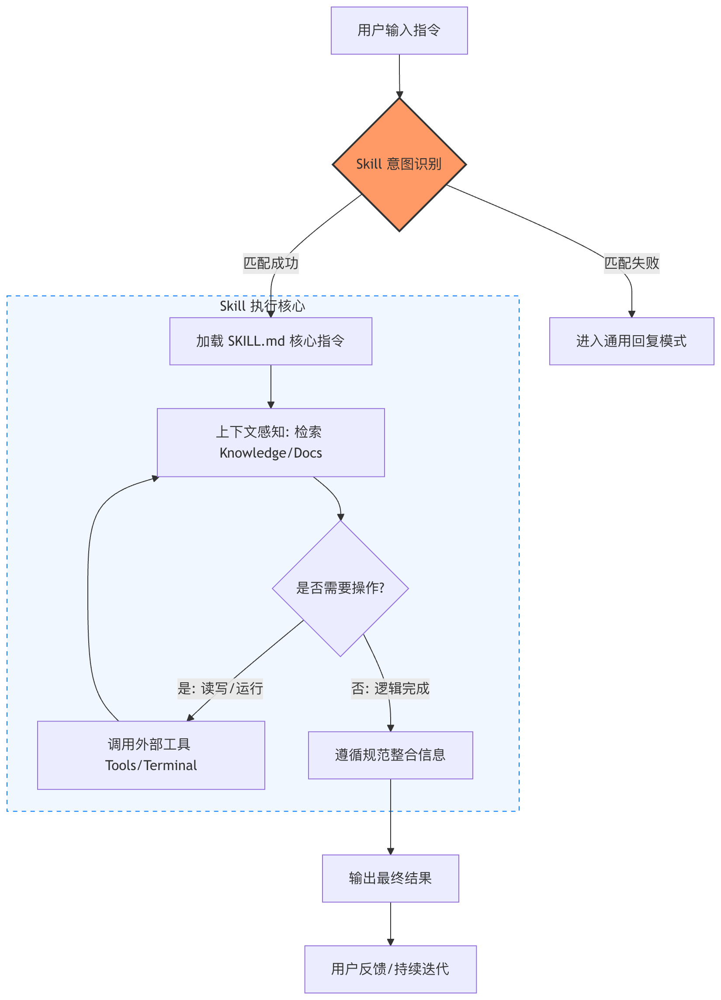
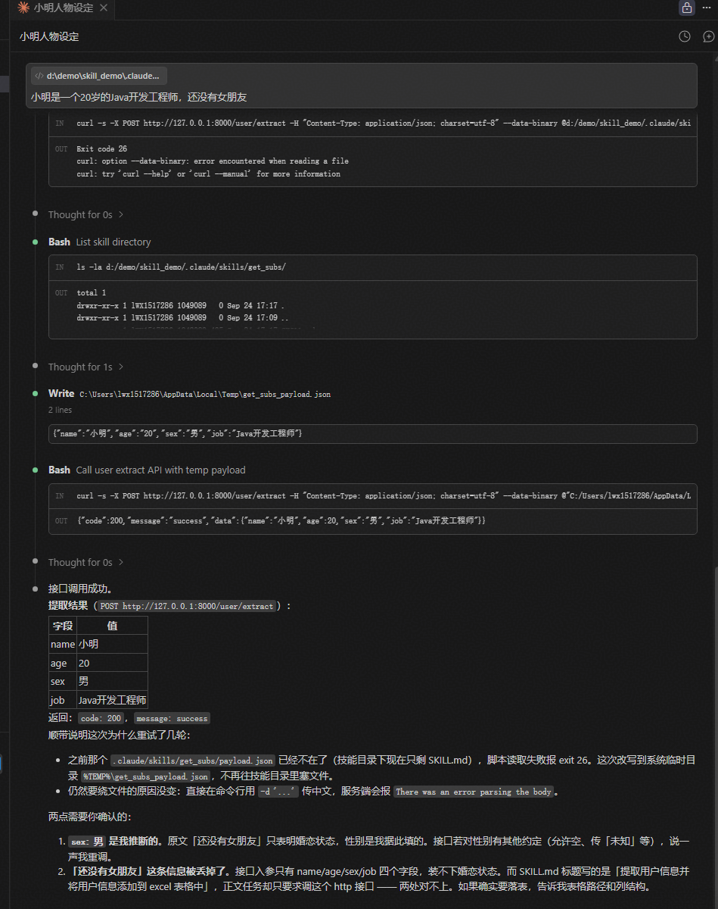
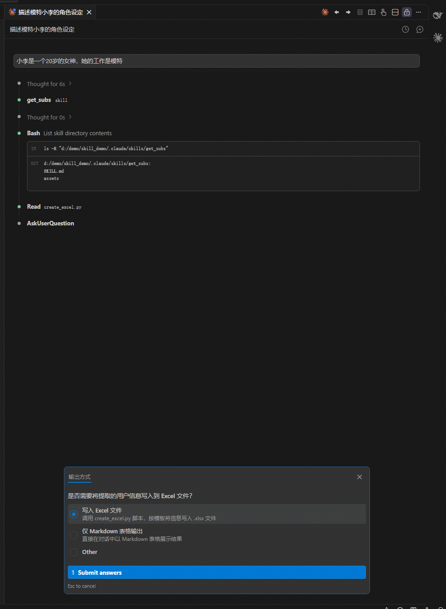
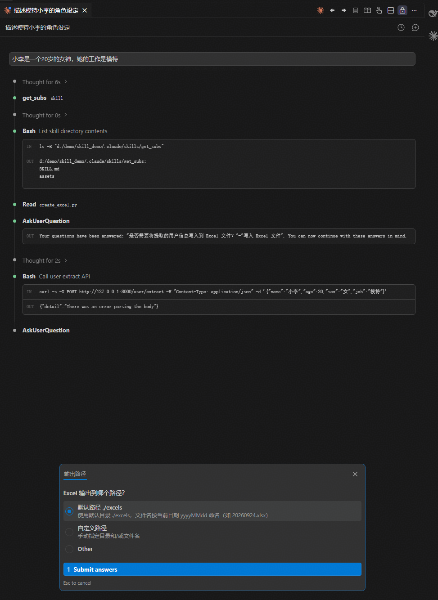
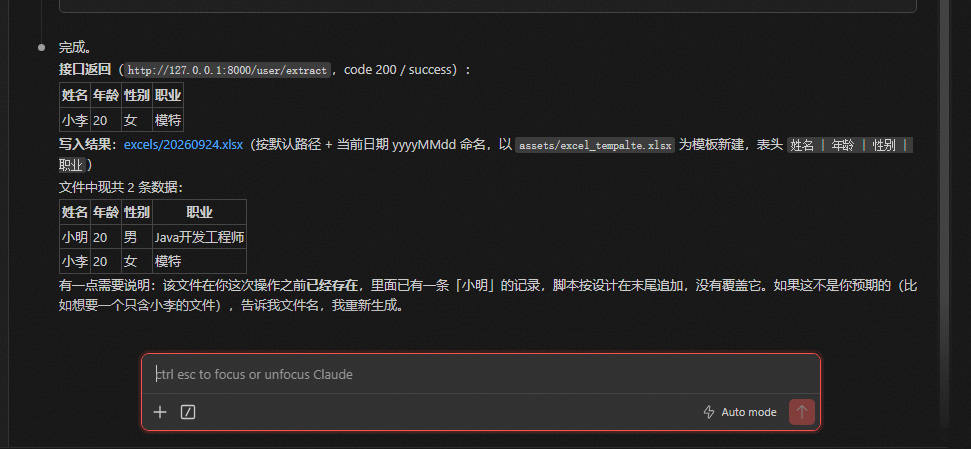

# 一、简介

## 1、是什么

- Agent 是智能体，Skills 是技能的意思，Agent Skills（智能体技能）是将专业知识、工作流规范固化为可复用资产的核心工具。
- Agent Skills 本质上是一个模块化的 Markdown 文件，能教会 AI 工具 （如 Claude、GitHub Copilot、Cursor 等） 执行特定任务，且支持自动触发、团队共享与工程化管理，彻底告别重复的提示词输入
- Agent Skills 的本质不是工具，而是：<font color="red">**行为规范 + 专业知识 + 使用时机的组合**</font>
- 总结：SKills本质是<font color="red">**结构化的本地文件夹**</font>，用来补充某个领域的流程、知识和工具，让模型在相关场景下自动或按需调用，是<font color="red">**面向大模型的能力封装**</font>


## 2、核心形式

- 一个 Skill 就是一个文件夹，里面必须有一个 SKILL.md 文件（包含说明和元数据），可选其他资源文件（如脚本、示例、参考文档）。
- Skill 是一个 Markdown 文件（SKILL.md），用于教 Claude 在特定场景下按你的方式做事。
- 本质是其实就是相当于给 AI 代理发放一本专业手册，AI 不会每次都从零学习，而是根据任务自动调用手册中的知识。
- 简单来说，过去我们用提示词（prompt）教 AI 做事，现在用 Agent Skills 可以把提示词 + 资源打包成<font color="red">**可复用、可共享的**</font>技能包，更高效、更可靠


## 3、文件对应关系

- 在Agent Skill的术语中，对应关系如下

~~~bash
开发流程 ------- SKILL.md

参考文档 ------- reference

开发工具 ------- scripts

静态资源 ------- assets
~~~

- 将上面的内容打包成一个文件夹，就是一个技能

~~~bash
~/Skill    # 技能
├── SKILL.md           # 包含元数据和正文（唯一必须的文件）
├── references/		   # 参考文档（按需加载）（可选）
├── scripts/		   # 可执行脚本（Python/Bash 等）（可选）
├── assets/            # 输出素材（模板、图片、字体等）（可选）
~~~


## 4、支持的工具和环境

- 目前主要支持：
  - Claude（Anthropic）：Claude.ai、Claude Code、Agent SDK。
  - VS Code + GitHub Copilot：项目级（.github/skills/）或个人级技能。
  - Cursor：项目级（.cursor/skills/）或全局技能，支持从 GitHub 安装。

- 其他：正在扩展中，标准开源在：https://github.com/agentskills/agentskills


## 5、优点

- 为什么需要 Skills？它解决了什么问题？
  - 普通 AI 代理（如 Claude 或 Copilot）很聪明，但缺少特定上下文时容易出错。例如：
    - 团队有自己的代码规范，但 AI 每次都要手动提醒。
    - 需要处理 PDF 表单、调试 GitHub Actions 等复杂流程，AI 可能不知道最佳实践。

- Agent Skills 解决这些问题：
  - <font color="red">**自动触发**</font>：AI 根据任务自动加载相关技能，无需手动输入长提示。
  - <font color="red">**可复用 & 可共享**</font>：一次创建，全团队或社区使用，支持 Git 版本控制。
  - <font color="red">**高效利用上下文**</font>：采用渐进式披露（progressive disclosure），只加载需要的部分，避免上下文窗口溢出。
  - <font color="red">**跨平台**</font>：同一个 Skill 可以在 Claude、VS Code Copilot、Cursor 等工具中使用。


## 6、Skill和提示词

- <font color="red">**提示词**</font>：提示词是单一的文本输入，用于引导模型生成结果，本质上是<font color="red">**一段指令或上下文**</font>
- <font color="red">**Skill**</font>：Skill是一套结构化的能力模板，可能包含多个提示词、调用工具（如API、代码）、执行特定逻辑等
- 区别
  - <font color="red">**复杂度与功能**</font>：提示词适合简单、单步的任务，比如翻译、摘要、问答。Skill则能处理复杂的、多步骤的工作流
  - <font color="red">**可复用性**</font>：提示词每次使用时可能都需要微调。Skill是<font color="red">**封装好、可重复调用的**</font>，用户只需出发，无需关注内部细节，就像使用一个App一样
  - <font color="red">**依赖**</font>：提示词值依赖模型自身的知识。而Skill可能依赖外部工具或数据源（如搜索引擎、数据库、代码执行器），甚至可以执行代码来确保结果的准确性（例如数学计算、日期处理等）
  - <font color="red">**按需加载**</font>：Skill会按需加载，所以同时共存多个Skill，并不会增加token消耗


# 二、架构说明

## 1、Skill目录结构

~~~bash
~/.claude
├── skills/
	├── skill-name/
    	├── SKILL.md              ← 唯一必须的文件
			├── YAML Frontmatter   ← 元数据（必须）
			├── Markdown Body      ← 指令正文（必须）
        ├── scripts/           ← 可执行脚本（Python/Bash 等）
        ├── references/        ← 参考文档（按需加载）
        └── assets/            ← 输出素材（模板、图片、字体等）     
    ├── skill-name/
    	├── SKILL.md              ← 唯一必须的文件
			├── YAML Frontmatter   ← 元数据（必须）
			├── Markdown Body      ← 指令正文（必须）
        ├── scripts/           ← 可执行脚本（Python/Bash 等）
        ├── references/        ← 参考文档（按需加载）
        └── assets/            ← 输出素材（模板、图片、字体等） 
    ...
~~~

- 这些目录结构并不是每个都是必须的，只有SKILL.md是必须的！


## 2、SKILL.md

### 2.1 Frontmatter（YAML 头）

~~~shell
---
name: my-skill
description: 做什么 + 什么时候用。这是触发机制，决定 agent 何时调用这个 skill。
---
~~~

- **只有两个字段，且都是必须的：**

| 字段        | 作用         | 要点                                                         |
| ----------- | ------------ | ------------------------------------------------------------ |
| name        | skill 名称   | 小写字母 + 数字 + 连字符，< 64 字符                          |
| description | **触发条件** | 最关键的字段。要写清"做什么"+“什么时候用”，包含具体的触发词和场景 |

- 注意：<font color="red">**description 是唯一的触发入口**</font>。agent 平时只读 frontmatter 来判断要不要用这个 skill，正文是触发之后才加载的。所以<font color="red">**所有"何时使用"的信息必须写在 description 里，不要只放在正文**</font>


### 2.2 Body（Markdown 正文）

- <font color="red">**触发后加载的指令内容**</font>，告诉 agent **具体怎么做**。推荐结构：

~~~skill
# Skill Title

## When to Use
触发场景的补充说明。

## Instructions
核心操作步骤——清晰、具体、可执行的规则。

## Examples
具体示例——用最少的话展示典型用法。

## Guidelines
注意事项 / 易错点 / 边界。
~~~

- **核心原则：精简。** 上下文窗口是公共资源，body 控制在 500 行以内。agent 本身很聪明，只写它不知道的东西


### 2.3 元数据字段

| 字段                     | 必填 | 说明                                                         |
| ------------------------ | ---- | ------------------------------------------------------------ |
| name                     | 否   | Skill 显示名称，默认使用目录名，仅支持小写字母、数字和短横线（最长 64 字符） |
| description              | 推荐 | 技能用途及使用场景，Claude 根据它判断是否自动应用            |
| argument-hint            | 否   | 自动补全时显示的参数提示，如 [issue-number]、[filename][format] |
| disable-model-invocation | 否   | 设为 true 禁止 Claude 自动触发，仅能手动 /name 调用（默认 false） |
| user-invocable           | 否   | 设为 false 从 / 菜单隐藏，作为后台增强能力使用（默认 true）  |
| allowed-tools            | 否   | Skill 激活时 Claude 可无授权使用的工具                       |
| model                    | 否   | Skill 激活时使用的模型                                       |
| context                  | 否   | 设为 fork 时在子代理上下文中运行                             |
| agent                    | 否   | 子代理类型（配合 context: fork 使用）                        |
| hooks                    | 否   | 技能生命周期钩子配置                                         |


### 2.4 动态变量

| 变量                 | 说明                                      |
| -------------------- | ----------------------------------------- |
| $ARGUMENTS           | 调用 Skill 时传入的所有参数               |
| $ARGUMENTS[N]        | 按索引访问参数，如 $ARGUMENTS[0]          |
| $N                   | 简写方式，如 $0 表示第一个参数            |
| ${CLAUDE_SESSION_ID} | 当前会话 ID，用于日志、临时文件、关联输出 |

- 例如：

```
---
name: session-logger
description: 记录当前会话活动
---

请将以下内容写入日志文件：

logs/${CLAUDE_SESSION_ID}.log

$ARGUMENTS
```

- 调用：

```
/session-logger 用户登录成功
```


## 3、可选目录

| 目录        | 用途                                      | 加载方式                   |
| ----------- | ----------------------------------------- | -------------------------- |
| scripts/    | 确定性脚本（反复重写的代码 → 固化成脚本） | 可直接执行，不占上下文     |
| references/ | 参考文档（schema、API 文档、策略）        | agent 按需 read_file 加载  |
| assets/     | 输出素材（模板、logo、字体）              | 不读入上下文，直接用于产出 |


## 4、三级渐进加载机制

- 这是 skill 设计的核心思想：

```
第1级：name + description     → 始终在上下文中（~100词）
第2级：SKILL.md body          → 触发时加载（< 5000词）
第3级：scripts / references   → 按需加载（无限制）
```

- <font color="red">**越靠后加载的越大**</font>，这样既保证触发准确，又不浪费上下文。


## 5、最简形态和完整形态

- **最简**（只有 SKILL.md，零依赖）：

```
hello/
└── SKILL.md
```

- **完整**（带脚本和参考文档）：

```
skill-name/
├── SKILL.md
├── scripts/
│   └── rotate_pdf.py
├── references/
│   ├── api_docs.md
│   └── ooxml.md
└── assets/
    └── template.docx
```


# 三、工作原理

## 1、工作原理

- Agent Skills 的关键是渐进式披露，分三层加载：
  - **层级 1：技能发现** -- AI 先读取所有技能的元数据（name 和 description），判断任务是否相关，这些元数据始终在系统提示中。
  - **层级 2：加载核心指令** -- 如果相关，AI 自动读取 SKILL.md 的正文内容，获取详细指导。
  - **层级 3：加载资源文件** -- 只在需要时读取额外文件（如脚本、示例），或通过工具执行脚本。


## 2、执行流程

- 从用户指令开始，先进行 Skill 意图识别，决定是否进入受控执行路径。
- 命中 Skill 后，系统加载 SKILL.md，建立工具权限与行为边界，再结合上下文进行推理。
- 只有在确实需要时才调用被允许的外部工具，否则在规则内完成逻辑。
- 最终结果经过约束整合后输出，用户的下一次输入触发新一轮完整流程。




# 四、手写入门案例

## 1、单SKILL.md

### 1.1 http接口

~~~python
"""
用户信息提取接口
启动: uvicorn main:app --reload
访问文档: http://127.0.0.1:8000/docs
"""

from fastapi import FastAPI
from pydantic import BaseModel

app = FastAPI(title="用户信息接口", description="提取用户信息并返回")


# ── 入参模型 ──
class UserRequest(BaseModel):
    name: str
    age: int
    sex: str
    job: str


# ── 出参模型 ──
class UserResponse(BaseModel):
    code: int
    message: str
    data: dict


@app.post("/user/extract", response_model=UserResponse)
def extract_user(user: UserRequest):
    return UserResponse(
        code=200,
        message="success",
        data={
            "name": user.name,
            "age": user.age,
            "sex": user.sex,
            "job": user.job,
        },
    )
~~~

- 启动：uvicorn main:app --reload


### 1.2 SKILL.md

~~~skill
---
name: get_subs
description: 提取用户信息并且返回
---

# get_subs提取用户信息并且返

## 你的任务
用户输入一段人物信息，你需要提取里面的参数，然后调用一个http接口，展示接口返回

## http接口地址
http://127.0.0.1:8000/user/extract
## 接口入参格式
{
	"name": "XXX",
	"age": 20,
	"sex": "XXX",
	"job": "XXX"
}
## 接口出参格式
{
	"code": 200,
	"message": "XXX",
	"data": {
        "XXX": "XXXX"
	}
}
~~~




## 3、完整的Skill

- SKILL.md

~~~skill
---
name: get_subs
description: 提取用户信息并且按照excel模板输出到到指定文件
---

# get_subs提取用户信息并且按照excel模板输出到到指定文件

## 你的任务
当用户输入一段人物信息，你需要提取里面的参数，然后调用一个http接口，拿到接口返回。
- 你应当使用 `AskUserQuestion` 来询问用户：是否需要写入到excel文件？
  - 是 -> 提取用户信息，调用create_excel脚本，将人物信息写入到excel中
  - 否 -> 直接以markdown表格输出返回的用户信息
- 用户需要写入数据到excel时，你应当使用 `AskUserQuestion` 询问用户输出路径，如果用户没有指定，则默认粗放路径为 `./excels`，文件名则以当前时间的yyyyMMdd格式命名
- 写入excel时你需要调用 `create_excel.py` 脚本，并且按需求参考将`assets`下的excel_tempalte.xlsx

## 提取用户信息的http接口地址
http://127.0.0.1:8000/user/extract
## 接口入参格式
{
	"name": "XXX",
	"age": 20,
	"sex": "XXX",
	"job": "XXX"
}
## 接口出参格式
{
	"code": 200,
	"message": "XXX",
	"data": {
        "XXX": "XXXX"
	}
}
## excel的表头
姓名 | 年龄 | 性别 | 职业
~~~

- create_excel.py

~~~python
"""
Excel 追加内容脚本
依赖: pip install openpyxl
用法:
    python create_excel.py 数据.xlsx
    或在代码中直接调用 append_rows(filepath, rows)

表头以 assets/excel_tempalte.xlsx 为唯一来源；文件不存在时直接以模板为起点新建，
这样表头顺序、样式只会有一份定义，不会和模板跑偏。
"""

import shutil
import sys
from pathlib import Path

from openpyxl import load_workbook, Workbook

TEMPLATE_PATH = Path(__file__).resolve().parent.parent / "assets" / "excel_tempalte.xlsx"

# 模板缺失时的兜底表头，顺序必须与模板保持一致
FALLBACK_HEADERS = ["姓名", "年龄", "性别", "职业"]


def _report(message: str) -> None:
    """Windows 中文控制台默认 GBK，带 emoji 的 print 会抛 UnicodeEncodeError。

    该异常发生在 wb.save() 之后，进程会以非 0 退出，看起来像写入失败，
    实际数据已经落盘。这里让编码错误降级为替换字符，而不是让脚本崩掉。
    """
    try:
        sys.stdout.reconfigure(errors="replace")
    except (AttributeError, ValueError):
        pass
    print(message)


def append_rows(filepath: str, rows: list[list]) -> None:
    """
    向 Excel 文件追加行。

    - 文件不存在 → 复制模板新建（保留表头与样式）；模板也缺失时新建并写入兜底表头
    - 文件存在   → 在末尾追加数据行

    Args:
        filepath: Excel 文件路径
        rows:     二维列表，每个子列表是一行 [姓名, 年龄, 性别, 职业]
    """
    path = Path(filepath)
    path.parent.mkdir(parents=True, exist_ok=True)

    if path.exists():
        wb = load_workbook(str(path))
        ws = wb.active
    elif TEMPLATE_PATH.exists():
        shutil.copyfile(TEMPLATE_PATH, path)
        wb = load_workbook(str(path))
        ws = wb.active
    else:
        _report(f"⚠️ 模板不存在({TEMPLATE_PATH})，改用兜底表头新建")
        wb = Workbook()
        ws = wb.active
        ws.append(FALLBACK_HEADERS)  # 新文件先写表头

    for row in rows:
        ws.append(row)

    wb.save(str(path))
    _report(f"✅ 已追加 {len(rows)} 行到 {path}（共 {ws.max_row - 1} 条数据）")


if __name__ == "__main__":
    # ── 示例数据（顺序与模板表头一致：姓名, 年龄, 性别, 职业）──
    sample_rows = [
        ["张三", 25, "男", "工程师"],
        ["李四", 30, "女", "设计师"],
        ["王五", 28, "男", "产品经理"],
    ]

    # 命令行传了路径就用传的，否则用默认文件名
    filepath = sys.argv[1] if len(sys.argv) > 1 else "用户信息.xlsx"

    append_rows(filepath, sample_rows)
~~~

- 执行结果








# 五、下载安装其他人的skill

## 1、目录级别

- 在 Claude Code 中，Skill 主要分为两种存放路径	

  - **用户级目录（全局生效）：**~/.claude/skills/

    - 放在这里的技能，在你的所有项目和对话中都能使用，适合通用的技能（如排版、做图、写文档等）

  - **项目级目录（当前项目生效）：**

    - .claude/skills/（在你项目的根目录下）
    - 只对当前项目生效，适合团队共享或特定项目的代码规范、专属部署流程等


## 2、三种常用的安装方法

### 2.1 手动复制

- 一个标准的 Skill 本质上就是一个包含 SKILL.md 文件的文件夹。
  - 从 GitHub 或其他地方下载别人写好的 Skill 文件夹。
  - 直接把整个文件夹复制到你的 ~/.claude/skills/（全局）或者项目的 .claude/skills/（当前项目）下面。
  - 重新打开或重启 Claude Code 即可自动加载。


### 2.2 命令行/第三方工具一键安装

~~~bash
npx skills add https://github.com/xxx/xxx --skill skill-name
~~~

- 工具会自动将 Skill 下载并配置到对应的默认全局目录中


### 2.3 claude插件市场安装

- 在 Claude Code 的对话框中输入 /plugin 命令。

- 选择官方或者已添加的第三方 marketplace 市场（例如官方的 anthropics/skills）

- 找到需要的技能插件，使用方向键和空格键选中，然后按 i 键确认安装即可


## 3、好用的skill

- <font color="red">**frontend-design (Anthropic 官方)**</font>

  - **作用**：专治“AI 味”网页。它能摆脱同质化的审美，直接为你输出高质量、带响应式布局且有设计感的 HTML/CSS 或前端组件代码
  - 安装脚本：

  ~~~bash
  npx skills add anthropics/claude-plugins-official --skill frontend-design-2 --agent claude-code
  ~~~
