# 一、概述

## 1、为什么需要LangChain

### 1.1 从传统应用到智能体时代

- PC互联网时代
- 移动互联网时代
- AI 智能化时代


### 1.2 单一的大语言模型的局限性

- 单一的大语言模型有局限性
  - <font color="red">**知识受限于训练数据**</font>，无法获取训练时点之后的信息
  - <font color="red">**无法直接与外部系统交互**</font>，无法查询实时数据，调用API或读取数据库
  - <font color="red">**不具备状态保持能力**</font>，难以及逆行连贯的多轮对话，遗忘之前的上下文


- 所以要构建真正的AI应用，必须将大语言模型与外部工具、数据源和记忆机制有机结合，从而催生了LangChain框架的设计理念
- LangChain，是当前构建生产级AI智能体系统的首选


### 1.3 LangChain框架定位

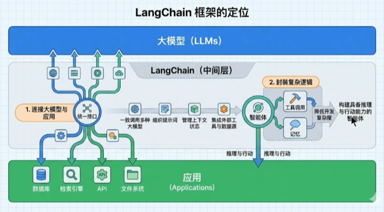

- LangChain 作为大模型与应用间的中间层，可统一调用各类大模型、管理提示词与上下文，还能集成外部工具和数据源，快速搭建具备推理、行动能力的智能体。
- 核心定位三点：
  1. <font color="red">**打通大模型与外部资源**</font>：统一接口对接数据库、检索引擎、API、文件系统等；
  2. <font color="red">**封装底层复杂逻辑**</font>：抽象工具调用、记忆等能力，降低智能体开发难度；
  3. <font color="red">**支撑多智能体协作**</font>：依托 LangGraph 等生态，从单智能体拓展至多智能体协作，可构建工业级智能体


### 1.4 LangChain应用场景

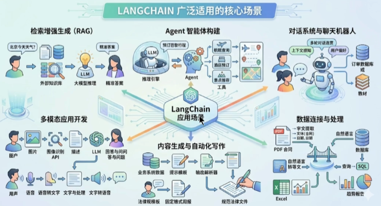

- 主要应用场景如下

  - <font color="red">**检索增强生成（RAG）**</font>
    - 流程：用户提问 → 调用外部知识库 → 大模型结合检索信息推理 → 输出精准答案

    - 价值：解决大模型 “幻觉” 和知识滞后问题，让回答更可靠、贴合业务数据

  - <font color="red">**Agent 智能体构建**</font>

    - 流程：用户目标（如 “预订巴黎行程”）→ 推理引擎规划 → Agent 调用航班查询、酒店预订等工具 → 完成复杂任务

    - 价值：让大模型具备自主规划、工具调用和多步执行能力，实现 “目标驱动” 的智能体

  - <font color="red">**对话系统与聊天机器人**</font>

    - 流程：多轮对话 → 上下文感知与用户偏好学习 → 对接订单数据库、教材等业务数据

    - 价值：构建连贯、个性化的对话交互，适用于客服、教育助手等场景

  - <font color="red">**多模态应用开发**</font>

    - 视觉方向：用户上传图片 → 图像识别 API → 生成描述 → 大模型问答

    - 语音方向：用户语音 → 转文字 → 处理 → 生成语音回复

    - 价值：打通图文、语音等多模态交互，拓展大模型的输入输出形态

  - <font color="red">**内容生成与自动化写作**</font>

    - 流程：业务系统数据 / 法律模板 → 提示模板生成 → 输出解析 → 生成规范周报、法律文件等

    - 价值：自动化生成结构化、合规的文档，提升办公效率

  - <font color="red">**数据连接与处理**</font>

    - 流程：PDF/Excel 等文件 → 文本提取 / 自然语言转等文 → 统一数据处理 → 生成 SQL 查询 → 输出趋势报告
    - 价值：让大模型直接对接企业数据资产，用自然语言完成数据分析与可视化


## 2、LangChain是什么

### 2.1 是什么

- LangChain 是一个基于 python 语言的模块化、可组合、面向开发者的开源框架，<font color="red">**旨在简化基于大型语言模型的应用程序开发**</font>。它由 Harrison Chase 于 2022 年 10 月发起，迅速成为 GitHub 上增长最快的开源项目之一。

- 顾名思义，LangChain中的“Lang”是指language，即⼤语⾔模型，“Chain”即“链”，也就是<font color="red">**将⼤模型与外部数据&各种组件连接成链，以此构建AI应⽤程序**</font>
  - LangChain ≠ LLMs
  - LangChain 之于 LLMs，类似于Spring之于 Java
  - LangChain 之于 LLMs，类似于Django、Flask之于 Python
- <font color="red">**学习LangChain框架，高效开发大模型应用**</font>


### 2.2 为什么使用LangChain

- 当ChatGPT、QwenLM、DeepSeek等大语言模型（LLM）横空出世时，开发者们立刻意识到：LLM不是终点，而是构建智能应用的“大脑”。但要让这个“大脑”真正解决实际问题，还需要解决<font color="red">**三个关键痛点**</font>：
  - <font color="red">**信息过时**</font>：LLM的知识截止于训练数据的时间节点（如GPT-4的训练数据截止到2023年），无法回答诸如“2024年最新AI论文内容”或“今天纽约股市收盘价”这样的问题
  - <font color="red">**无法动手**</font>：LLM虽然能生成自然语言，但它不能执行外部操作，比如调用API、计算数值、查询数据库、发送邮件等。它就像一个只会思考的“脑壳”，没有“手脚”。
  - <font color="red">**记忆有限**</font>：LLM的上下文窗口（例如GPT-4最多支持32,768个tokens）限制了它处理长文本的能力，难以记住对话历史或文档细节。
- 因此，我们需要一个框架，<font color="red">**将LLM的“大脑”与“感官（数据）”、“手脚（工具）”、“记忆（上下文）”连接起来，让它从“聊天机器人”升级为“能解决具体问题的助手”**</font>
- 不使用LangChain，确实可以使用GPT 或GLM4 等模型的API进行开发。比如，搭建“智能体”（Agent）、问答系统、对话机器人等复杂的 LLM 应用，但使用LangChain的<font color="red">**好处**</font>有：
  - <font color="red">**简化开发难度**</font>：更简单、更高效、效果更好
  - <font color="red">**学习成本更低**</font>：不同模型的API不同，调用方式也有区别，切换模型时学习成本高。使用LangChain，可以以统一、规范的方式进行调用，有更好的移植性。
  - <font color="red">**现成的链式组装**</font>：LangChain提供了一些现成的链式组装，用于完成特定的高级任务。让复杂的逻辑变得结构化、易组合、易扩展

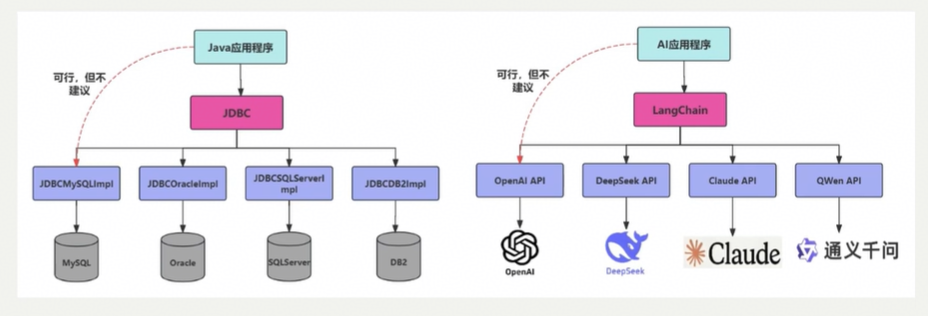

- 总结：<font color="red">**LangChain是一个能构建LLM应用的全套工具集，涉及到prompt构建、LLM接入、记忆管理、工具调用、RAG、智能体开发等模块**</font>


### 2.3 主要模块

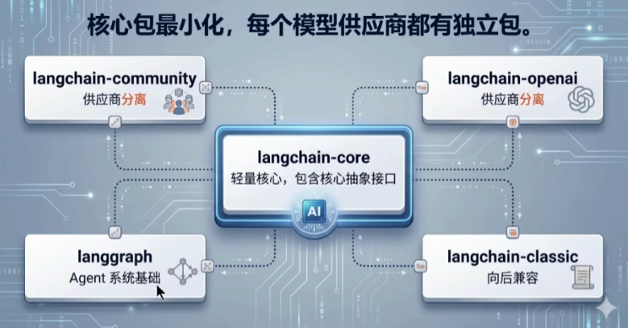

- **langchain-core**：官方推荐的核心 API。比如 Runnable, BaseMessage 等
- **langchain-classic**：冗余代码或不推荐使用的经典 API 移到此。比如 0.x 中常用而 1.x 移除的 API 都在这里。
- **langchain-community**：第三方集成，比如：合作伙伴包 langchain-openai, langchain-anthropic 等，按需安装、避免臃肿。
- **langgraph**：深度整合 LangGraph 1.0，协调多个 Chain、Agent、Tools 完成更复杂（下方文字被遮挡，推测为 “任务，可能也需要调用到 LangGraph 的”）


### 2.4 API文档

- 官网：https://www.langchain.com/

- Github 地址：https://github.com/langchain-ai

- 中文文档地址：https://docs.langchain.org.cn/oss/python/langchain/overview

- 英文文档地址：https://docs.langchain.com/oss/python/langchain/overview

- API 文档查询地址：https://reference.langchain.com/python/langchain/


## 3、LangChain四大支柱

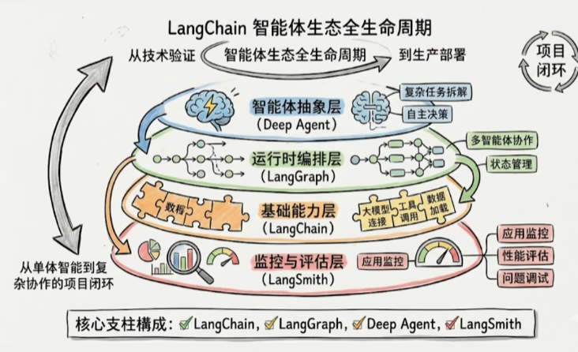

- 截至 2025 年 11 月，LangChain 已从一个独立的开发框架，成长为一个覆盖智能体系统全生命周期的技术生态。该生态由四大核心支柱构成：LangChain、LangGraph、Deep Agent 与 LangSmith。

- LangChain 智能体生态全生命周期

  - **智能体抽象层（Deep Agent）**：复杂任务拆解、自主决策

  - **运行时编排层（LangGraph）**：多智能体协作、状态管理

  - **基础能力层（LangChain）**：大模型连接、工具调用、数据加载

  - **监控与评估层（LangSmith）**：应用监控、性能评估、问题调试

- 核心支柱构成

  - LangChain（基础能力层）

  - LangGraph（运行时编排层）

  - Deep Agent（智能体抽象层）
  - LangSmith（监控与评估层）

- 它们分别对应基础能力层、运行时编排层、智能体抽象层、监控与评估层，共同构建了一个从技术验证到生产部署、从单体智能到复杂协作的项目闭环


### 3.1 LangChain：智能体开发的基石

- LangChain 是整个生态的核心与起点，为开发者提供了模型调用、工具与中间件集成、智能体构建等一整套基础能力。

- 其核心价值如下：

  - **统一的模型抽象层**：屏蔽了不同模型服务提供商（如 OpenAI、Anthropic、Ollama 等）的接口差异，提供一致的调用方式。

  - **高度模块化的设计**：使用 Message、Tool、Agent、Middleware 等组件实现灵活的组合与扩展。

  - **丰富的集成生态**：预置了丰富的数据源、API、中间件等，构成了强大的 AI 能力枢纽。

- 在整体架构中，LangChain 如同智能体的操作系统内核，是所有上层能力构建的基础。

- **结论**：<font color="red">**如果你需要构建简单的智能体应用，无需复杂的编排需求，那就选择 LangChain**</font>


### 3.2  LangGraph：复杂工作流的编排引擎

- 当智能体的任务从单一指令执行扩展为多步骤、有状态的复杂工作流时，LangGraph 应运而生。

- 其核心思想是**将智能体内部抽象为一张有向图**。

  - **节点（Node）**：代表独立的功能单元或决策点。

  - **边（Edge）**：定义了节点之间的流转条件与路径。

  - **状态（State）**：作为一个共享上下文，在节点间传递并持久化存储任务信息。

- 通过这种图式结构，LangGraph 让智能体的工作流节点交互变得显式、可控、可观测

- 官方也强调：“快速起步用 LangChain，复杂控制用 LangGraph，二者并行协同”
  - LangChain = 能力抽象层（LLM / Tool / Message 标准化），负责 “有什么能力”
  - LangGraph = 执行与编排层（状态机 / 工作流 / 多 Agent 系统），负责 “怎么跑”

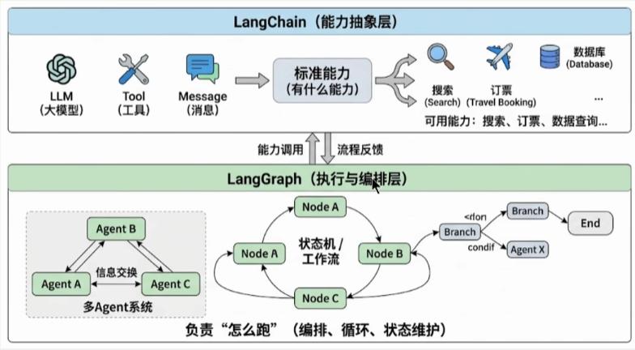


### 3.3 Deep Agent：智能体的执行框架

- Deep Agent 是新推出的全新组件，被定位为 Agent Harness（智能体执行框架）。它<font color="red">**构建于 LangChain 与 LangGraph 之上**</font>，增加了规划能力、文件系统、子 Agent 等高级功能。旨在让开发者**无须从零构建**复杂的控制逻辑，即可创建具备深度规划、长期记忆与多专家协作能力的智能体。

- Deep Agent 的核心能力如下：

  - **显式规划**：自主生成、执行并动态调整多步任务计划。

  - **虚拟文件系统**：为智能体提供结构化的中间结果与知识存储。

  - **子智能体**：支持任务在多个智能体之间的分解与协作。

  - **长期记忆**：通过与 LangGraph 状态存储的结合，实现跨对话的经验积累。

  - **可扩展中间件**：允许嵌入安全审计、性能监控或自定义业务逻辑


### 3.4 三者关系

- 三个框架不是竞争关系，并非排斥，复杂项目完全可以同时使用到这三层

- 从LangChain快速搭建，用LangGraph打磨生产稳定性，再用Deep Agents赋予Agent更强的自主能力，这才是完整的LangChain生态

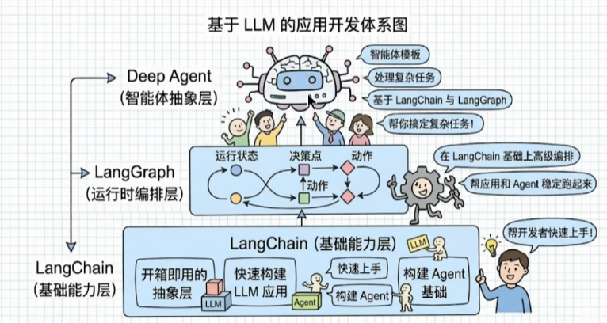


### 3.5 LangSmith：可视化监控与测试平台

- 当智能体系统逐渐复杂时，单靠日志与打印输出（print）调试已无法满足调试与质量管理的需求。

- LangSmith 是 LangChain 官方推出的<font color="red">**可视化监控与测试平台，用于跟踪、记录和分析智能体在运行过程中的完整调用链路**</font>，让智能体的内部运行过程变得透明和可评估

- LangSmith 的核心目标如下：

  - **全链路追踪**：可视化追踪模型调用、提示词输入、结果输出、工具使用等行为。

  - **调试与优化**：发现运行中智能体的异常行为与性能瓶颈。

  - **评测与质量控制**：支持人工与自动化评测，量化智能体表现。

  - **团队协作**：支持多人共享测试集与调用记录。

- LangSmith 官网：https://www.langchain.com/langsmith

- LangSmith 的引入使得智能体的开发、调试与运维形成了完整的质量闭环


## 4、大模型应用场景介绍

### 4.1 RAG开发

- 1、背景

  - <font color="red">**大模型的知识冻结**</font>：随着 LLM 规模扩大，训练成本与周期相应增加，模型无法实时学习到最新的信息或动态变化。导致 LLM 难以应对诸如“请推荐现在的热门影片”等时间敏感的问题。

  - <font color="red">**大模型幻觉**</font>：涉及到大模型从未在训练过程中学习过的信息时，大模型无法给出准确的答复，转而开始臆想和编造答案。

- 2、举例：LLM在考试的时候面对陌生的领域，答复能力有限，然后就准备放飞自我了，而此时RAG给了一些提示和思路，让LLM懂了开始往这个提示的方向做，最终考试的正确率从60%到了90%！

- 3、何为RAG：Retrieval-Augmented Generation（检索增强生成）

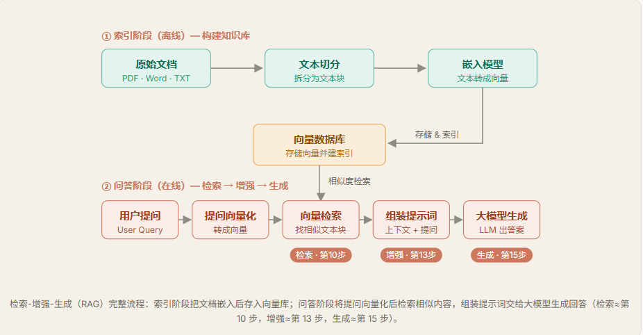

- 4、这些过程中的难点：1、文件解析 2、文件切割 3、知识检索 4、知识重排序

  - 1、文件解析：如果是pdf，内部包含文件、图片、表格，图片上还有文字，需要处理。

  - 2、文件切割：没有固定的格式

  - 3、在 RAG 应用中，随着文档数量增加，召回准确率会下降，引入reranker（重排器）可对初步召回的较多 chunk（如 top 20 或 top 50）进行精排，提高召回准确率，防止LLM 处理无关信息，减少时间和成本。此外，与基于基本矢量搜索的 RAG 相比，reranker增强型 RAG 的成本更高，但与仅依靠LLM 生成答案相比，它的成本低些。Reranker的使用场景：

    - 适合：追求回答高精度和高相关性的场景中特别适合使用 Reranker，例如专业知识库或者客服系统等应用。

    - 不适合：引入reranker会增加召回时间，增加检索延迟。服务对响应时间要求高时，使用reranker可能不合适


### 4.2 Agent开发

- 充分利用 LLM 的推理决策能力，通过增加规划、记忆和工具调用的能力，构造一个能够独立思考、逐步完成给定目标的 Agent（智能体）
- 一个数学公式来表示：<font color="red">**Agent = LLM + Planning + Tools + Memory + Action**</font>

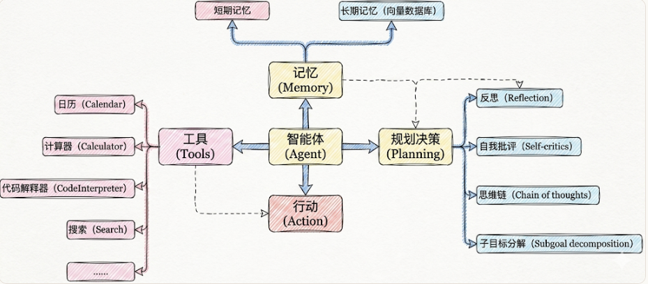

- 类比：打车到西藏玩

  - 大脑中枢：规划行程的你
  - 规划：步骤1：规划打车路线，步骤2：订饭店、酒店，。。。
  - 调用工具：调用MCP或FunctionCalling等API，滴滴打车、携程、美团订酒店饭店
  - 记忆能力：沟通时，要知道上下文。比如订酒店得知道是西藏路上的酒店，不能聊着聊着忘了最初的目的。
  - 能够执行上述操作。说走就走，不能纸上谈兵

- 智能体核心要素被细化为以下模块：

  - 1、<font color="red">**大模型（LLM）作为“大脑”**</font>：提供推理、规划和知识理解能力，是AI Agent的决策中枢。大脑主要由一个大型语言模型 LLM 组成，承担着信息处理和决策等功能， 并可以呈现推理和规划的过程，能很好地应对未知任务。

  - 2、<font color="red">**规划决策（Planning）**</font>：通过任务分解、反思与自省框架实现复杂任务处理。例如，利用思维链（Chain of Thought）将目标拆解为子任务，并通过反馈优化策略
  - 3、<font color="red">**工具使用（Tool Use）**</font>：调用外部工具（如API、数据库）扩展能力边界
  - 4、<font color="red">**记忆（Memory）**</font>：智能体像人类一样，能留存学到的知识以及交互习惯等，这样的机制能让智能体在处理重复工作时调用以前的经验，从而避免用户进行大量重复交互
    - 短期记忆：存储单次对话周期的上下文信息，属于临时信息存储机制。受限于模型的上下文窗口长度。
    - 长期记忆：可以横跨多个会话或时间周期，可存储并调用核心知识，非即时任务。比如，关于用户的偏好，过去执行过的指令等。长期记忆，可以通过模型参数微调（固化知识）、知识图谱（结构化语义网络）或向量数据库（相似性检索）方式实现。
  - 5、<font color="red">**行动（Action）**</font>：实际执行决策的模块，涵盖软件接口操作（如自动订票）和物理交互（如机器人执行搬运）。比如：检索、推理、编程等

- 智能体会形成完整的计划流程。例如先读取以前工作的经验和记忆，之后规划子目标并使用相应工具去处理问题，最后输出给用户并完成反思


### 4.3 大模型应用开发的4个场景

#### 4.3.1 纯 Prompt

- Prompt是操作大模型的唯一接口
- 当人看：你说一句，ta回一句，你再说一句，ta再回一句...

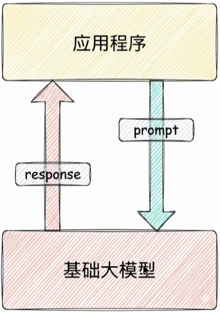


#### 4.3.2 Agent + Function Calling

- Agent：AI 主动提要求
- Function Calling：需要对接外部系统时，AI 要求执行某个函数
- 当人看：你问 ta「我明天去杭州出差，要带伞吗？」，ta 让你先看天气预报，你看了告诉ta，ta 再告诉你要不要带伞

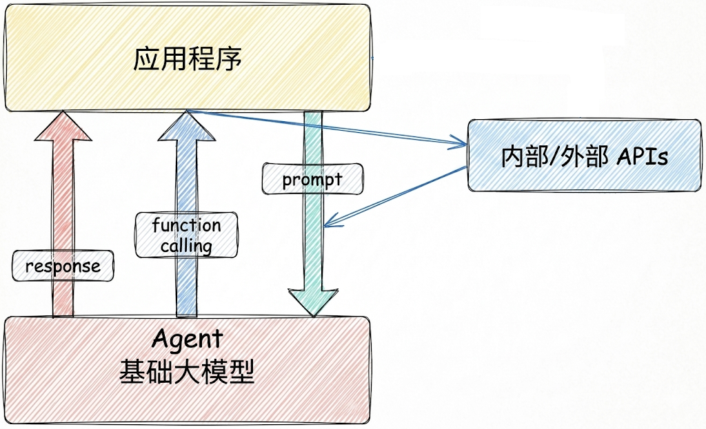


#### 4.3.3 RAG 

- RAG：需要补充领域知识时使用

  - Embeddings：把文字转换为更易于相似度计算的编码。这种编码叫向量

  - 向量数据库：把向量存起来，方便查找
  - 向量搜索：根据输入向量，找到最相似的向量

- 举例：考试答题时，到书上找相关内容，再结合题目组成答案

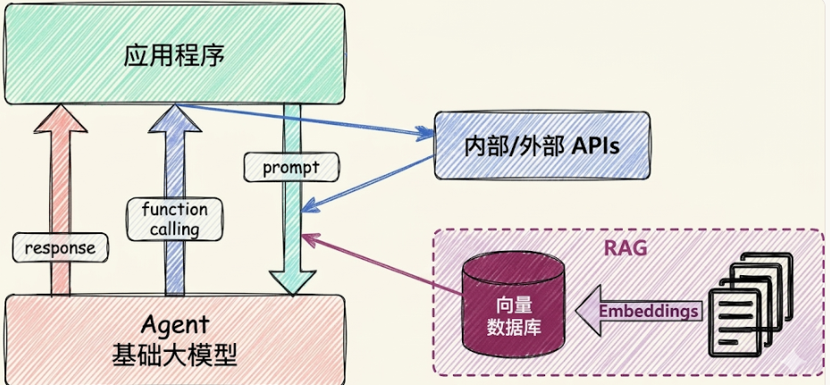


#### 4.3.4 Fine-tuning(精调/微调)

- 举例：努力学习考试内容，长期记住，活学活用。

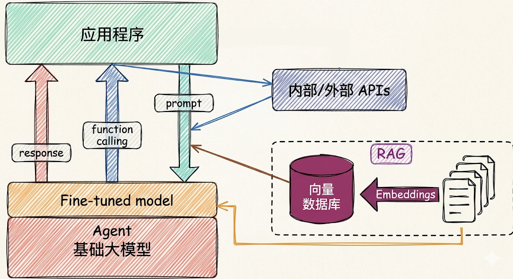


### 4.4 如何选择相关技术

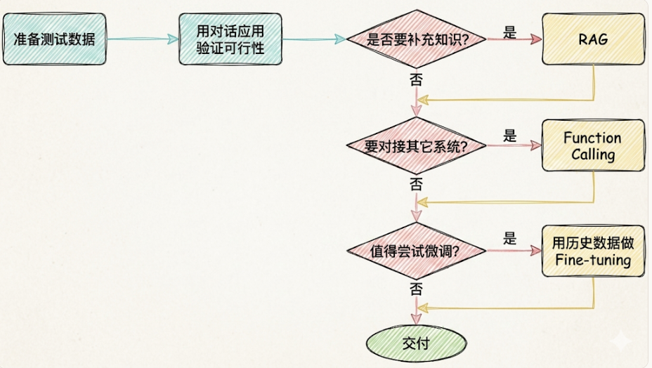


# 二、模型调用和创建

## 1、准备工作

### 1.1 大模型的调用步骤

- 在LangChain v0.3版本中，提到了Model I/O，包括输入提示(Format)、调用模型(Predict)、输出解析(Parse)。分别对应着Prompt Template ， Model 和Output Parser 

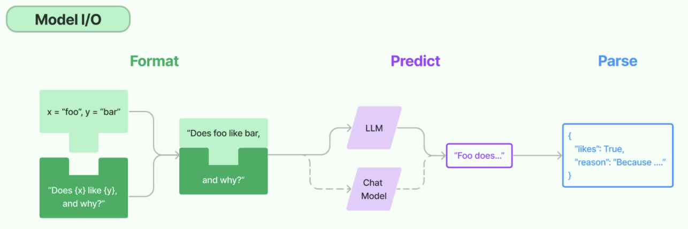

- 关于模型调用模块，如今对话模型已经是主要形式。从历史上解读：
  - 在GPT-3时代，大模型以补全模型为主，只能以类似“成语接龙”的方式对文本进行补全，并且实际运行效果也非常不稳定。此时LangChain借助一些高层封装的API，能够让模型完成对话、调用外部工具、甚至是结构化输出等功能，为开发者提供了极大的便利。
  - 伴随着GPT-3.5模型的发布，对话模型正式登上历史的舞台，并逐渐成为主流。而得益于对话模型更强的指令跟随能力，很多GPT-3需要借助LangChain才能完成的工作，已经成为GPT-3.5原生自带的一些功能。

- 所以，本章只提供了对话模型的创建，而没有了非对话模型


### 1.2 模型初始化的分类方式

- 简单来说，就是用谁家的API以什么方式创建存放在哪个位置的大模型

- 角度1：调用谁家的API
  - 使用模型提供商的库
  - 使用LangChain统一方式（推荐）

- 角度2：模型初始化时，几个重要参数(如BASE_URL、API-KEY)的书写位置的不同：
  - 使用配置文件（推荐）
  - 硬编码：写在代码文件中

- 角度3：调用的模型所在位置

  - 在线部署的大模型

  - 本地部署的大模型

- LangChain作为一个“工具”，不提供任何 LLMs，而是依赖于第三方集成各种大模型。这里就看大模型到底部署在哪里


### 1.3 线上大模型服务平台

- 有许多提供大模型API服务的平台，使用时只需要注册、充值并创建API-Key，之后即可使用API-Key与URL来调用平台提供的相应的模型的服务。

| 平台       | 网址                                           | 备注                 |
| ---------- | ---------------------------------------------- | -------------------- |
| OpenRouter | https://openrouter.ai/                         | 全球主流，含国外模型 |
| CloseAI    | https://platform.closeai-asia.com/             | 亚洲最大，含国外模型 |
| 阿里云百炼 | https://bailian.console.aliyun.com/            | 企业端友好           |
| 硅基流动   | https://www.siliconflow.cn/                    | 性价比高，适合个人   |
| 百度千帆   | https://console.bce.baidu.com/qianfan/overview | 主打百度生态         |
| 火山引擎   | https://console.volcengine.com/ark/            | 主打字节多模态生态   |

- 说明：每个平台配置时，都需要几个要素：模型名、api-key 、base-url 。

- 如果大家想使用国外的大模型，就选择前两个；如果只使用国内的大模型，可以选择后四个。


## 2、使用模型提供商库初始化

- 在 LangChain 中初始化模型，主要可以通过直接<font color="red">**使用特定的 Model Class**</font> 和<font color="red">**使用统一的 init_chat_model 函数**</font>这两种方式来实现。
- 这里先讲方式 1，这种方式最直接。LangChain 为一些大模型供应商提供了专门的 Model 类，导入对应的具体类（如 ChatOpenAI、ChatAnthropic、ChatDeepSeek、ChatOllama、ChatHunyuan、ChatTongyi、ChatZhipuAI）并进行实例化。
- 官网链接：https://reference.langchain.com/python/langchain-community/chat-models


### 2.1 通过专用API调用

注意：使用不同的模型可能传入的参数名称不同，可以参考对应的源码


#### 2.1.1 DeepSeek大模型

- 官网：https://www.deepseek.com/
- 步骤1：安装依赖
  - 说明：langchain-deepseek 是使用deepseek 大模型必要依赖。
  - 注意：langchain-deepseek 依赖于langchain-openai ，安装前者，pip会自动从pypi拉取元数据解析依赖，后者也会被安装。所以我们把langchain-openai 也放在此处。

~~~bash
# 初始化项目
uv init
# 安装ChatOpenAI依赖包
uv add langchain-openai
# 安装ChatDeepSeek 依赖包
uv add langchain-deepseek
# 用于环境管理的包
uv add python-dotenv
~~~

- 步骤2：创建.env环境变量

~~~bash
DEEPSEEK_API_KEY=<Your API Key>
DEEPSEEK_BASE_URL=https://api.deepseek.com
~~~

- 步骤3：读取配置并初始化模型

~~~python
from langchain_deepseek import ChatDeepSeek
import os
from dotenv import load_dotenv


# 通过load_dotenv()将.env中的变量加载为环境变量
# override=True表示：无论你当前的操作系统、终端或者虚拟环境中是否已经存在同名的环境变量
load_dotenv(override=True)

# 从环境变量读取配置
DEEPSEEK_API_KEY = os.getenv("DEEPSEEK_API_KEY")
DEEPSEEK_BASE_URL = os.getenv("DEEPSEEK_BASE_URL")

# 创建DeepSeek LLM
deepseek_llm = ChatDeepSeek(
    api_key=DEEPSEEK_API_KEY,
    api_base=DEEPSEEK_BASE_URL,
    model_name="deepseek-v4-flash",
)

print(deepseek_llm.invoke("你好"))
~~~

- 步骤3优化：依靠默认行为读取 .env 环境变量

~~~python
from langchain_deepseek import ChatDeepSeek
import os
from dotenv import load_dotenv


# 通过load_dotenv()将.env中的变量加载为环境变量
# override=True表示：无论你当前的操作系统、终端或者虚拟环境中是否已经存在同名的环境变量，
load_dotenv(override=True)

# 从环境变量读取配置
DEEPSEEK_API_KEY = os.getenv("DEEPSEEK_API_KEY")
DEEPSEEK_BASE_URL = os.getenv("DEEPSEEK_BASE_URL")

# 创建DeepSeek LLM
deepseek_llm = ChatDeepSeek(
    model_name="deepseek-v4-flash"
)

print(deepseek_llm.invoke("你好"))
~~~

- <font color="red">**调用ChatDeepSeek要求系统存在名为DEEPSEEK_API_KEY的环境变量**</font>。URL通过源码可以查看，有默认值。如下：

~~~python
api_key: SecretStr | None = Field(
    default_factory=secret_from_env("DEEPSEEK_API_KEY",
                                 default=None),
)
"""DeepSeek API key"""
api_base: str = Field(
    default_factory=from_env("DEEPSEEK_API_BASE",
                         default=DEFAULT_API_BASE),
)
"""DeepSeek API base URL"""
DEFAULT_API_BASE = "https://api.deepseek.com/v1"
~~~


#### 2.1.2 智谱大模型

- 官网：<https://www.bigmodel.cn/>

- 步骤1：相关依赖：

~~~bash
# 安装 Langchain 社区依赖包，包含ChatHunyuan、ChatTongyi、ChatZhipuAI
uv add langchain-community
# ChatZhipuAI / 智谱 AI 认证相关依赖
uv add pyjwt
~~~

- 步骤2：在.env环境变量中补充

~~~bash
ZHIPUAI_API_KEY=<Your API Key>
ZHIPUAI_BASE_URL=https://open.bigmodel.cn/api/paas/v4/
~~~

- 步骤3：初始化大模型

~~~python
import os

from langchain_community.chat_models import ChatZhipuAI
from dotenv import load_dotenv

# override=True 确保.env文件优先
load_dotenv(override=True)

ZHIPUAI_API_KEY = os.getenv("ZHIPUAI_API_KEY")
ZHIPUAI_BASE_URL = os.getenv("ZHIPUAI_BASE_URL")

zhipu_llm = ChatZhipuAI(
    model="glm-5.1",
    api_base=ZHIPUAI_BASE_URL,  #可选
    api_key=ZHIPUAI_API_KEY     #可选
)
print(zhipu_llm.invoke("请介绍一下你自己"))
~~~


#### 2.1.3 千问大模型

- 通过阿里云百炼平台调用，官网：<https://bailian.console.aliyun.com/>
- 步骤1：相关依赖：

~~~bash
# ChatTongyi / 阿里通义千问依赖包
uv add dashscope
~~~

- 步骤2：环境变量.env
  - 注意：一般不要添加这样的环境变量
  - DASHSCOPE_BASE_URL=<https://dashscope.aliyuncs.com/compatible-mode/v1>
  - 百炼平台提供了两种访问方式：专用SDK和OpenAI兼容接口，上述URL是为后者准备的，而ChatTongyi底层是基于专用SDK实现的，如果指定了上述URL，则运行报错

~~~bash
DASHSCOPE_API_KEY=<Your API Key>
~~~

- 步骤3：初始化模型

~~~python
import os
from langchain_community.chat_models import ChatTongyi
from dotenv import load_dotenv

# override=True 确保.env文件优先
load_dotenv(override=True)
DASHSCOPE_API_KEY = os.getenv("DASHSCOPE_API_KEY")
tongyi_llm = ChatTongyi(
    api_key=DASHSCOPE_API_KEY,
    model="glm-5",
)

print(tongyi_llm.invoke("请介绍一下你自己"))
~~~


### 2.2 兼容用法

- 一方面，LangChain没有为所有大模型厂商提供专用接口，见Langchain大模型集成列表。如果选用的平台没有专用接口，可以通过兼容接口调用。
- 另一方面，专用接口的对接方式五花八门，如腾讯混元的ChatHunyuan需要单独的APP_ID + SecretId + SecretKey ，配置繁琐，用户不友好。

- 结论：<font color="red">**大多数API平台都支持OpenAI API接口规范，所以基本都可以通过 ChatOpenAI 集成**</font>
- DeepSeek

~~~python
import os

from dotenv import load_dotenv
from langchain_openai import ChatOpenAI

# 从环境变量中加载
load_dotenv(override=True)
# 从环境变量读取配置
DASHSCOPE_API_KEY = os.getenv("DASHSCOPE_API_KEY")
DASHSCOPE_BASE_URL = os.getenv("DASHSCOPE_BASE_URL")

chat_model = ChatOpenAI(
    api_key=DASHSCOPE_API_KEY,
    base_url=DASHSCOPE_BASE_URL,
    model_name="glm-5"
)

print(chat_model.invoke("你好"))
~~~

- 智谱

~~~python
import os

from dotenv import load_dotenv
from langchain_openai import ChatOpenAI

# 从环境变量中加载
load_dotenv(override=True)
# 从环境变量读取配置
DEEPSEEK_API_KEY = os.getenv("DEEPSEEK_API_KEY")
DEEPSEEK_BASE_URL = os.getenv("DEEPSEEK_BASE_URL")

chat_model = ChatOpenAI(
    api_key=DEEPSEEK_API_KEY,
    base_url=DEEPSEEK_BASE_URL,
    model_name="glm-5.1"
)

print(chat_model.invoke("你好"))
~~~

- 千问

~~~python
import os

from dotenv import load_dotenv
from langchain_openai import ChatOpenAI

# 从环境变量中加载
load_dotenv(override=True)
# 从环境变量读取配置
DASHSCOPE_API_KEY = os.getenv("DASHSCOPE_API_KEY")
DASHSCOPE_BASE_URL = os.getenv("DASHSCOPE_BASE_URL")

chat_model = ChatOpenAI(
    api_key=DASHSCOPE_API_KEY,
    base_url=DASHSCOPE_BASE_URL,
    model_name="glm-5"
)

print(chat_model.invoke("你好"))
~~~


### 2.3 中转站

- 受政策影响，国内无法直接调用国外顶尖的闭源模型，某些复杂任务需要用这些模型实现，此时可以通过中转平台曲线救国


#### 2.3.1 OpenRouter

- 官网：<https://openrouter.ai/>

- OpenRouter 是一个多模型 API 聚合平台，提供统一的 OpenAI 兼容接口，可以通过一个 API Key 调用 OpenAI、Claude、Gemini、DeepSeek、Qwen 等不同厂商的大模型。它适合用于模型对比、模型路由、Agent 应用开发和课程实验。

- 是目前知名度最高的中转平台。但是使用的话，需要tizi（即魔法，大家都懂的）

- 步骤1：相关依赖：

~~~bash
# OpenRouter 模型集成
uv add langchain-openrouter
~~~

- 步骤2：环境变量

~~~bash
OPENROUTER_API_KEY=<YOUR_API_KEY>
OPENROUTER_API_BASE=https://openrouter.ai/api/v1
~~~

- 步骤3：LangChain 当前版本为 OpenRouter 提供了专用集成：ChatOpenRouter

~~~python
from langchain_openrouter import ChatOpenRouter
from dotenv import load_dotenv
import os


load_dotenv(override=True)
OPENROUTER_API_KEY = os.getenv("OPENROUTER_API_KEY")
# OPENROUTER_API_BASE = os.getenv("OPENROUTER_API_BASE")
model = ChatOpenRouter(
    model="deepseek/deepseek-v4-flash",
    api_key=OPENROUTER_API_KEY,
    # base_url=OPENROUTER_API_BASE,
)
print(model.invoke("一句话介绍下你自己"))
~~~

- 步骤3：当然也可以使用ChatOpenAI的方式进行调用。如下：

~~~python
from dotenv import load_dotenv
from langchain_openai import ChatOpenAI
import os
load_dotenv(override=True)
OPENROUTER_API_KEY = os.getenv("OPENROUTER_API_KEY")
OPENROUTER_API_BASE = os.getenv("OPENROUTER_API_BASE")
model = ChatOpenAI(
    model="deepseek/deepseek-v4-flash",
    api_key=OPENROUTER_API_KEY,
    base_url=OPENROUTER_API_BASE,
)
print(model.invoke("一句话介绍下你自己"))
~~~


#### 2.3.2 CloseAI

- 官网：<https://www.closeai-asia.com/>

- CloseAI 是一个面向国内用户的 AI API 中转平台，提供 OpenAI、Claude、Gemini 等模型接口的代理访问能力。它适合用于解决国内网络访问、支付和接口统一管理等问题，常用于大模型应用开发、教学演示和测试环境。

- LangChain没有为CloseAI提供专用集成，可以通过ChatOpenAI兼容接口调用。

- 举例：

~~~python
from dotenv import load_dotenv
from langchain_openai import ChatOpenAI
import os

load_dotenv(override=True)
CLOSEAI_API_KEY = os.getenv("CLOSEAI_API_KEY")
CLOSEAI_BASE_URL = os.getenv("CLOSEAI_BASE_URL")

model = ChatOpenAI(
    # model="gpt-5-mini",
    model="deepseek-v4-flash",
    api_key=CLOSEAI_API_KEY,
    base_url=CLOSEAI_BASE_URL,
)
print(model.invoke("欧盟都有哪些国家"))
~~~


## 3、init_chat_model初始化模型

### 3.1 介绍

- init_chat_model 是 LangChain 1.x 中推出的用于初始化聊天模型的统一接口。只要是LangChain支持的模型都可以处理，它会根据模型名称自动选择对应的模型类初始化实例

- 基本用法

~~~python
from langchain.chat_models import init_chat_model
model = init_chat_model(
    "provider:model_name",   # 提供商:模型名称
    api_key="your-api-key",  # API 密钥（可选，可从环境变量读取）
    temperature=0.7,         # 温度参数（可选）
    max_tokens=1000,         # 最大 token 数（可选）
    **kwargs                 # 其他模型特定参数
)
~~~

- 问题： init_chat_model 和直接使用 ChatTongyi、ChatOpenAI、ChatDeepSeek有什么区别？
- 回答： init_chat_model 是 LangChain 1.0 的统一接口，优势包括：
  - <font color="red">**统一接口**</font>：无需记住每个提供商的不同初始化方式（以一致的方式初始化）
  - <font color="red">**易于切换**</font>：简化了智能体系统中模型切换策略（只需修改模型字符串）
  - <font color="red">**简洁明了**</font>：更简洁的语法，减少样板代码自动适配：内部根据模型标识自动选择对应的驱动类(ChatOpenAI、ChatDeepSeek)

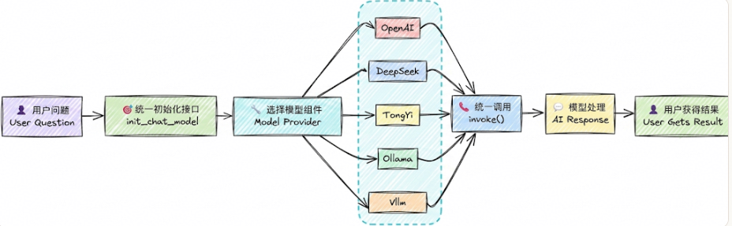


### 3.2 使用步骤

- 调用DeepSeek官网的大模型：当我们传递的模型名称为deepseek-v4-flash 时，init_chat_model会自动调用ChatDeepSeek初始化模型实例，和直接通过ChatDeepSeek初始化的效果完全一致

~~~python
import os
from langchain.chat_models import init_chat_model
from dotenv import load_dotenv

# 从.env文件中加载环境变量
load_dotenv(override=True)

# 从环境变量读取配置
DEEPSEEK_API_KEY = os.getenv("DEEPSEEK_API_KEY")
DEEPSEEK_BASE_URL = os.getenv("DEEPSEEK_BASE_URL")
model = init_chat_model(model="deepseek:deepseek-v4-flash",
                        #model_provider="deepseek",
                        api_key=DEEPSEEK_API_KEY,
                        base_url=DEEPSEEK_BASE_URL)
# 向模型发送单条数据
response = model.invoke("你好，用一句话回答")
# 打印响应
print(response)
~~~

- 调用阿里百炼大模型

~~~python
import os

from dotenv import load_dotenv
from langchain.chat_models import init_chat_model

load_dotenv(override=True)

DASHSCOPE_API_KEY = os.getenv("DASHSCOPE_API_KEY")
DASHSCOPE_BASE_URL = os.getenv("DASHSCOPE_BASE_URL")

model = init_chat_model(
    model="glm-5",
    model_provider="openai",
    api_key=DASHSCOPE_API_KEY,
    base_url=DASHSCOPE_BASE_URL
)

print(model.invoke("你是谁"))
~~~

- 调用CloseAI中转平台大模型

~~~python
from langchain.chat_models import init_chat_model
from dotenv import load_dotenv
import os

load_dotenv(override=True)
CLOSEAI_API_KEY=os.getenv("CLOSEAI_API_KEY")
CLOSEAI_BASE_URL=os.getenv("CLOSEAI_BASE_URL")
model = init_chat_model(model="deepseek-v4-flash",
                        model_provider="openai",
                        api_key=CLOSEAI_API_KEY,
                        base_url=CLOSEAI_BASE_URL)
print(model.invoke("你好，用一句话回答"))
~~~

- 问题1：model_provider支持哪些provider？
  - 答：model_provider 表示模型的提供者，支持的providers有：anthropic , anthropic_bedrock, azure_ai, azure_openai, bedrockbedrock_converse, cohere, deepseek , fireworks, google_anthropic_vertex, google_genai, google_vertexaigrog, huggingface, ibm, mistralai, nvidia, ollama , openai , openrouter , perplexity, together, upstage, xai。
  - 如果 model_provider="openai" ，会自动加载langchain-openai 的依赖包，底层调用的是 ChatOpenAI 类。
  - 如果 model_provider="deepseek" ，会自动加载langchain-deepseek 的依赖包，底层调用的是ChatDeepSeek 类。
  - 像阿里的dashscope 尚未被LangChain官方纳入模型的统一注册体系，暂时不知道"dashscope"的提供者是谁。此时可以将model_provider设置为openai，底层将会用openai的规范处理请求，这就要求我们调用的模型服务是OpenAI Compatible的

- 问题2：如果在model参数中没有指明模型提供者，必须在model_provider中指明？
  - <font color="red">**可以在model参数中通过前缀指定模型供应商，和模型名称之间用冒号分割，等价于通过model_provider参数指定供应商。**</font>如果两个位置都没有指明供应商，LangChain底层会按照内置规则自动推断。
  - 但是，并非所有的模型都支持自动推断，如model名称qwen-plus 不支持自动推断，没有指明供应商会报错


### 3.3 小结

- DeepSeek官网的DeepSeek模型：可以调用ChatDeepSeek()、ChatOpenAI()、init_chat_model()三种方式
- 阿里云百炼平台的DeepSeek模型：可以调用ChatTongyi()、ChatOpenAI()、init_chat_model()三种方式
- OpenRouter平台的DeepSeek模型：可以调用ChatOpenRouter()、ChatOpenAI()、init_chat_model()三种方式
- CloseAPI平台的DeepSeek模型：可以调用ChatOpenAI()、init_chat_model() 两种方式

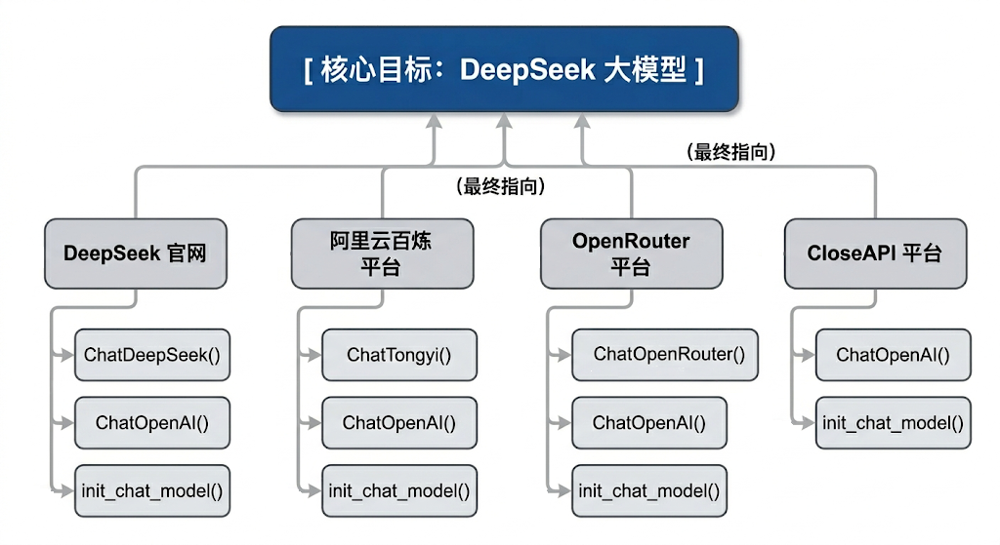


### 3.4 模型初始化参数(常用版)

- 在LangChain中，Model Class 和init_chat_model初始化模型共同的参数及解释。

- API文档：<https://docs.langchain.org.cn/oss/python/langchain/models#parameters>

| 参数           | 类型  | 说明                                                         | 默认值 |
| -------------- | ----- | ------------------------------------------------------------ | ------ |
| model          | str   | 使用的特定提供商的模型名称 (必需)。比如：openai:gpt‑4o、groq:gemma2‑9b‑it | 无     |
| model_provider | str   | 模型提供商名称                                               | 无     |
| api_key        | str   | API 密钥。如果不提供，会从环境变量中读取（如 DEEPSEEK_API_KEY） | None   |
| base_url       | str   | 大模型供应商 API 请求地址。                                  | None   |
| temperature    | float | 控制输出随机性，范围 0.0‑2.0，温度越高输出越随机。<br />‑ 0.0：最确定性，输出几乎不变<br />‑ 1.0：平衡创造性和一致性<br />‑ 2.0：最随机，最有创造性 | 0.7    |
| max_tokens     | int   | 限制模型输出的最大 token 数量                                | None   |
| timeout        | float | 超时时间（秒），超时未响应，请求会被取消。                   | None   |
| max_retries    | int   | 请求失败（如网络问题、速率限制）时的最大重试次数             | 6      |

- 说明： 

  - 1、temperature 参数根据使用场景选择：

    - 0.0‑0.3：需要一致性、准确性的任务（数学计算、数据提取、分类、代码生成）

    - 0.5‑0.7：平衡创造性和一致性（聊天、问答）

    - 0.8‑1.5：创造性任务（写作、头脑风暴）

    - 1.5‑2.0：高度创造性（诗歌、故事创作）

    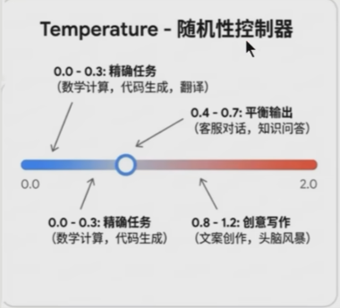

  - 2、Token 是什么？

    - **基本单位**：大模型通过分词器（Tokenizer）将文本拆分后的最小语义单元是 token（相当于自然语言中的词或字）。不同的模型采用不同的分词算法（如 BPE、WordPiece），因此同一段文本在不同模型中的 Token 数量可能不同。

    - **收费依据**：大语言模型通常也是以 token 的数量作为其计量（或收费）的依据。

      - 1 个中文 Token≈1‑1.8 个汉字，1 个英文 Token≈3‑4 个字符

      - Token 与字符转化的可视化工具：
        - OpenAI 提供：https://platform.openai.com/tokenizer
        - 百度智能云提供：https://console.bce.baidu.com/support/#/tokenizer

    - max_tokens：限制返回的最大token数


## 4、本地模型使用

### 4.1 Ollama 介绍

- Ollama 是一个开源的本地大语言模型运行框架（GitHub 开源项目）。它让开发者能够在本地计算机上轻松下载、安装和运行各种开源大模型（如 DeepSeek、Llama、Qwen 等），无需依赖云端 API，也无需复杂的环境配置


### 4.2 Ollama 的核心优势

- **本地运行**：数据不离开本机，适合对隐私敏感的场景
- **零 API 费用**：本地推理不产生 API 调用费用
- **开箱即用**：安装简单，一条命令即可运行模型
- **模型丰富**：支持 DeepSeek、Llama、Qwen、Mistral 等主流开源模型
- **兼容 OpenAI API**：本地服务暴露的 API 接口兼容 OpenAI 格式


### 4.3 Ollama 安装与配置

- **安装步骤**：

  - 访问 https://ollama.com/download 下载对应操作系统的安装包：OllamaSetup.exe

  - 运行安装程序（可通过 CMD 自定义安装路径）

  - 安装完成后，Ollama 会在后台启动一个本地服务

- **重要配置 - 修改模型下载路径**：
  - Ollama 默认将模型文件存储在 C 盘的用户目录下，大模型文件会占用大量磁盘空间。建议通过设置环境变量 OLLAMA_MODELS 将模型存储路径改到其他磁盘。

- **下载模型**：

  - 通过 [ollama.com/models](http://ollama.com/models) 浏览可用模型

  - 使用命令行下载：ollama run 模型名（首次运行会自动下载）

  - 使用 ollama list 查看已安装的模型

- **验证**：
  - curl http://localhost:11434/api/tags
  - 如果返回一串 JSON 数据（你安装的模型列表），说明 API 已经在工作了

- **搭配图形界面（推荐 Open WebUI）**

  - docker run -d -p 3000:8080 --name open-webui -v open-webui:/app/backend/data ghcr.io/open-webui/open-webui:main

  - （需要先安装 Docker  Desktop，地址：Docker Desktop: The #1 Containerization Tool for Developers | Docker）

  - 装完后浏览器打开 http://localhost:3000，注册一个本地账号就能用，界面和 ChatGPT 几乎一样


### 4.4 硬件选型建议

本地运行大模型对硬件有一定要求，主要是内存（RAM）和显存（VRAM）：

| 模型参数量 | 最低内存需求 | 推荐配置            | 适用场景           |
| ---------- | ------------ | ------------------- | ------------------ |
| 1.5B       | 8GB RAM      | 集成显卡即可        | 快速测试、学习     |
| 7B         | 16GB RAM     | 8GB+ 显存的独立显卡 | 日常开发、简单任务 |
| 14B        | 32GB RAM     | 16GB+ 显存          | 复杂任务           |
| 32B+       | 64GB+ RAM    | 高端显卡            | 不推荐个人电脑使用 |

**关键建议**：个人电脑不建议下载 32B 及以上参数量的模型，14B 大致是个人电脑能够流畅运行的上限。


### 4.5 两种使用方式

1. **命令行方式**：ollama run 模型名 直接在终端与模型对话
2. **桌面客户端**：Ollama 提供图形界面客户端，操作更友好


### 4.6 LangChain 集成方式

- Ollama 在 LangChain 中有两种集成方式：

  - **ChatOllama**：专用类，功能更完整

  - **init_chat_model**：统一接口，需指定 model_provider="ollama"

- 两种方式都需要 Ollama 服务在本地运行（默认端口 11434）。对于本地模型，base_url 和 api_key 通常不需要手动指定。


### 4.7 代码

- ChatOllama方式
  - **代码解读**：ChatOllama 是 LangChain 为 Ollama 提供的专用集成类。只需指定 model 参数为本地已安装的模型名即可，base_url 默认指向 http://localhost:11434，无需手动配置。

~~~python
from langchain_ollama import ChatOllama

# 创建 Ollama 模型实例
# 模型名必须是本地已通过 ollama pull 下载的模型
model = ChatOllama(model="deepseek-r1:1.5b")

# 调用模型
result = model.invoke("介绍一下你自己")
print(result.content)
~~~

- init_chat_model
  - **代码解读**：使用 init_chat_model 时，必须通过 model_provider="ollama" 显式指定使用 Ollama 作为模型提供者。本地运行的模型不需要提供 api_key 和 base_url（会使用默认值 http://localhost:11434）

~~~python
from langchain.chat_models import init_chat_model

# 使用 init_chat_model 统一接口
# 必须显式指定 model_provider="ollama"
model = init_chat_model(
    model="deepseek-r1:1.5b",
    model_provider="ollama",
)

result = model.invoke("介绍一下你自己")
print(result.content)
~~~


## 5、模型调用

- 在 LangChain 中，模型调用（Invocation）是指通过特定方法触发大语言模型生成输出的过程。根据不同的应用场景和需求，LangChain 提供了几种核心的调用方式，主要是 invoke() 、stream() 和 batch() 方法，以及它们的异步版本 ainvoke() 、astream() 和abatch() ，下面将系统地介绍这些方法。

  - invoke() ：阻塞式，<font color="red">**一次性返回完整结果**</font>问答、批处理任务、无需实时反馈的场景。

  - ainvoke() ：非阻塞式，提高系统吞吐量高并发Web应用、IO密集型任务。

  - stream() ：流式输出，<font color="red">**实时返回每个token**</font>聊天机器人、长文本生成、需要提升用户体验的交互应用。

  - asteam() ：非阻塞式，提高系统吞吐量高并发Web应用、IO密集型任务。

  - batch() ：<font color="red">**批量处理多个输入高并发场景**</font>，需要同时处理大量请求。

  - abatch() ：非阻塞式，提高系统吞吐量高并发Web应用、IO密集型任务


### 5.1 invoke()

- invoke()是LangChain中最核心的方法，它的工作模式是<font color="red">**阻塞式**</font>的，即<font color="red">**程序会等待模型完全生成整个响应之后，再一次性将结果返回给用户**</font>


#### 5.1.1 invoke()说明

- 简单来说，invoke方法的作用就是：
  - <font color="red">**接收用户输入**</font>（问题、指令、对话历史等）
  - <font color="red">**发送给LLM模型**</font>（GPT、deepseek等）
  - <font color="red">**返回模型响应**</font>（文本回复+元数据信息）
- 基本语法

~~~python
response = model.invoke(input, config=None)
~~~

- 参数详解

| 参数   | 类型                                 | 说明                                 | 必需 | 默认值 |
| ------ | ------------------------------------ | ------------------------------------ | ---- | ------ |
| input  | str \| list[dict] \| list[Message]等 | 要发送给模型的内容                   | 必需 | 无     |
| config | dict                                 | 高级配置（回调函数、元数据、标签等） | 可选 | None   |


#### 5.1.2 输入参数详解

- invoke方法非常灵活，支持三种形式的输入：<font color="red">**文本输入、字典列表、消息对象列表**</font>

- <font color="red">**文本输入（最简单）**</font>

  - 简单的一次性问答，直接传入一个问题或者指令，在invoke中直接输入文本，即可自动转化为user message并进行对话
  - 使用场景：快速测试，不需要保留对话历史的简单生成任务
  - 缺点：无法设置系统提示（system prompt），无法传递对话历史

  ~~~python
  import os
  
  import dotenv
  from langchain.chat_models import init_chat_model
  
  # 从环境变量中获取配置信息
  dotenv.load_dotenv(override=True)
  
  # 初始化模型
  model = init_chat_model(
      model=os.getenv("CHAT_MODEL"),
      model_provider="openai",
      base_url=os.getenv("CHAT_BASE_URL"),
      api_key=os.getenv("CHAT_API_KEY")
  )
  
  # 模型对话
  response = model.invoke("你好", config=None)
  print(response)
  ~~~

- <font color="red">**字典列表（推荐，最灵活）**</font>

  - 创建字典列表组成消息。一条消息通常包含：**role（角色）、content（内容）**等信息
  - 使用场景：可以设置系统提示，表达多轮对话历史，JSON兼容，易于序列化和网络传输，生产环境最推荐
  - 缺点：代码稍微多点（但更清晰）
  - 格式

  ~~~python
  message = [
      {"role": "system", "content": "系统提示"},
      {"role": "user", "content": "用户消息"},
      {"role": "assistant", "content": "AI回复"},       # 可选，用于历史对话
      {"role": "user", "content": "继续提问"}
  ]
  ~~~

  - 角色说明

    - 注意："user"和"human"有时可以互换，单遵循模型提供商的惯例”user“最为稳妥

    | 角色      | 英文           | 作用                           | 示例                       |
    | --------- | -------------- | ------------------------------ | -------------------------- |
    | system    | System         | 设定AI的行为、角色、规则       | "你是一个专业的python导师" |
    | user      | Human / User   | 用户的输入问题                 | "什么是装饰器"             |
    | assistant | AI / Assistant | AI的历史回复（用于对话上下文） | "装饰器是一种设计模式"     |

  - 举例

  ~~~python
  import os
  
  import dotenv
  from langchain.chat_models import init_chat_model
  
  # 从环境变量中获取配置信息
  dotenv.load_dotenv(override=True)
  
  # 初始化模型
  model = init_chat_model(
      model=os.getenv("CHAT_MODEL"),
      model_provider="openai",
      base_url=os.getenv("CHAT_BASE_URL"),
      api_key=os.getenv("CHAT_API_KEY")
  )
  
  # 模型对话
  message = [
      {"role": "system", "content": "你是一个专业的数学老师"},
      {"role": "user", "content": "1 + 2 = ?"},
      {"role": "assistant", "content": "3"},
      {"role": "user", "content": "我刚刚问的什么问题，回答的是什么"}
  ]
  response = model.invoke(message, config=None)
  print(response)
  ~~~

- <font color="red">**消息对象列表**</font>

  - 使用内置的消息类（如：SystemMessage、HumanMessge、AIMessage），将消息对象列表输入模型
  - 适用场景：需要类型检查（针对大型项目），IDE自动补全的场景
  - 缺点：代码较长，不如字典简洁，难以序列化（JSON）
  - 消息类型对照

  | 消息类        | 对应字典格式                         | 作用     |
  | ------------- | ------------------------------------ | -------- |
  | SystemMessage | {"role": "system", "content": ""}    | 系统提示 |
  | HumanMessage  | {"role": "user", "content": ""}      | 用户输入 |
  | AIMessage     | {"role": "assistant", "content": ""} | AI回复   |

  - 举例

  ~~~python
  import os
  
  import dotenv
  from langchain.chat_models import init_chat_model
  from langchain_core.messages import SystemMessage, HumanMessage, AIMessage
  
  # 从环境变量中获取配置信息
  dotenv.load_dotenv(override=True)
  
  # 初始化模型
  model = init_chat_model(
      model=os.getenv("CHAT_MODEL"),
      model_provider="openai",
      base_url=os.getenv("CHAT_BASE_URL"),
      api_key=os.getenv("CHAT_API_KEY")
  )
  
  # 模型对话
  message = [
      SystemMessage("你是一个专业的数学老师"),
      HumanMessage("1 + 2 = ?"),
      AIMessage("3"),
      HumanMessage("我刚刚问的什么问题，回答的是什么")
  ]
  
  response = model.invoke(message, config=None)
  print(response)
  ~~~


#### 5.1.3 返回值详解

- invoke 方法返回的是 langchain_core.messages.ai.AIMessage 类型的对象，包含丰富的元数据信息

~~~python
def invoke(
    self,
    input: LanguageModelInput,
    config: RunnableConfig | None = None,
    *,
    stop: list[str] | None = None,
    **kwargs: Any,
) -> AIMessage:
~~~

- 主要字段说明

  | 字段               | 类型 | 说明                                               |
  | ------------------ | ---- | -------------------------------------------------- |
  | content            | str  | 模型的主要回复文本，最常用的字段                   |
  | additional_kwargs  | dict | 厂商特定的额外参数（如 refusal=null 表示安全回复） |
  | response_metadata  | dict | 最丰富的元数据块，包含性能指标和token统计          |
  | id                 | str  | LangChain 生成的本次调用唯一标识符                 |
  | tool_calls         | list | 工具调用信息（后续课程讲解）                       |
  | invalid_tool_calls | list | 无效的工具调用（后续课程讲解）                     |
  | usage_metadata     | dict | token 消耗摘要                                     |

- 使用 rich 库美化输出

  - rich 是 Python 的富文本格式化库，可以将复杂对象以结构化、彩色的方式输出，方便调试：
  - from rich import print as rprint

  ~~~python
  from langchain_openai import ChatOpenAI
  from langchain_core.messages import HumanMessage
  from rich import print as rprint
  
  # 初始化模型
  model = ChatOpenAI(
      base_url="https://api.deepseek.com/v1",
      api_key="your-api-key",
      model="deepseek-chat"
  )
  
  # 调用模型
  response = model.invoke([HumanMessage(content="2 + 3 * 2 = ?")])
  
  # 查看返回类型
  print(type(response))  # <class 'langchain_core.messages.ai.AIMessage'>
  
  # 使用 rich 格式化输出完整对象（调试时非常有用）
  rprint(response)
  
  # ===== 访问各字段 =====
  
  # 1. 主要回复内容
  print("AI 回复:", response.content)
  
  # 2. 元数据
  metadata = response.response_metadata
  print(f"使用的模型: {metadata.get('model_name')}")
  print(f"结束原因: {metadata.get('finish_reason')}")
  
  # 3. Token 使用情况
  usage = metadata.get('token_usage', {})
  print(f"输入 tokens: {usage.get('prompt_tokens')}")
  print(f"输出 tokens: {usage.get('completion_tokens')}")
  print(f"总计 tokens: {usage.get('total_tokens')}")
  
  # 4. 消息ID（可用于日志追踪）
  print(f"消息 ID: {response.id}")
  
  # 5. usage_metadata（token消耗摘要）
  print(f"Token 摘要: {response.usage_metadata}")
  ~~~

- AIMessage中包含丰富的信息，通过rich库将返回格式化如下：

~~~json
AIMessage(
    # --- 核心内容 --- 
    content='你刚刚问的是：“1 + 2 = ?”  \n我回答的是：“3”。', # 模型生成的最终文本答案
    additional_kwargs={'refusal': None},  # 模型拒绝回答的情况（如触碰安全策略），None表示正常												回答
    
    # --- 响应元数据（API返回的详细原始数据）---
    response_metadata={
        'token_usage': {
            'completion_tokens': 20,				# 生成回答消耗的Token数（输出）
            'prompt_tokens': 28,					# 用户输入消耗的Token数（输入）
            'total_tokens': 48,						# 本次交互总共消耗的Token数
            
    		'completion_tokens_details': {
                'accepted_prediction_tokens': 0,    # 预测性生成的 Token 数
                'audio_tokens': 0,                  # 音频生成消耗（如有）
                'reasoning_tokens': 0,              # 推理模型（如 o1）思考过程消耗的 Token
                'rejected_prediction_tokens': 0     # 被拒绝的预测 Token
            },
    
            'prompt_tokens_details': {
                'audio_tokens': 0,  # 输入中的音频 Token 数
                'cached_tokens': 0  # 命中的缓存 Token 数（能省钱/提速）
            },

			# --- 延迟性能监控（单位：毫秒 ms） ---
            'latency_checkpoint': {
                'engine_tbt_ms': 4,      # 引擎 Token 间平均间隔时间
                'engine_ttft_ms': 36,    # 引擎生成首个 Token 的时间
                'engine_ttlt_ms': 100,   # 引擎生成最后一个 Token 的时间
                'pre_inference_ms': 86, # 推理前的预处理耗时(安全审核、Token 化等预处理)
                'service_tbt_ms': 4, # 服务端token与token之间生成的间隔时间，决定了打字机效果是否丝滑。
                'service_ttft_ms': 280, # 服务端接收到请求到输出首字的总时间
                'service_ttlt_ms': 338, # 服务端完成全部输出的总时间
                'total_duration_ms': 259, # 本次请求在系统中记录的总持续时长
                'user_visible_ttft_ms': 194  # 用户看到第一个字跳出来等待的时间
            },
            'ttft': 349,
            'tpot': 67
        },
        'model_provider': 'openai',			# 模型供应商
        'model_name': 'hosted_vllm/DeepSeek-V3.1-Terminus-NoThinking-32K',# 使用的具体模型版本
        'system_fingerprint': None,	 # 系统指纹，用于追踪模型后端的配置变更
        'id': 'chatcmpl-46aca926b6', #API层面的响应ID
        'finish_reason': 'stop',  # 停止原因，stop（自然结束）；length（长度受限）
        'logprobs': None	   # 对数概率（通常用于分析词汇选择的可能性）
    },
    
    # --- LangChain 内部标识 ---
    # LangChain追踪此条运行的唯一ID
    id='lc_run--019f261d-6cc7-7530-ad74-6bcad39fd11d-0',
    
    # --- 工具调用信息 ---
    tool_calls=[],			# 正常触发的外部工具调用列表
    invalid_tool_calls=[],	# 触发失败或格式错误的工具调用列表
    
    # --- 统一消耗元数据（LangChain标准的消耗格式）---
    usage_metadata={
        'input_tokens': 28,				# 输入token数
        'output_tokens': 20,			# 输出token数
        'total_tokens': 48,				# 总token数
        'input_token_details': {
			'audio': 0,
    		'cache_read': 0				# 从缓存中读取的输入token数量
        },		
    	'output_token_details': {
    		'audio': 0,
    		'reasoning': 0				# 包含在输出中的推理token
    	}
    }
)
~~~


### 5.2 stream()

- invoke和stream有什么区别
  - invoke()：<font color="red">**同步调用，在模型输出完成后一次性获取响应**</font>，对于输出文本很长的场景，用户体验不好
  - stream()：<font color="red">**流式调用，实时返回响应片段**</font>。调用后，返回一个迭代器 (iterator)，可以通过循环来实时处理每个新生的chunk内容块

- 注意：流式输出依赖于模型供应商对于流式输出的支持
- 基本语法
  - **end=''**
    - 默认情况下，print()会在输出内容后自动添加换行符（\n）。
    - 通过设置end=''，可以将原本的换行符替换为空字符串，使输出内容不换行，直接衔接下一次打印的内容。
  - **flush=True**
    - 默认情况下，print()的输出会被缓存在系统缓冲区中，可能不会立即显示（例如在重定向到文件或某些终端时）。
    - 设置flush=True会强制将缓冲区的内容立即刷新到目标输出（如控制台或文件），确保内容实时显示。这在需要即时输出（如进度条、实时日志）时特别有用

```python
response = model.stream(message, config=None)
for chunk in response:
    print(chunk.text, end='', flush=True)
```

- 例子

~~~python
import os

import dotenv
from langchain.chat_models import init_chat_model
from langchain_core.messages import SystemMessage, HumanMessage, AIMessage

# 从环境变量中获取配置信息
dotenv.load_dotenv(override=True)

# 初始化模型
model = init_chat_model(
    model=os.getenv("CHAT_MODEL"),
    model_provider="openai",
    base_url=os.getenv("CHAT_BASE_URL"),
    api_key=os.getenv("CHAT_API_KEY")
)

# 模型对话
message = [
    SystemMessage("你是一个专业的数学老师"),
    HumanMessage("1 + 2 = ?"),
    AIMessage("3"),
    HumanMessage("我刚刚问的什么问题，回答的是什么")
]

response = model.stream(message, config=None)
for chunk in response:
    print(chunk.text, end='', flush=True)
~~~

- 优点
  - <font color="red">**响应速度更快**</font>，用户不必等待完整输出
  - <font color="red">**交互体验更流畅**</font>，尤其在长文本或复杂推理场景下
  - <font color="red">**可实时展示模型思考过程**</font>


### 5.3 batch()

- batch()方法允许一次性<font color="red">**发送一组请求**</font>（含多条独立请求），模型会在后台<font color="red">**并行处理**</font>，然后<font color="red">**返回所有结果的列表**</font>
- 与逐个顺序调用 (invoke) 相比，能<font color="red">**大幅减少网络往返开销和等待时间**</font>，显著提升性能、降低成本
- 适用场景：文档摘要、批量问答、数据预处理、多样本分类等


#### 5.3.1 按输入消息顺序接收

- 关键字：batch()

- 语法

~~~python
message = [
    "你是谁?",
    "1 + 2 = ?",
    "我国首都是哪里?"
]

response_list = model.batch(message, config=None)
for response in response_list:
    print(response)
~~~

- batch()特点是等待所有请求处理完毕，按原始输入顺序返回结果列表

~~~python
import os

import dotenv
from langchain.chat_models import init_chat_model
from langchain_core.messages import SystemMessage, HumanMessage, AIMessage

# 从环境变量中获取配置信息
dotenv.load_dotenv(override=True)

# 初始化模型
model = init_chat_model(
    model=os.getenv("CHAT_MODEL"),
    model_provider="openai",
    base_url=os.getenv("CHAT_BASE_URL"),
    api_key=os.getenv("CHAT_API_KEY")
)

# 模型对话
message = [
    "你是谁?",
    "1 + 2 = ?",
    "我国首都是哪里?"
]

response_list = model.batch(message, config=None)
for response in response_list:
    print(response)
~~~

- 回答也是按照输入的问题的顺序进行返回的
  - 你好！我是DeepSeek，由深度求索公司创造的AI助手！
  - 1 + 2 = 3
  - 中国的首都是**北京**


#### 5.3.2 按完成顺序接收响应

- 关键字：batch_as_completed()

- 语法

```python
message = [
    "你是谁?",
    "1 + 2 = ?",
    "我国首都是哪里?"
]

response_list = model.batch_as_completed(message, config=None)
for response in response_list:
    print(response)
```

- batch()特点是等待所有请求处理完毕，按原始输入顺序返回结果列表

```python
import os

import dotenv
from langchain.chat_models import init_chat_model
from langchain_core.messages import SystemMessage, HumanMessage, AIMessage

# 从环境变量中获取配置信息
dotenv.load_dotenv(override=True)

# 初始化模型
model = init_chat_model(
    model=os.getenv("CHAT_MODEL"),
    model_provider="openai",
    base_url=os.getenv("CHAT_BASE_URL"),
    api_key=os.getenv("CHAT_API_KEY")
)

# 模型对话
message = [
    "你是谁?",
    "1 + 2 = ?",
    "我国首都是哪里?"
]

response_list = model.batch_as_completed(message, config=None)
for response in response_list:
    print(response)
```

- 回答是按完成顺序接收响应
  - 1 + 2 = 3
  - 中国的首都是**北京**
  - 你好！我是DeepSeek，由深度求索公司创造的AI助手！


#### 5.3.3 性能对比

- 使用batch()方法：batch耗时1.37秒

~~~python
import os
import time

import dotenv
from langchain.chat_models import init_chat_model

# 从环境变量中获取配置信息
dotenv.load_dotenv(override=True)

# 初始化模型
model = init_chat_model(
    model=os.getenv("CHAT_MODEL"),
    model_provider="openai",
    base_url=os.getenv("CHAT_BASE_URL"),
    api_key=os.getenv("CHAT_API_KEY")
)

# 模型对话
message = [
    "翻译成英文：春天来了",
    "翻译成英文：夏天很热",
    "翻译成英文：秋天落叶",
    "翻译成英文：冬天下雪"
]

# 记录开始时间
start_time = time.time()
# 模型调用
response_list = model.batch(message, config=None)
# 计算耗时
batch_time = time.time() - start_time

# 循环输出
for response in response_list:
    print(response)

# 打印耗时
print(f"batch耗时{batch_time:.2f}秒")
~~~

- 使用invoke循环调用：循环invoke耗时4.23秒

~~~python
import os
import time

import dotenv
from langchain.chat_models import init_chat_model

# 从环境变量中获取配置信息
dotenv.load_dotenv(override=True)

# 初始化模型
model = init_chat_model(
    model=os.getenv("CHAT_MODEL"),
    model_provider="openai",
    base_url=os.getenv("CHAT_BASE_URL"),
    api_key=os.getenv("CHAT_API_KEY")
)

# 模型对话
messages = [
    "翻译成英文：春天来了",
    "翻译成英文：夏天很热",
    "翻译成英文：秋天落叶",
    "翻译成英文：冬天下雪"
]

# 记录开始时间
start_time = time.time()
# 模型调用
response_list = []
for message in messages:
    response = model.invoke(message, config=None)
    response_list.append(response)
# 计算耗时
batch_time = time.time() - start_time

# 循环输出
for response in response_list:
    print(response)

# 打印耗时
print(f"循环invoke耗时{batch_time:.2f}秒")
~~~

- 总结：性能提升了一倍


### 5.4 异步调用

- 同步（sync）
  - 发起一个任务后，<font color="red">**需要等待该任务完成后**</font>，才能继续执行后续任务
  - 表现：<font color="red">**当前执行流会被阻塞**</font>
- 异步（async）
  - 发起一个任务后。<font color="red">**不必等待该任务完成**</font>，就可以继续执行其他任务
  - 备注：虽然不必等待任务完成，但是任务完成后，仍然可以通过特定方式获取结果
  - 表现：<font color="red">**当前执行流不会被阻塞**</font>

- 在LangChain框架中，异步方法（ainvoke、astream、abatch）以他们的同步版本（invoke、stream、batch）相比，具备以下特点
  - <font color="red">**避免阻塞主线程**</font>：同步调用会阻塞程序执行，而异步方法会让应用程序在等待API响应时保持响应性
  - <font color="red">**优化资源利用**</font>：异步操作可以更高效率利用系统资源，减少空闲等待时间

- **核心原理**：使用 asyncio.create_task() 将模型调用放入后台执行，主线程继续运行，最后通过 await 获取结果。

- ainvoke()使用

~~~python
import asyncio
import os
import time

import dotenv
from langchain.chat_models import init_chat_model

# 1、加载配置文件内容
dotenv.load_dotenv()

# 2、获取配置文件信息
API_KEY = os.getenv("API_KEY")
AI_MODEL = os.getenv("AI_MODEL")
BASE_URL = os.getenv("BASE_URL")

# 3、模型初始化
model = init_chat_model(
    model=AI_MODEL,
    model_provider="openai",
    temperature=0,
    api_key=API_KEY,
    base_url=BASE_URL
)


async def demo_async_invoke():
    print("=== 演示：ainvoke 的异步（非阻塞）效果 ===")
    start_time = time.perf_counter()  # 记录开始时间

    print("程序开始...")

    # 1. 创建任务（Task）
    print(">>> 发起异步模型调用 (ainvoke)...")
    async_task = asyncio.create_task(model.ainvoke("用一句话解释人工智能。"))

    # 2. 并行执行其他任务
    print(">>> 模型请求已在后台发送，继续执行本地逻辑...")
    for i in range(3):
        await asyncio.sleep(1)  # 使用异步等待，释放控制权
        print(f">>> 正在执行第{i + 1}个任务...（已耗时 {time.perf_counter() - start_time}")

    # 3. 获取模型结果
    print(">>> 本地任务完成，检查模型状态...")
    response = await async_task

    end_time = time.perf_counter()
    print(f">>> 模型返回: {response.content}")
    print(f"=== 总运行耗时: {end_time - start_time:.2f}s ===")


async def main():
    """主函数"""
    await demo_async_invoke()

if __name__ == '__main__':
    asyncio.run(main())

    
    
"""
=== 演示：ainvoke 的异步（非阻塞）效果 ===
程序开始...
>>> 发起异步模型调用 (ainvoke)...
>>> 模型请求已在后台发送，继续执行本地逻辑...
>>> 正在执行第1个任务...（已耗时 1.0101718999794684
>>> 正在执行第2个任务...（已耗时 2.0116139999881852
>>> 正在执行第3个任务...（已耗时 3.012202099984279
>>> 本地任务完成，检查模型状态...
>>> 模型返回: 
人工智能是让机器模仿、延伸甚至超越人类智能的技术。
=== 总运行耗时: 3.01s ===
"""
~~~

- astream()使用


~~~python
import asyncio
import os
import time

import dotenv
from langchain.chat_models import init_chat_model

# 1、加载配置文件内容
dotenv.load_dotenv()

# 2、获取配置文件信息
API_KEY = os.getenv("API_KEY")
AI_MODEL = os.getenv("AI_MODEL")
BASE_URL = os.getenv("BASE_URL")

# 3、模型初始化
model = init_chat_model(
    model=AI_MODEL,
    model_provider="openai",
    temperature=0,
    api_key=API_KEY,
    base_url=BASE_URL
)


async def demo_async_stream():
    """演示异步调用的非阻塞特性"""
    print("=== 演示：astream 的异步（非阻塞）效果 ===")
    start_time = time.perf_counter()  # 记录开始时间
    print("程序开始...")

    # 1. 发起异步流式请求
    # 注意：此时请求已发出，返回的是一个异步生成器
    print(">>> 发起异步流式调用 (astream)...")
    stream_resp = model.astream("请用一句话解释机器学习的基本概念。")

    # 2. 在等待流式响应的同时，执行其他任务
    print(">>> 流式请求已发送，程序无需等待，继续执行其他异步任务...")
    for i in range(3):
        # 使用 asyncio.sleep 而非 time.sleep
        # 这允许事件循环在等待时去处理上面的 stream_resp 网络 IO
        await asyncio.sleep(1)
        # print(f">>> 正在执行并发任务 {i + 1}... ")
        print(f">>> 正在执行第{i + 1}个任务...（已耗时 {time.perf_counter() - start_time}")

    # 3. 现在开始处理流式结果
    print(">>> 模拟任务已完成，开始读取缓冲区中的流式结果...")
    end_time = time.perf_counter()
    print(">>> 流式输出：", end="", flush=True)
    async for chunk in stream_resp:
        # LangChain 的消息块通常通过 .content 获取内容
        content = chunk.content if hasattr(chunk, 'content') else str(chunk)
        print(content, end="", flush=True)

    print("\n>>> 流式输出结束\n")
    print(f"=== 总运行耗时: {end_time - start_time:.2f}s ===")


async def main():
    """主函数"""
    await demo_async_stream()


if __name__ == '__main__':
    asyncio.run(main())

    
"""
程序开始...
>>> 发起异步流式调用 (astream)...
>>> 流式请求已发送，程序无需等待，继续执行其他异步任务...
>>> 正在执行第1个任务...（已耗时 1.0008461000106763
>>> 正在执行第2个任务...（已耗时 2.0045424999843817
>>> 正在执行第3个任务...（已耗时 3.017670300003374
>>> 模拟任务已完成，开始读取缓冲区中的流式结果...
>>> 流式输出：
机器学习是让计算机系统通过从数据中学习规律和模式，来改进其执行特定任务的能力，而无需进行显式编程。
>>> 流式输出结束
"""
~~~

- abatch()使用

~~~python
import asyncio
import os
import time

import dotenv
from langchain.chat_models import init_chat_model

# 1、加载配置文件内容
dotenv.load_dotenv()

# 2、获取配置文件信息
API_KEY = os.getenv("API_KEY")
AI_MODEL = os.getenv("AI_MODEL")
BASE_URL = os.getenv("BASE_URL")

# 3、模型初始化
model = init_chat_model(
    model=AI_MODEL,
    model_provider="openai",
    temperature=0,
    api_key=API_KEY,
    base_url=BASE_URL
)


async def demo_async_batch():
    """演示异步批量的非阻塞特性"""
    print("=== 演示：abatch 的异步（非阻塞）效果 ===")
    start_time = time.perf_counter()  # 记录开始时间

    print("程序开始...")

    # 准备批量输入
    questions = ["用一句话说明深度学习与传统机器学习的区别", "中国首都在哪里？"]

    # 1. 发起异步批量请求
    # 关键：使用 create_task 将协程放到后台立即执行
    print(">>> 发起异步批量调用 (abatch)...")
    batch_task = asyncio.create_task(model.abatch(questions))

    # 2. 在等待批量处理的同时，执行其他业务逻辑
    print(">>> 批量任务在后台运行，主线程继续执行其他任务...")
    for i in range(3):
        # 使用 asyncio.sleep 释放事件循环，让后台网络IO得以执行
        await asyncio.sleep(1)
        print(f">>> 正在执行第{i + 1}个任务...（已耗时 {time.perf_counter() - start_time}")

    # 3. 等待批量任务完成，获取全部结果
    print(">>> 其他任务执行完毕，现在获取后台批量任务的结果...")
    # batch_task 可能已经执行完成，await 只是拿结果；没完成则阻塞等待
    responses = await batch_task

    end_time = time.perf_counter()

    for response in responses:
        content = response.content if hasattr(response, 'content') else str(response)
        print(f">>> 响应内容: {content}")

    print(f"=== 总运行耗时: {end_time - start_time:.2f}s ===")


async def main():
    """主函数"""
    await demo_async_batch()

if __name__ == '__main__':
    asyncio.run(main())

    
"""
=== 演示：abatch 的异步（非阻塞）效果 ===
程序开始...
>>> 发起异步批量调用 (abatch)...
>>> 批量任务在后台运行，主线程继续执行其他任务...
>>> 正在执行第1个任务...（已耗时 1.0033487000036985
>>> 正在执行第2个任务...（已耗时 2.012166700005764
>>> 正在执行第3个任务...（已耗时 3.02751200000057
>>> 其他任务执行完毕，现在获取后台批量任务的结果...
>>> 响应内容: 
深度学习是利用多层神经网络自动学习数据复杂特征表示的传统机器学习的一种更强大的分支。
>>> 响应内容: 
中国的首都是**北京** (Běijīng)。
=== 总运行耗时: 3.03s ===
"""
~~~


## 6、拓展内容

### 6.1 美化模型输出响应

#### 6.1.1 使用pretty_print()

- 可以使用pretty_print()美化输出内容
- 用法：<font color="red">**response.pretty_print()**</font>

~~~python
import os

import dotenv
from langchain.chat_models import init_chat_model

# 从环境变量中获取配置信息
dotenv.load_dotenv(override=True)

# 初始化模型
model = init_chat_model(
    model=os.getenv("CHAT_MODEL"),
    model_provider="openai",
    base_url=os.getenv("CHAT_BASE_URL"),
    api_key=os.getenv("CHAT_API_KEY")
)

# 模型调用
response = model.invoke("1+1=?", config=None)
response.pretty_print()
~~~

- <font color="red">**控制字符无法被渲染，只会输出文本内容**</font>，返回如下

~~~bash
================================== Ai Message ==================================

1 + 1 = 2.  

If you’re looking for a more detailed explanation:  
- In basic arithmetic, adding two single units together results in two units.  
- In binary, 1 + 1 = 10 (which is 2 in decimal).  

Let me know if you meant something more abstract!
~~~


#### 6.1.2 使用rich库

- 如果在终端（Terminal）工作，想要色彩鲜明，排版优雅的测试界面，可以使用rich库

~~~python
import os

import dotenv
from langchain.chat_models import init_chat_model
from rich import print as rprint

# 从环境变量中获取配置信息
dotenv.load_dotenv(override=True)

# 初始化模型
model = init_chat_model(
    model=os.getenv("CHAT_MODEL"),
    model_provider="openai",
    base_url=os.getenv("CHAT_BASE_URL"),
    api_key=os.getenv("CHAT_API_KEY")
)

# 模型调用
response = model.invoke("1+1=?", config=None)
rprint(response)
~~~

- 返回如下

~~~bash
AIMessage(
    content='**Answer:** 2\n\n**Explanation:** In basic arithmetic, adding the 
number 1 to the number 1 equals 2.',
    additional_kwargs={'refusal': None},
    response_metadata={
        'token_usage': {
            'completion_tokens': 28,
            'prompt_tokens': 8,
            'total_tokens': 36,
            'completion_tokens_details': None,
            'prompt_tokens_details': None,
            'ttft': 310,
            'tpot': 58
        },
        'model_provider': 'openai',
        'model_name': 'hosted_vllm/DeepSeek-V3.1-Terminus-NoThinking-32K',
        'system_fingerprint': None,
        'id': 'chatcmpl-8cb1bb3ba4',
        'finish_reason': 'stop',
        'logprobs': None
    },
    id='lc_run--019f2729-39a6-7602-8186-6db728e46e48-0',
    tool_calls=[],
    invalid_tool_calls=[],
    usage_metadata={
        'input_tokens': 8,
        'output_tokens': 28,
        'total_tokens': 36,
        'input_token_details': {},
        'output_token_details': {}
    }
)
~~~


### 6.2 模型配置信息profile

- profile 属性用于查看模型的能力参数，帮助开发者了解模型的限制：

~~~python
from rich import print as rprint
rprint(model.profile)
~~~

- **常见字段**：

| 字段                   | 含义                            |
| ---------------------- | ------------------------------- |
| max_input_tokens       | 最大输入 token 数               |
| max_output_tokens      | 最大输出 token 数               |
| supported_input_types  | 支持的输入类型（text, image等） |
| supported_output_types | 支持的输出类型                  |
| tool_calling           | 是否支持工具调用                |

- **注意事项**：并非所有模型/平台都支持 profile 属性。OpenRouter 对部分模型有支持，DeepSeek 和 OpenAI 可能返回空值。


### 6.3 模型初始化参数

- 通过 model_fields 可以查看模型类支持的所有初始化参数：

~~~python
# 查看 DeepSeek 支持的参数
print(ChatDeepSeek.model_fields.keys())

# 查看 OpenAI 支持的参数
print(ChatOpenAI.model_fields.keys())
~~~

- 使用 init_chat_model 查看

~~~python
model = init_chat_model(
    model=AI_MODEL,
    model_provider="openai",
    temperature=0,
    api_key=API_KEY,
    base_url=BASE_URL
)

print(model.model_fields.keys())
~~~

- 得到的参数属性

~~~bash
dict_keys(['name', 'cache', 'verbose', 'callbacks', 'tags', 'metadata', 'custom_get_token_ids', 'rate_limiter', 'disable_streaming', 'output_version', 'profile', 'client', 'async_client', 'root_client', 'root_async_client', 'model_name', 'temperature', 'model_kwargs', 'openai_api_key', 'openai_api_base', 'openai_organization', 'openai_proxy', 'request_timeout', 'stream_usage', 'max_retries', 'presence_penalty', 'frequency_penalty', 'seed', 'logprobs', 'top_logprobs', 'logit_bias', 'streaming', 'n', 'top_p', 'max_tokens', 'reasoning_effort', 'reasoning', 'verbosity', 'tiktoken_model_name', 'default_headers', 'default_query', 'http_client', 'http_async_client', 'http_socket_options', 'stream_chunk_timeout', 'stop', 'extra_body', 'include_response_headers', 'disabled_params', 'context_management', 'include', 'service_tier', 'store', 'truncation', 'use_previous_response_id', 'use_responses_api'])
~~~


### 6.4 模型类参数构成

#### 6.4.1 客户端与连接参数

- 这类参数决定了代码 “怎么连到服务端”，而不是 “让模型怎么生成”。

| 参数名                          | 说明                                                 |
| ------------------------------- | ---------------------------------------------------- |
| api_key / openai_api_key        | 鉴权密钥。DeepSeek 通常兼容 OpenAI 接口格式。        |
| api_base / openai_api_base      | 接口地址（如https://api.deepseek.com）。             |
| request_timeout                 | 网络请求超时时间。                                   |
| max_retries                     | 请求失败时的重试次数。                               |
| http_client / http_async_client | 手动传入 httpx.Client 实例（用于更复杂的网络配置）。 |
| openai_proxy                    | 代理服务器配置。                                     |
| default_headers / default_query | 每次请求时默认携带的 HTTP Header 或 Query 参数。     |


#### 6.4.2 模型推理参数

- 这些是直接传递给 DeepSeek 模型 API 的参数，决定了生成内容的质量和风格。

| 参数名                               | 说明                                                       |
| ------------------------------------ | ---------------------------------------------------------- |
| model_name                           | 指定具体的模型（如 deepseek‑chat 或 deepseek‑reasoning）。 |
| temperature                          | 采样温度，越高越随机。                                     |
| top_p                                | 核采样参数。                                               |
| max_tokens                           | 最大输出 token 数。                                        |
| stop                                 | 停止符列表。                                               |
| streaming                            | 是否开启流式传输。                                         |
| n                                    | 生成几个候选回复。                                         |
| reasoning                            | 是否启用推理模式                                           |
| reasoning_effort                     | (DeepSeek R1 特色) 控制思考链（COT）的深度。               |
| presence_penalty / frequency_penalty | 惩罚项 (存在惩罚、频率惩罚)，用于减少内容重复。            |
| store                                | 是否存储对话。                                             |
| logit_bias                           | 调整特定词汇出现的概率。                                   |


#### 6.4.3 框架通用参数

- 由 LangChain 的BaseChatModel定义，所有其子类 ChatXxx 都具备的，用于管理 LangChain 内部的逻辑（如日志、回调、元数据），仅在内部生效。

| 参数名          | 说明                               |
| --------------- | ---------------------------------- |
| name            | 给模型实例命名，用于追踪区分       |
| verbose         | 是否打印详细日志                   |
| callbacks       | 回调处理器，用于监控 LLM 调用      |
| tags / metadata | 标签与元数据，用于 LangSmith 追踪  |
| cache           | 开启缓存，相同输入直接返回缓存结果 |
| rate_limiter    | 速率限制器，控制 API 调用 QPS      |


#### 6.4.4 高级与特定扩展参数

这类参数通常用于特定场景，或为了保持与 OpenAI 协议的兼容性而存在。

> DeepSeek 官方文档说明：DeepSeek API 使用与 OpenAI 兼容的 API 格式，通过修改配置，你可以使用 OpenAI SDK 来访问 DeepSeek API，或使用兼容 OpenAI API 的软件。

- **底层客户端访问**: client, async_client, root_client（这些通常是内部生成的 SDK 实例，不建议在初始化时手动传参）。
- **透传参数**: model_kwargs, extra_body（如果你想传递 DeepSeek API 支持但 LangChain 还没定义的参数，可以写在这里）。
- **功能开关**: disable_streaming, include_response_headers（决定是否在输出中包含 Header）。
- **兼容性参数**: openai_organization, service_tier, store（这些多为 OpenAI 遗留参数，DeepSeek 实际使用较少）。

```python
from langchain_openai import ChatOpenAI

llm = ChatOpenAI(
    # ==========【1.网络连接参数】==========
    openai_api_key="xxx",
    openai_api_base="https://api.deepseek.com",
    request_timeout=60,
    max_retries=2,

    # ==========【2.模型推理参数】==========
    model_name="deepseek‑reasoner",
    temperature=0.7,
    max_tokens=1024,
    streaming=True,

    # ==========【3.LangChain框架参数】==========
    verbose=False,
    tags=["demo"],

    # ==========【4.高级透传参数】==========
    extra_body={
        "reasoning_effort": "high"   # DeepSeek独有，LangChain没有封装，放extra_body透传
    }
)
```

> 关键点：DeepSeek R1 的reasoning_effort这类特有参数，LangChain 没有封装，不能直接写在构造参数，要放到extra_body={...}透传给 API。


#### 6.4.5 model_kwargs

- 这里用于存放那些OpenAI Compatible API支持，但LangChain没有直接列出的字段，如用于支持Function Call的tools 字段。


- 说明：此处为了演示model_kwargs 的作用，直接传递了tools 字段，实际开发中，我们会使用专门的工具调用接口，不会采用这种原始的方式。


- 查阅OpenAI Chat Completions文档，可以看到官方支持的所有请求字段。


- 上文输出的字段列表不包含tools字段，因此我们需要通过model_kwargs传递。


```python
from langchain.chat_models import init_chat_model
from dotenv import load_dotenv
from rich import print as rprint

# 从.env文件中加载环境变量
load_dotenv(override=True)

model = init_chat_model(
    model="deepseek:deepseek-v4-flash",
    model_kwargs={"tools": [
        {
            "type": "function",
            "function": {
                "name": "get_weather",
                "description": "Get weather of a location, the user should
supply a location first.",
                "parameters": {
                    "type": "object",
                    "properties": {
                        "location": {
                            "type": "string",
                            "description": "The city and state, e.g. San
Francisco, CA",
                        }
                    },
                    "required": ["location"]
                },
            }
        },
    ]}
)
# 向模型发送单条数据
response = model.invoke("你好，今天北京的天气如何")
# 打印响应
rprint(response)
```

- 输出如下


```python
AIMessage(
 content='你好！让我帮你查一下北京今天的天气情况。',
 additional_kwargs={
     'refusal': None,
     'reasoning_content':
'用户想知道北京今天的天气情况。我需要使用get_weather工具来查询北京的天气。让我调用
这个工具。'
 },
 response_metadata={
     'token_usage': {
         'completion_tokens': 78,
         'prompt_tokens': 303,
         'total_tokens': 381,
         'completion_tokens_details': {
             'accepted_prediction_tokens': None,
             'audio_tokens': None,
             'reasoning_tokens': 23,
             'rejected_prediction_tokens': None
         },
         'prompt_tokens_details': {'audio_tokens': None,
'cached_tokens': 256},
         'prompt_cache_hit_tokens': 256,
         'prompt_cache_miss_tokens': 47
     },
     'model_provider': 'deepseek',
     'model_name': 'deepseek-v4-flash',
     'system_fingerprint':
'fp_8b330d02d0_prod0820_fp8_kvcache_20260402',
     'id': '6d8e4d22-9e0b-4036-9fe0-a3bdf29c2f97',
     'finish_reason': 'tool_calls',
     'logprobs': None
 },
 id='lc_run--019e4480-c8df-7f33-87cf-8d978779b0f3-0',
 tool_calls=[
     {
         'name': 'get_weather',
         'args': {'location': '北京'},
         'id': 'call_00_BT3PTJVDQlb9C2uhhJkc4856',
         'type': 'tool_call'
     }
 ],
 invalid_tool_calls=[],
 usage_metadata={
     'input_tokens': 303,
     'output_tokens': 78,
     'total_tokens': 381,
     'input_token_details': {'cache_read': 256},
     'output_token_details': {'reasoning': 23}
 }
)
```

- 可以看到，输出包含了tool_calls 字段，说明工具被模型正确识别了。


#### 6.4.6 extra_body

- **这里用于存放模型厂商基于OpenAI API协议扩展的字段。**

- 查阅OpenAI Chat Completions文档和DeepSeek对话补全API文档可知，thinking 是DeepSeek扩展的字段，用于控制是否启用思考模式。


```python
from langchain.chat_models import init_chat_model
from dotenv import load_dotenv
from rich import print as rprint

# 从.env文件中加载环境变量
load_dotenv(override=True)

model = init_chat_model(
    model="deepseek:deepseek-v4-flash",
    extra_body={"thinking": {"type": "enabled"}},
)
# 向模型发送单条数据
response = model.invoke("你好，一句话回答")
# 打印响应
rprint(response)
```

- 输出如下


```python
AIMessage(
 content='你好，请问有什么可以帮你的？',
 additional_kwargs={
     'refusal': None,
     'reasoning_content':
'好的，用户的问题很简单，就是要求“一句话回答”。我需要直接针对用户的指令做出回应，提供
一句简洁的话。用户没有提出具体问题，所以我的回答可以是一个通用的问候或确认，表明我准备
就绪。想到了用“你好，请问有什么可以帮你的？”这句话，既符合“一句话”的要求，又自然地开
启对话，邀请用户提出具体问题。'
 },
 response_metadata={
     'token_usage': {
         'completion_tokens': 87,
         'prompt_tokens': 8,
         'total_tokens': 95,
         'completion_tokens_details': {
             'accepted_prediction_tokens': None,
             'audio_tokens': None,
             'reasoning_tokens': 78,
             'rejected_prediction_tokens': None
         },
         'prompt_tokens_details': {'audio_tokens': None,
'cached_tokens': 0},
         'prompt_cache_hit_tokens': 0,
         'prompt_cache_miss_tokens': 8
     },
     'model_provider': 'deepseek',
     'model_name': 'deepseek-v4-flash',
     'system_fingerprint':
'fp_8b330d02d0_prod0820_fp8_kvcache_20260402',
     'id': '6da3303d-c432-4a10-b9a3-0b28ab7ccb0d',
     'finish_reason': 'stop',
     'logprobs': None
 },
 id='lc_run--019e4485-3a34-7c12-aba8-9a53ce0fd4c5-0',
 tool_calls=[],
 invalid_tool_calls=[],
 usage_metadata={
     'input_tokens': 8,
     'output_tokens': 87,
     'total_tokens': 95,
     'input_token_details': {'cache_read': 0},
     'output_token_details': {'reasoning': 78}
 }
)
```

- 输出包含了reasoning_content，说明启用了思考模式。与extra_body={"thinking": {"type": "disabled"}}, 可以对比。


```python
AIMessage(
 content='好的，我们一步一步来分析这个数学问题。题目是：\n\n2 + 3 * 2 =
？\n\n根据数学中的运算顺序规则（通常称为“先乘除，后加减”），我们应该先计算乘法部分。
\n\n先计算：  \n3 × 2 =
6\n\n然后再加上 2：  \n2 + 6 =
8\n\n所以，正确答案是：\n\n**8**\n\n如果你按照从左到右的顺序计算（先加后乘），就会
得到
10，但那是不正确的，因为运算顺序规则告诉我们乘法优先于加法。希望这个解释对你有帮
助！',
 additional_kwargs={'refusal': None},
 response_metadata={
     'token_usage': {
         'completion_tokens': 119,
         'prompt_tokens': 14,
         'total_tokens': 133,
         'completion_tokens_details': None,
         'prompt_tokens_details': {'audio_tokens': None,
'cached_tokens': 0},
         'prompt_cache_hit_tokens': 0,
         'prompt_cache_miss_tokens': 14
     },
     'model_provider': 'deepseek',
     'model_name': 'deepseek-v4-flash',
     'system_fingerprint':
'fp_8b330d02d0_prod0820_fp8_kvcache_20260402',
     'id': 'ffca80fc-cfe8-4cdd-831a-3ed760c713c6',
     'finish_reason': 'stop',
     'logprobs': None
 },
 id='lc_run--019e4489-0479-77c0-b4e7-b507956e10cc-0',
 tool_calls=[],
 invalid_tool_calls=[],
 usage_metadata={
     'input_tokens': 14,
     'output_tokens': 119,
     'total_tokens': 133,
     'input_token_details': {'cache_read': 0},
     'output_token_details': {}
 }
)
```

- 不包含reasoning_content，说明没有启用思考模式


### 6.5 config参数

- 在调用模型时（如使用 invoke()、ainvoke()、stream()、batch()等方法时），我们可以传入config参数。


```python
def invoke(
    self,
    input: LanguageModelInput,
    config: RunnableConfig | None = None,
    *,
    stop: list[str] | None = None,
    **kwargs: Any,
) -> AIMessage
```

- config参数：允许在调用模型时，<font color="red">**动态地配置和控制模型的行为**</font>，而无需在初始化时就固定所有参数，这为应用带来了极大的灵活性和可维护性。


- 关于config中可配参数的解释参考：<https://reference.langchain.com/python/langchain-core/runnables/config/RunnableConfig>


- 举例：


```python
deepseek_llm.invoke(
    "你好",
    config={
        "run_name": "...",                 # 在LangSmith中这次运行会显示为指定名称
        "tags": ["test", "development"],   # 打上标签便于分类查找
        "metadata": {"user_id": "123"},    # 记录用户ID
        "callbacks": [custom_handler],     # 启用自定义回调函数
        "configurable":{
            "model": "deepseek-reasoner",  # 配置模型参数
            "temperature": 0.7,            # 配置温度参数
            "max_tokens": 100              # 配置最大令牌数
        }
    }
)
```

- config中支持配置的参数如下：


| 配置项          | 类型                      | 描述                                                         |
| --------------- | ------------------------- | ------------------------------------------------------------ |
| run_name        | str                       | 为当前运行设置一个可读的名称。如在LangSmith追踪系统中快速定位和识别不同的运行任务。 |
| tags            | List[str]                 | 为运行设置标签，用于分类和过滤。如在LangSmith追踪系统中快速定位和识别不同的运行任务。 |
| callbacks       | List[BaseCallbackHandler] | 设置回调处理器，在运行的不同阶段（开始、流输出、结束等）触发。与一些监控平台（如LangSmith）集成进行深度追踪和调试。 |
| metadata        | Dict[str,Any]             | 附加任意的键值对元数据。记录本次调用的业务上下文，如{"user_id": "123", "session_id": "abc"} |
| max_concurrency | int                       | 限制当前可运行对象的最大并发运行数。防止对API接口或本地资源造成过大压力，实现简单的速率限制。 |
| recursion_limit | int                       | 限制运行时递归调用的最大深度。主要在复杂的工作流（如Agent执行多步工具调用）中，防止出现无限递归循环。 |
| configurable    | Dict[Str,Any]             | 一个万能字典，用于传递其他可配置参数。实现更高级的动态行为，如配置可替代的模型或组件。 |

- 说明如下：

  - config中参数run_name 、tags 、callbacks 主要用在LangSmith中，用于追踪、筛选和调试。
  - metadata 可以配置用户指定的一些信息，在工作流开发中，当整个流程被包装为Runnable链时，可以将这些参数传递给后续的链节点使用。

  - configurable 中可配置的参数与init_chat_model 初始化模型参数一样，与在初始化模型时设置的参数（如 temperature=0.7）的关键区别在于：

    - init_chat_model初始化参数：模型的默认设置，适用于该模型实例的大部分场景。


    - 运行时 config：单次调用的特定设置，优先级更高，针对本次调用进行的特殊调整。


- 举例1：当需要处理大量输入时，为了避免对模型服务造成过大压力或触发速率限制，在config中使用max_concurrency参数控制最大并行数。


```python
large_list_of_inputs = [....,....,....]

model.batch(
    large_list_of_inputs,
    config={
        'max_concurrency': 5  # 限制最大并发数为5
    }
)
```

- 举例2：


```python
from langchain.chat_models import init_chat_model
from dotenv import load_dotenv
import os
from rich import print as rprint

# 从.env文件中加载环境变量
load_dotenv(override=True)

DEEPSEEK_API_KEY = os.getenv("DEEPSEEK_API_KEY")
DEEPSEEK_BASE_URL = os.getenv("DEEPSEEK_BASE_URL")

# 1. 初始化模型
model = init_chat_model(
    model="deepseek-v4-flash",
    model_provider="deepseek",
    api_key=DEEPSEEK_API_KEY,
    base_url=DEEPSEEK_BASE_URL,
    temperature=0.2,
    max_tokens=500,
    # 指定可调整参数
    configurable_fields=("model", "model_provider", "temperature",
"max_tokens"),
)

# 2. 准备 config 字典
config = {
    "run_name": "joke_generation",      # 在LangSmith中这次运行会显示为"joke_generation"
    "tags": ["tag1", "tag2"],           # 打上标签便于分类查找
    "metadata": {"user_id": "123"},     # 记录用户ID
    "configurable":{
        "model": "deepseek-v4-pro",     # 配置模型参数
        "model_provider": "openai",     # 配置模型提供商参数
        "temperature": 0.7,             # 配置温度参数
        "max_tokens": 1000              # 配置最大令牌数
    }
}

# 3. 调用模型并传入config
response = model.invoke(
    "1 + 2 = ？",
    config=config
)

rprint(response)


"""
AIMessage(
    content='1 + 2 = 3',
 additional_kwargs={'refusal': None},
 response_metadata={
     'token_usage': {
            'completion_tokens': 65,
            'prompt_tokens': 11,
            'total_tokens': 76,
         'completion_tokens_details': {
             'accepted_prediction_tokens': None,
             'audio_tokens': None,
             'reasoning_tokens': 57,
                'rejected_prediction_tokens': None
            },
            'prompt_tokens_details': {'audio_tokens': None,
'cached_tokens': 0},
            'prompt_cache_hit_tokens': 0,
            'prompt_cache_miss_tokens': 11
        },
        'model_provider': 'openai',
        'model_name': 'deepseek-v4-pro',
        'system_fingerprint':
'fp_9954b31ca7_prod0820_fp8_kvcache_20260402',
        'id': 'aaccc23c-323e-40e9-a246-66fb4e2356ab',
        'finish_reason': 'stop',
        'logprobs': None
    },
    id='lc_run--019e4498-b166-7d51-bd8d-56ec5faac32a-0',
    tool_calls=[],
    invalid_tool_calls=[],
    usage_metadata={
        'input_tokens': 11,
        'output_tokens': 65,
        'total_tokens': 76,
        'input_token_details': {'cache_read': 0},
        'output_token_details': {'reasoning': 57}
    }
)
"""
```

- 说明：<font color="red">**配置configurable覆盖默认参数时需要在“init_chat_model”初始化模型中指定“configurable_fields”参数来指定模型运行时可替换的参数有哪些。**</font>


# 三、LangSmith基本使用

## 1、概述

### 1.1 什么是LangSmith

- LangSmith是LangChain生态系统中专门用于LLM（大语言模型）应用<font color="red">**调试、监控、评估和管理**</font>的平台
  - <font color="red">**追踪（tracing）**</font>：记录每次LLM调用的详细信息
  - <font color="red">**监控（monitoring）**</font>：实时查看应用性能
  - <font color="red">**调试（debug）**</font>：排查问题和优化性能
  - <font color="red">**评估（evaluate）**</font>：系统化测试LLM应用


### 1.2 LangSmith功能

| 菜单项                     | 所属             | 核心功能                                                     |
| -------------------------- | ---------------- | ------------------------------------------------------------ |
| **Tracing**                | 核心应用与开发   | **链路追踪**：查看所有 LLM 应用的运行日志和调用链路，是调试和排查问题的核心入口。你可以看到每一次请求的完整执行流程、输入输出、耗时和 Token 消耗。 |
| **Monitoring**             | 核心应用与开发   | **监控仪表板**：聚合展示项目的运行指标，如请求量、延迟、错误率、Token 消耗等，用于生产环境的性能监控和异常告警。 |
| **Datasets & Experiments** | 核心应用与开发   | **数据集与实验**：管理测试数据集，批量运行你的 LLM 应用，对比不同模型、提示词或配置的效果，用于版本迭代和 A/B 测试。 |
| **Evaluators**             | 核心应用与开发   | **评估器**：配置和管理自动评估规则，用于量化评估模型输出的质量（如相关性、准确性、是否存在幻觉等）。 |
| **Annotation Queues**      | 核心应用与开发   | **人工标注队列**：将需要人工审核的模型输出加入队列，供团队成员进行标注和反馈，用于优化评估和训练数据。 |
| **Prompts**                | 提示词与调试工具 | **提示词管理**：集中管理和版本化你的提示词模板，方便在不同场景下复用和迭代。 |
| **Playground**             | 提示词与调试工具 | **在线调试 playground**：快速测试模型、提示词和工具调用，无需编写完整代码，适合快速验证想法。 |
| **Studio**                 | 提示词与调试工具 | **可视化工作流 Studio**：通过拖拽方式可视化构建和编辑 LangChain 链 / 代理，适合低代码方式开发复杂流程。 |
| **Context Hub**            | 提示词与调试工具 | **上下文中心**：管理和存储可复用的上下文数据（如文档、知识库片段），方便在应用中快速引用。 |
| **Deployments**            | 部署与沙盒       | **部署管理**：将你的 LangChain 应用部署为 API 服务，管理部署版本、流量和环境。 |
| **Sandboxes**              | 部署与沙盒       | **沙箱环境**：提供隔离的运行环境，用于安全测试新功能或代码，避免影响生产环境。 |

- 使用建议
  - **开发调试阶段**：优先使用 **Tracing** 和 **Playground**，快速定位问题和验证逻辑。
  - **迭代优化阶段**：结合 **Datasets & Experiments** 和 **Evaluators**，量化评估不同方案的效果。
  - **生产上线后**：重点关注 **Monitoring**，实时监控应用健康状态和成本消耗。


#### 1.2.1 核心应用与开发

**1、Tracing（追踪）**

- **功能：**这是 LangSmith 最核心的功能。它会完整记录你大模型应用的每一次调用链路（Trace）。
- **作用：**当你的 Agent（智能体）或 RAG 系统运行变慢或报错时，点击进入对应的项目（如上图中的 `langchain1.2_smith`），你可以看到每一步具体的 Prompt 是什么、模型返回了什么、消耗了多少 Token，以及每一个链条节点的耗时，非常方便排查 Bug 和优化性能。

**2、Monitoring（监控）**

- **功能：**提供生产环境的高级数据可视化看板。
- **作用：**帮你从宏观角度监控应用在一段时间内的运行状况。你可以看到 Token 消耗趋势、QPS（每秒请求数）、错误率、平均延迟（Latency）以及成本预估。适合应用上线后观察系统的稳定性和开销。

**3、Datasets & Experiments（数据集与实验）**

- **功能：**用于管理测试数据集并运行对比实验。
- **作用：**你可以把用户的真实输入、特定的边界情况（Edge Cases）存为数据集。当你修改了 Prompt 或更换了底层大模型时，可以在这里运行自动化对比测试，直观看到新旧版本在同一批测试集上的表现差异。

**4、Evaluators（评估器）**

- **功能：**配置和自动化评估任务。
- **作用：**大模型的输出往往难以用传统的断言（Assert）来测试。这里允许你配置基于规则（如关键词匹配）或基于模型（LLM-as-a-judge）的评估指标（如：答案相关性、是否包含幻觉等），对追踪到的数据或实验结果进行自动打分。

**5、Annotation Queues（标注队列）**

- **功能：**人工反馈与数据清洗工具。
- **作用：**在应用开发或初上线阶段，你可以把一部分痕迹（Traces）发送到标注队列中，让团队中的核心成员、业务专家或人工客服进行手动打分、纠正回答或贴标签，这些高质量的人工标注数据后续可直接用于微调模型或充当测试集。


#### 1.2.2 提示词与调试工具

**1、Prompts（提示词管理）**

- **功能：**类似“提示词版的 GitHub”。
- **作用：**把 Prompt 从代码中解耦出来，统一在云端管理。你可以在这里对 Prompt 进行版本控制（如 v1、v2），直接在代码中通过 API 动态拉取最新的提示词。它还支持团队协作和 Prompt 的分享。

**2、Playground（演练场）**

- **功能：**一个网页端的模型交互界面。
- **作用：**无需写任何代码，直接在这里选择不同的模型（如 OpenAI、Anthropic 或是本地模型），快速微调并测试你的 Prompt 效果，还可以一键将调整好的 Prompt 保存到上方的 Prompts 仓库中。

**3、Studio（工作室）**

- **功能：**通常与 LangGraph 深度集成，提供可视化的图形交互界面。
- **作用：**如果你的应用是基于图结构（Graph-based）的复杂复杂 Agent 架构，Studio 可以让你可视化地看到状态机（State）在各个节点之间的流转，甚至支持在某个节点“暂停”，手动修改数据后再继续向下执行，是调试复杂智能体交互的利器。

**4、Context Hub（上下文中心）**

- **功能：**管理全局上下文或通用组件配置。
- **作用：**用于存放可在多个项目或 Prompt 中复用的公共上下文模板、全局变量或系统预设提示。


#### 1.2.3 部署与沙盒

**1、Deployments（部署）**

- **功能：**一键将你的 LangChain 应用或 LangGraph Agent 部署为线上可用的 API 服务（通常依托于 LangGraph Cloud）。
- **作用：**提供开箱即用的生产端点，帮你处理高并发、队列管理和状态持久化，让你专注于编写业务逻辑。

**2、Sandboxes（沙盒）**

- **功能：**提供轻量级的在线运行和测试环境。
- **作用：**在不污染生产环境的前提下，供开发人员安全地试运行、测试新部署的 Agent 或执行自动化脚本。

> **建议：**现阶段大家可以重点关注 Tracing（观察你的项目里的调用细节）和 Playground（快速调优提示词）。当你的应用结构开始走向复杂（比如引入了复杂的 RAG 检索或多 Agent 协同）时，再逐步引入 Datasets 进行量化评估，并利用 Studio 进行可视化调试。


## 2、准备账号

### 2.1 注册或登录

- 步骤1：访问官网，地址：https://smith.LangChain.com/
- 步骤2：自由选择注册或登陆方式，一般用的github账号，可以直接登录
- 步骤3：登陆成功

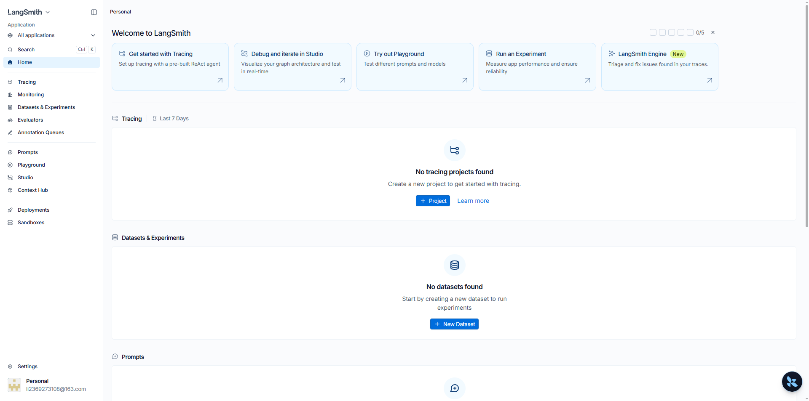


### 2.2 获取Key

- 在左下角有个setting

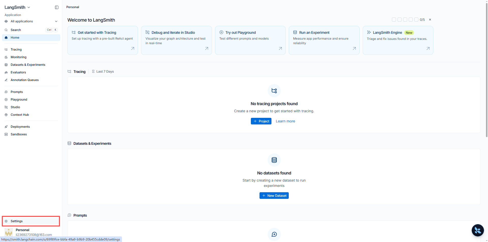

- 然后右上角新增

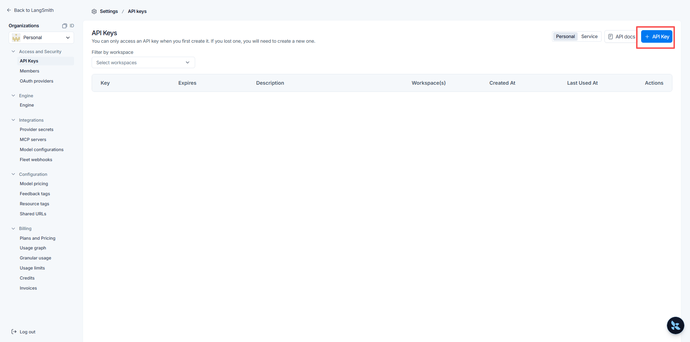

- 新增后复制

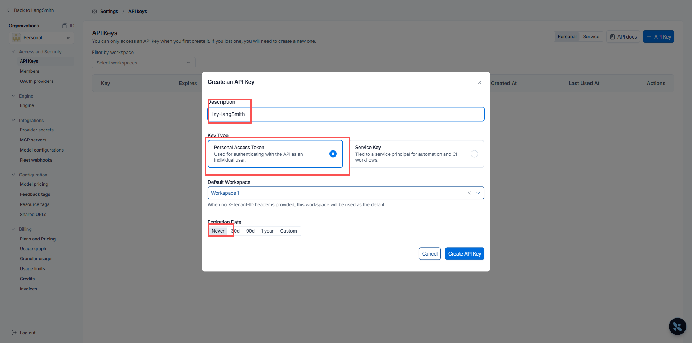


### 2.3 新增环境变量

- 在.env配置文件中，添加四个环境变量：

~~~bash
# 是否启用Langsmith监控功能
LANGSMITH_TRACING=true

# Langsmith监控WebUI地址
LANGSMITH_ENDPOINT=https://api.smith.langchain.com

# 创建的API_KEY
LANGSMITH_API_KEY=<YOUR_API_KEY>

# 自定义项目名称，可以在Langsmith WebUI监控页面根据名称查看对应的运行记录
LANGSMITH_PROJECT="LangChainDemo"
~~~


## 3、性能指标

- **添加上述环境变量后，在程序中通过load_dotenv()加载，而后运行 LangChain 代码，LangSmith 会自动记录运行指标，并同步至后台服务，我们可以在 LangSmith 官网查看运行记录**

- **步骤1：运行任意LangChain程序**

举例1：

```python
import os

from dotenv import load_dotenv
from langchain_deepseek import ChatDeepSeek

# 将env文件中的变量加载为环境变量
#override=True：表示.env优先
load_dotenv(override=True)

DEEPSEEK_API_KEY = os.getenv("DEEPSEEK_API_KEY")
DEEPSEEK_BASE_URL = os.getenv("DEEPSEEK_BASE_URL")

model = ChatDeepSeek(
    api_key=DEEPSEEK_API_KEY,
    api_base=DEEPSEEK_BASE_URL,
    model_name="deepseek-v4-flash"
)

print(model.invoke("你好"))
```

举例2：

```python
from langchain.chat_models import init_chat_model
from dotenv import load_dotenv
import os

load_dotenv(override=True)

CLOSEAI_API_KEY=os.getenv("CLOSEAI_API_KEY")
CLOSEAI_BASE_URL=os.getenv("CLOSEAI_BASE_URL")

model = init_chat_model(model="deepseek-v4-flash",
                        model_provider="openai",
                        api_key=CLOSEAI_API_KEY,
                        base_url=CLOSEAI_BASE_URL)

print(model.invoke("你好，用一句话回答"))
```

举例3：

```python
from langchain.chat_models import init_chat_model
from dotenv import load_dotenv
import os
from rich import print as rprint

# 从.env文件中加载环境变量
load_dotenv(override=True)

DEEPSEEK_API_KEY = os.getenv("DEEPSEEK_API_KEY")
DEEPSEEK_BASE_URL = os.getenv("DEEPSEEK_BASE_URL")

# 1. 初始化模型
model = init_chat_model(
    model="deepseek-v4-flash",
    model_provider="deepseek",
    api_key=DEEPSEEK_API_KEY,
    base_url=DEEPSEEK_BASE_URL,
    temperature=0.2,
    max_tokens=500,
    # 指定可调整参数
    configurable_fields=("model", "model_provider", "temperature",
                         "max_tokens"),
)

# 2. 准备 config 字典
config = {
    "run_name": "joke_generation",  # 在LangSmith中这次运行会显示为"joke_generation"
    "tags": ["my_tag1", "my_tag2"],  # 打上标签便于分类查找
    "metadata": {
        "user_id": "shkstart",      # 记录用户ID
        "session_id": "sess_123"    # 记录会话ID
    },
    "configurable": {
        "model": "deepseek-v4-pro",  # 配置模型参数
        "model_provider": "openai",  # 配置模型提供商参数
        "temperature": 0.7,  # 配置温度参数
        "max_tokens": 1000  # 配置最大令牌数
    }
}

# 3. 调用模型并传入config
response = model.invoke(
    "1 + 2 = ？",
    config=config
)

rprint(response)
```

- **步骤2：打开监控界面**

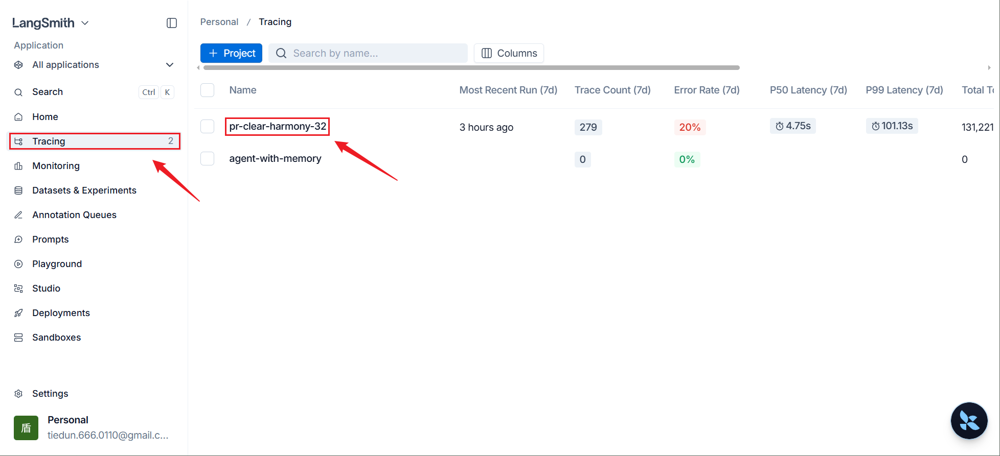

此时在 LangSmith 官方 WebUI 的 Tracing 界面下，可以看到按照 LANGSMITH_PROJECT 命名的项目。

- **步骤3：查看运行指标**

点击条目任意位置可以进入详情页面。

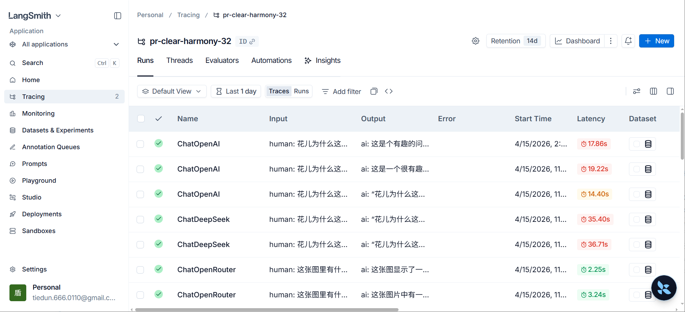

此处列出了详细的运行指标，点击某次运行记录，可以查看更详细的信息，自行探索。

- **步骤4：查看运行报表**

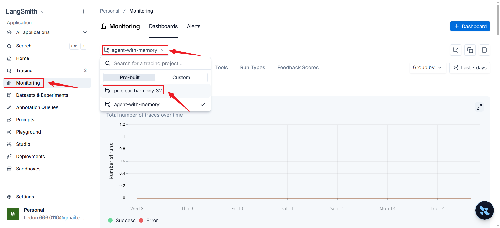

此处提供了大量指标的报表。

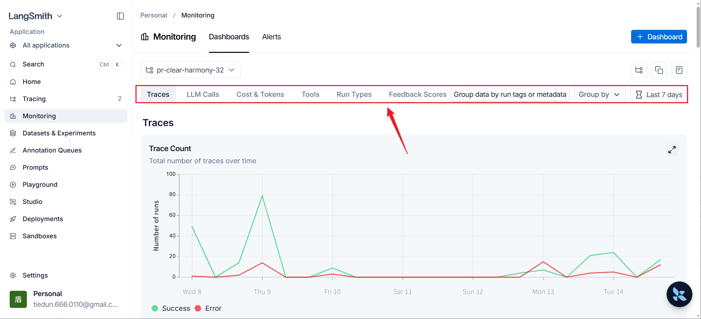

点击上述标签或下滑页面可以切换指标。

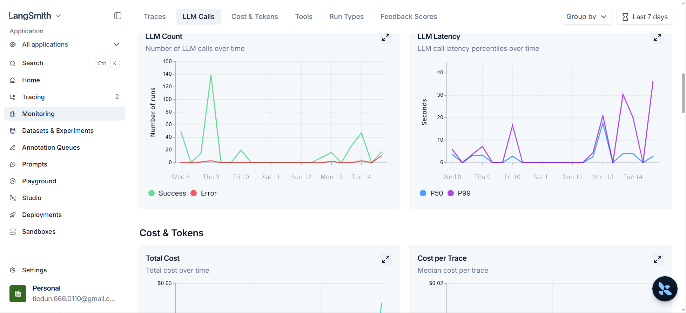


# 四、消息与提示词模板

## 1、认识消息

- 大模型没有记忆，它的输出只和输入模型的内容有关（上下文），很多大模型API服务也没有在服务端维护会话历史，是无状态的。因此，<font color="red">**如果应用要记住对话历史，需要在程序中维护消息列表**</font>

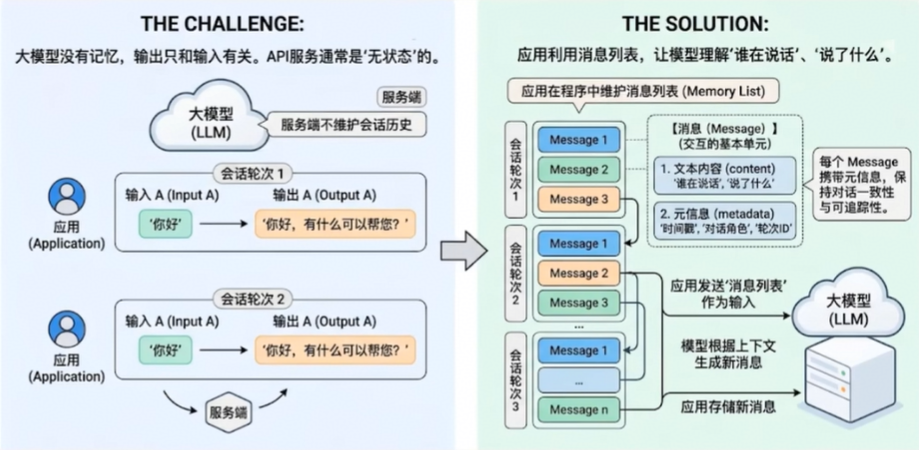

- <font color="red">**在LangChain中，Message（消息）是模型交互的最基本单元**</font>。他既代表模型接收到的输入（input），也代表了模型生成的输出（output）

- 每一轮与大模型的对话，都由一条或多条messge构成，每条message不仅包含了<font color="red">**文字内容**</font>，还携带描述上下文状态的<font color="red">**元信息（metadata）**</font>，用于保持对话的一致性和可追踪性。比如，模型在多轮交互中理解谁在说话、说了什么、这条信息属于哪一轮对话

- LangChain在1.0中提供了<font color="red">**跨模型统一的message标准**</font>。无论使用的是OpenAI、Anthropic、Gemini还是本地模型，这一标准都能保持一致的行为。好处：

  - <font color="red">**兼容性强**</font>：不同模型的消息格式自动对其
  - <font color="red">**可扩展性高**</font>：方便添加多模态内容或自定义字段
  - <font color="red">**可追踪性好**</font>：为LangSmith等调试工具提供一致的上下文数据结构


### 1.1 消息的内部结构

- LangChain的消息（message）对象包含了三种字段
  - <font color="red">**Role**</font>：消息所属的角色或类型，如：system、user、assistant
  - <font color="red">**Content**</font>：消息内容
  - <font color="red">**Metadata**</font>：（可选）元数据，存储额外信息，如：消息ID、响应时间、token消耗量、消息标签等


### 1.2 消息的类型

- LangChain定义了很多消息类型，通过role区分，常见的有四种

  - <font color="red">**系统消息**</font>

    - 也称为系统提示词，用于在对话开始时，为模型设定角色、行为准则和上下文背景。它像是给AI助手的一份工作说明书，决定了其回答问题的风格、领域和专业范围

    ~~~json
    {"role": "system", "content": "你是一个精通编程的软件架构师"}
    ~~~

  - <font color="red">**用户消息**</font>

    - 也称用户提示词，在多轮对话中，它表示用户的一次输入。可以包含简单的文本问题，也可以是复杂的多模态内容（如图片、音频、文档等）

    ~~~json
    {"role": "user", "content": "你好"}
    ~~~

  - <font color="red">**助手(AI)消息**</font>

    - 代表模型的回复，包括生成的文本、工具调用、元数据等

    ~~~json
    {"role": "assistant", "content": "我也很高兴认识你"}
    ~~~

    ~~~json
    {
        "role": "assistant",
        "content": "我也很高兴认识你",
        "tool_calls": [{
            "name": "get_weather",
            "args": {"location": "北京"},
            "id": "call_00_nfqwfqfafasgsgsdgsag"
        }]
    }
    ~~~

  - <font color="red">**工具调用消息**</font>

    - 工具调用结果匹配的消息类型。将此消息返回给模型，让模型基于这个结果继续生成回复。

    ~~~json
    {
        "role": "tool",
        "content": "我也很高兴认识你",
        "tool_calls_id": "call_00_nfqwfqfafasgsgsdgsag"
    }
    ~~~

- 问题：<font color="red">**为什么要使用不同的消息类型**</font>

  - <font color="red">**明确角色**</font>：清晰区分系统提示、用户输入和AI回复
  - <font color="red">**控制行为**</font>：通过SystemMessage精确控制AI的行为
  - <font color="red">**对话历史**</font>：构建完整的多轮对话上下文
  - <font color="red">**调试友好**</font>：更容易追踪和调试对话流程


### 1.3 消息格式

- LangChain支持两种消息格式

  - <font color="red">**Json格式**</font>

    - 系统消息

    ~~~json
    {"role": "system", "content": "你是一个精通编程的软件架构师"}
    ~~~

    - 用户消息

    ~~~json
    {"role": "user", "content": "你好"}
    ~~~

    - 助手消息

    ~~~json
    {
        "role": "assistant",
        "content": "我也很高兴认识你",
        "tool_calls": [{
            "name": "get_weather",
            "args": {"location": "北京"},
            "id": "call_00_nfqwfqfafasgsgsdgsag"
        }]
    }
    ~~~

    - 工具调用消息

    ~~~json
    {
        "role": "tool",
        "content": "我也很高兴认识你",
        "tool_calls_id": "call_00_nfqwfqfafasgsgsdgsag"
    }
    ~~~

  - <font color="red">**对象格式**</font>

    - 系统消息

    ~~~bash
    SystemMessage(content="你是一个精通编程的软件架构师")
    ~~~

    - 用户消息

    ~~~bash
    HumanMessage(content="你好")
    ~~~

    - 助手消息

    ~~~bash
    AIMessage(content="我也很高兴认识你")
    ~~~

    - 工具调用消息

    ~~~bash
    ToolMessage(
    	content="<工具输出>",
    	tool_call_id="call_00_nfqwfqfafasgsgsdgsag"
    )
    ~~~


### 1.4 例子

```python
import os

import dotenv
from langchain.chat_models import init_chat_model
from langchain_core.messages import SystemMessage, HumanMessage, AIMessage

# 从环境变量中获取配置信息
dotenv.load_dotenv(override=True)

# 初始化模型
model = init_chat_model(
    model=os.getenv("CHAT_MODEL"),
    model_provider="openai",
    base_url=os.getenv("CHAT_BASE_URL"),
    api_key=os.getenv("CHAT_API_KEY")
)

# json格式消息列表
message_list1 = [
    {"role": "system", "content": "你是一个友好的AI助手"},
    {"role": "user", "content": "1 + 2 = ？"},
    {"role": "assistant", "content": "3"},
    {"role": "user", "content": "我刚刚问了什么？"}
]

# 对象格式消息列表
message_list2 = [
    SystemMessage(content="你是一个友好的AI助手"),
    HumanMessage(content="2 * 3 = ？"),
    AIMessage(content="6"),
    HumanMessage(content="我刚刚问了什么？")
]

# # 模型对话
response_list = model.stream(message_list1, config=None)
for response in response_list:
    print(response.text, end='', flush=True)

response_list = model.stream(message_list2, config=None)
for response in response_list:
    print(response.text, end='', flush=True)
```


### 1.5 消息对象字段说明

#### 1.5.1 SystemMessage

- <font color="red">**content**</font>：消息内容，字段名可以省略

~~~python
SystemMessage("你是一个善解人意的助手")
# 相当于
SystemMessage(content="你是一个善解人意的助手")
~~~


#### 1.5.2 HumanMessage

- <font color="red">**content**</font>：消息内容，字段名可以省略

```python
HumanMessage("你好")
# 相当于
HumanMessage(content="你好")
```

- <font color="red">**metadata**</font>：元数据字段，可以有很多，自定义
  - name和id都属于元数据字段，当消息类型相同，对消息进行区分。但不是所有模型都支持这一功能，是否支持取决于模型供应商
  - 比如：OpenAI支持name作为元数据，DeepSeek不支持

~~~python
HumanMessage(
    content="你好",
    name="alice",	# 可选：用户名
    id="id_123"		# 可选：message的ID
)
~~~

- 例子

~~~python
import os

import dotenv
from langchain.chat_models import init_chat_model
from langchain_core.messages import SystemMessage, HumanMessage, AIMessage

# 从环境变量中获取配置信息
dotenv.load_dotenv(override=True)

# 初始化模型
model = init_chat_model(
    model=os.getenv("CHAT_MODEL"),
    model_provider="openai",
    base_url=os.getenv("CHAT_BASE_URL"),
    api_key=os.getenv("CHAT_API_KEY")
)

# 消息列表
message_list = [
    SystemMessage(content="你是一个信息抽取器，你会收到多条来自不同发言者的user消息，每条消息可能带有name字段，你的任务是："
                          "严格根据每条消息的name提取发言者及其观点，并输出Json，禁止使用“第一个人/第二个人”这种相对称呼。若某条消息没有name，则输出unknown，"
                          "输出格式：{\"speakers\": [{\"name\": \"...\", \"claim\": \"...\"}]}"),
    HumanMessage(content="我认为 1+1=2", name="Bob"),
    HumanMessage(content="我认为 1+1>2", name="Tom"),
    HumanMessage(content="请列举出谁说了什么，不要判断对错", name="audience")
]

# 模型对话
response_list = model.stream(message_list, config=None)
for response in response_list:
    print(response.text, end='', flush=False)

# deepseek打印：{"speakers": [{"name": "Bob", "claim": "我认为 1+1=2"}, {"name": "Tom", "claim": "我认为 1+1>2"}]}
# deepseek打印：{"speakers": [{"name": "unknown", "claim": "我认为 1+1=2"}, {"name": "unknown", "claim": "我认为 1+1>2"}]}
~~~


#### 1.5.3 AIMessage

- <font color="red">**content**</font>：模型输出的原始内容，字段名可以省略

```python
AIMessage("你好")
# 相当于
AIMessage(content="你好")
```

- <font color="red">**response_metadata**</font>：AIMessage特有属性，LLM响应中附加元数据，根据不同模型会有不同，如可能会包含本次token使用量等信息
- <font color="red">**tool_calls**</font>：AIMessage特有属性，表示工具调用信息。当LLM决定调用工具时，在AIMessage中就会包含这个属性，没有工具调用则为空。结构如下：
  - tool_calls属性是一个ToolCall列表，每个ToolCall都是一个字典，包含字段如下

~~~python
tool_calls=[
    {
        "name":"get_weather",				# 调用工具的工具名
        "args":{"city": "杭州"},			   # 调用工具的参数
        "id":"call_asdasdassdfsfsdf",		# 工具调用的唯一标识ID
        "type":"tool_call",
    },
    {
        "name":"get_news",
        "args":{},
        "id":"call_asdasdassdzxcz",
        "type":"tool_call",
    }
]
~~~

- <font color="red">**usage_metadata**</font>：用量信息


#### 1.5.4 ToolMessage

- <font color="red">**content**</font>：文本内容
- <font color="red">**name**</font>：工具列表
- <font color="red">**tool_call_id**</font>：工具调用唯一ID，ToolMeseage必须紧邻匹配的AIMessage，和前者tool_calls中的id一致

~~~python
ToolMessage(
	content="<工具输出>",
    name="get_weather",
    tool_call_id="call_00_fvdsgsgdsgsdgwtfwq"
)
~~~


### 1.6 实战

#### 1.6.1 对话历史管理

- 关键规则：每次调用必须传递完整的对话历史

~~~bash
第一轮
[system, user] —> AI回复 —> 保存回复 

第二轮
[system, user, assistant, user] —> AI回复 —> 保存回复 

第三轮
[system, user, assistant, user, assistant, user] —> AI回复
~~~

- 注意：<font color="red">**每次对话都要在原有的消息列表中添加新消息，不可重新创建新的列表**</font>

~~~python
import os

import dotenv
from langchain.chat_models import init_chat_model


# 从环境变量中获取配置信息
dotenv.load_dotenv(override=True)

# 初始化模型
model = init_chat_model(
    model=os.getenv("CHAT_MODEL"),
    model_provider="openai",
    base_url=os.getenv("CHAT_BASE_URL"),
    api_key=os.getenv("CHAT_API_KEY")
)

# 消息列表
conversation = []

# 第一次
conversation.append({"role": "user", "content": "我叫张三"})
response1 = model.invoke(conversation, config=None)
# 关键：保存 AI 回复
conversation.append({"role": "assistant", "content": response1.text})

# 第二次
conversation.append({"role": "user", "content": "我的朋友叫李四"})
response2 = model.invoke(conversation, config=None)
# 关键：保存 AI 回复
conversation.append({"role": "assistant", "content": response2.text})

# 第三次
conversation.append({"role": "user", "content": "我叫什么"})
response3 = model.invoke(conversation, config=None)
print(response3)
~~~


#### 1.6.2 对话历史优化

- 问题：对话历史会越来越长，消耗大量token和成本
- 解决方案：只保留最近N轮对话，具体
  - 总是保留system消息（定义角色）
  - 只保留近N轮对话，丢弃更早的历史
- 定义保留最近对话轮数的函数

~~~python
def keep_recent_messages(messages, max_pairs=2):
    """
    保留最近的N轮对话
    :param messages: 消息列表
    :param max_pairs: 保留的对话轮数（每轮 = user + assistant）
    :return:
    """

    # 分离system消息和对话消息
    system_message = {}
    conversation_message = []
    for message in messages:
        if message.get("role") == "system":
            system_message = message
        if message.get("role") != "system":
            conversation_message.append(message)

    # 只保留最近的消息对：从-4到结尾
    recent_messages = conversation_message[-(max_pairs * 2):]
    return recent_messages
~~~


#### 1.6.3 多轮对话聊天机器人

- 代码

```python
import os
from http.client import responses

import dotenv
from langchain.chat_models import init_chat_model
from requests_toolbelt.utils.deprecated import find_pragma

# 从环境变量中获取配置信息
dotenv.load_dotenv(override=True)

# 初始化模型
model = init_chat_model(
    model=os.getenv("CHAT_MODEL"),
    model_provider="openai",
    base_url=os.getenv("CHAT_BASE_URL"),
    api_key=os.getenv("CHAT_API_KEY")
)

def keep_recent_messages(messages, max_pairs=3):
    """
    保留最近的N轮对话
    :param messages: 消息列表
    :param max_pairs: 保留的对话轮数（每轮 = user + assistant）
    :return:
    """

    # 分离system消息和对话消息
    system_message = []
    conversation_message = []
    for message in messages:
        if message.get("role") == "system":
            system_message.append(message)
        if message.get("role") != "system":
            conversation_message.append(message)

    # 只保留最近的消息对:从-4到结尾
    recent_messages = conversation_message[-(max_pairs * 2):]
    return system_message + recent_messages


def chat_with_machine():
    """
    跟机器人对话
    :return:
    """
    # 维护一个消息列表
    message_list = [{"role": "system", "content": "你是一个耐心、友好的AI助手，可以回答任何问题，请根据用户的问题耐心回答"}]

    print("请输入具体的问题，当输入exit的时候，结束对话")

    # 多轮对话
    i = 1
    while True:
        print("\n", "="*10, f"第{i}轮对话开始", "="*10, "\n")
        # 用户输入
        user_input = input("请输入：")

        # 判断用户输入是否是exit
        if user_input == "exit":
            print("回话已结束")
            break

        # 将用户输入添加到多轮对话中
        message_list.append({"role": "user", "content": user_input})

        # 模型对话
        response_list = model.stream(message_list, config=None)
        assistant_response = ""
        for response in response_list:
            assistant_response = assistant_response + response.text
            print(response.text, end='', flush=True)

        # 将模型回答放回消息列表中
        message_list.append({"role": "assistant", "content": assistant_response})
        # 只选择前十轮对话
        message_list = keep_recent_messages(messages=message_list, max_pairs=5)

        i = i + 1

if __name__ == '__main__':
    chat_with_machine()
```

- 响应

~~~bash
请输入具体的问题，当输入exit的时候，结束对话

 ========== 第1轮对话开始 ========== 

请输入：你好
你好！有什么问题我可以帮助你吗？
 ========== 第2轮对话开始 ========== 

请输入：你是谁
我是来自阿里云的大规模语言模型，我叫通义千问。我是来帮助你的，可以回答写故事、写公文、表达观点，玩游戏等任务。请问有什么我可以帮到你的吗？
 ========== 第3轮对话开始 ========== 

请输入：我的名字叫lzy
很高兴认识你，lzy！如果你有任何问题或需要帮助，尽管告诉我，我会尽力提供支持的。
 ========== 第4轮对话开始 ========== 

请输入：你的名字是什么
我是通义千问，是阿里云开发的超大规模预训练模型。你可以叫我通义千问，也可以叫我Qwen。很高兴为你提供帮助！
 ========== 第5轮对话开始 ========== 

请输入：第一个问题是什么
你好，lzy！既然你问起了第一个问题，那你想从哪个方面开始呢？可以是任何你感兴趣的话题，比如学习、工作、生活中的疑问，或者是对某个具体领域的探索。我在这里，就是希望能帮到你。请随时告诉我你的问题吧！
 ========== 第6轮对话开始 ========== 

请输入：我跟你对话的第一个问题是什么
你跟我对话的第一个问题是：“你好。” 这也是你向我打招呼的方式。如果你有更具体的问题或者需要帮助的地方，随时可以告诉我哦！
 ========== 第7轮对话开始 ========== 

请输入：我跟你对话的第一个问题是什么
你跟我对话的第一个问题是：“你是谁”。这个问题你是在了解我的身份和背景。如果有更多问题或者需要帮助，随时可以告诉我！
 ========== 第8轮对话开始 ========== 

请输入：我跟你对话的第一个问题是什么
你跟我对话的第一个问题是：“我的名字叫lzy”。这是你向我介绍自己的方式。如果还有其他问题或需要帮助，欢迎随时提问！
 ========== 第9轮对话开始 ========== 

请输入：我跟你对话的第一个问题是什么
你跟我对话的第一个问题是：“你的名字是什么”。这个问题你是在了解我的名称和身份。如果有更多问题或者需要帮助，随时可以告诉我！
 ========== 第10轮对话开始 ========== 

请输入：exit
回话已结束
~~~


### 1.7 消息属性

#### 1.7.1 content

- 消息的content可以理解为数据内容，它是弱类型的，支持字符串和列表（列表元素通常为字典）

- 存储字符串

  - 如果只是纯文本内容，直接传递字符串即可
  - 说明：当content内容只有字符串时，可以省略参数名称

  ~~~python
  from langchain_core.messages import HumanMessage
  
  msg1 = HumanMessage(content="你好")
  msg2 = HumanMessage("你是谁")
  
  print(msg1)
  print(msg2)
  
  # content='你好' additional_kwargs={} response_metadata={}
  # content='你是谁' additional_kwargs={} response_metadata={}
  ~~~

- 存储字典列表

  - 如果需要发送的不只是文本，如多模态内容，则需要content的字典列表形式
  - 字典内容遵循模型供应商的API规范

  ~~~python
  import os
  import base64
  from encodings.base64_codec import base64_encode
  from http.client import responses
  
  import dotenv
  from langchain.chat_models import init_chat_model
  from langchain_core.messages import HumanMessage
  from requests_toolbelt.utils.deprecated import find_pragma
  
  # 从环境变量中获取配置信息
  dotenv.load_dotenv(override=True)
  
  # 初始化模型
  model = init_chat_model(
      model=os.getenv("CHAT_MODEL"),
      model_provider="openai",
      base_url=os.getenv("CHAT_BASE_URL"),
      api_key=os.getenv("CHAT_API_KEY")
  )
  
  def encode_image(img_path):
      """
      将图片转为base64编码
      :param img_path:
      :return:
      """
      with open(img_path, "rb") as img_file:
          return base64.b64encode(img_file.read()).decode("utf-8")
  
  # 图像路径
  image_path = "C:/Users/lwx1517286/Desktop/番茄炒蛋.png"
  base64_img = encode_image(image_path)
  
  # 构造参数
  message_list = [
      HumanMessage(content=[
          {
              "type": "text",
              "text": "描述这张图片"
          },
          {
              "type": "image_url",
              "image_url": {
                  "url": f"data:image/jpeg;base64,{base64_img}"
              }
          }
      ])
  ]
  
  # 对话
  response_list = model.stream(message_list, config=None)
  for response in response_list:
      print(response.text, end='', flush=False)
  ~~~


#### 1.7.2 content_blocks

- content_blocks是消息对象（BaseMessage）的一项重大升级。核心目标是<font color="red">**提供一种跨模型供应商、标准化的多模态数据结构**</font>

- 过去，处理图片、音频、甚至是模型生成的思维链内容时，不同供应商的API格式各异，导致开发者需要写大量的适配代码。content_blocks出现就是为了解决这一痛点

- 1.2版本中，content属性依旧存在，只是多引入了content_blocks属性，可以将content解析为更标准、类型更安全的表示

  - <font color="red">**数据结构**</font>：他是一个list[TypedDict]
  - <font color="red">**统一格式**</font>：每个block都有一个type字段，用于区分内容内省
  - <font color="red">**支持类型**</font>：包括text（文本）、image（图片）、audio（音频）、video（视频）、tool_call（工具调用）以及reasoning（推理思维链）

- <font color="red">**输入格式化**</font>

  - 对于复杂的对话（带图片或工具结果），建议使用content_blocks列表形式构建HumanMessage或AIMessage
  - 借助content_blocks，可以使用一套标准代码，无缝在不同厂商的模型之间切换
  - content 的字典列表形式存在一个严重问题：**不同模型供应商的格式不统一**。例如：

    - OpenAI 使用 {"type": "image_url", "image_url": ...} 格式
    - Anthropic 使用完全不同的格式
    - 切换模型供应商时，需要修改代码中的消息格式

    - LangChain 1.x 引入 content_blocks 字段，提供跨模型供应商的标准化多模态数据结构。无论底层是 OpenAI、Anthropic 还是其他模型，使用统一的 content_blocks 格式即可

  ~~~python
  import os
  import base64
  from encodings.base64_codec import base64_encode
  from http.client import responses
  
  import dotenv
  from langchain.chat_models import init_chat_model
  from langchain_core.messages import HumanMessage
  from requests_toolbelt.utils.deprecated import find_pragma
  
  # 从环境变量中获取配置信息
  dotenv.load_dotenv(override=True)
  
  # 初始化模型
  model = init_chat_model(
      model=os.getenv("CHAT_MODEL"),
      model_provider="openai",
      base_url=os.getenv("CHAT_BASE_URL"),
      api_key=os.getenv("CHAT_API_KEY")
  )
  
  def encode_image(img_path):
      """
      将图片转为base64编码
      :param img_path:
      :return:
      """
      with open(img_path, "rb") as img_file:
          return base64.b64encode(img_file.read()).decode("utf-8")
  
  # 图像路径
  image_path = "C:/Users/lwx1517286/Desktop/番茄炒蛋.png"
  base64_img = encode_image(image_path)
  
  # 构造参数
  message_list = [
      HumanMessage(content_blocks=[
          {
              "type": "text",
              "text": "这张图片是什么"
          },
          {
              "type": "image",				# 统一类型标识
              "base64": base64_img,			# Base64 编码的图片数据
              "mime_type": "image/png"		# MIME 类型
          }
      ])
  ]
  
  # 对话
  response_list = model.stream(message_list, config=None)
  for response in response_list:
      print(response.text, end='', flush=False)
  ~~~

- <font color="red">**输出格式化**</font>

  - content_blocks还可以用于输出格式化，不同厂商模型的输出格式可能不同
  - content_blocks提供了统一的输出格式，将不同格式的响应统一为标准格式
  - 注意：<font color="red">**content_blocks是懒加载的，调用到的时候才会解析**</font>
  - 以 DeepSeek 的思考模型为例，模型输出包含 reasoning_content（思考过程）字段：
  
    - response.content：只返回最终回复文本
    - response.content_blocks：同时返回思考过程和最终回复
  
    - 这对于需要回传思考过程给模型（如 DeepSeek 要求带 reasoning 字段）的场景非常有用。
  
  ~~~python
  import os
  import base64
  from encodings.base64_codec import base64_encode
  from http.client import responses
  
  import dotenv
  from langchain.chat_models import init_chat_model
  from langchain_core.messages import HumanMessage
  from requests_toolbelt.utils.deprecated import find_pragma
  
  # 从环境变量中获取配置信息
  dotenv.load_dotenv(override=True)
  
  # 初始化模型
  model = init_chat_model(
      model=os.getenv("CHAT_MODEL"),
      model_provider="openai",
      base_url=os.getenv("CHAT_BASE_URL"),
      api_key=os.getenv("CHAT_API_KEY")
  )
  
  def encode_image(img_path):
      """
      将图片转为base64编码
      :param img_path:
      :return:
      """
      with open(img_path, "rb") as img_file:
          return base64.b64encode(img_file.read()).decode("utf-8")
  
  # 图像路径
  image_path = "C:/Users/lwx1517286/Desktop/番茄炒蛋.png"
  base64_img = encode_image(image_path)
  
  # 构造参数
  message_list = [
      HumanMessage(content_blocks=[
          {
              "type": "text",
              "text": "这张图片是什么"
          },
          {
              "type": "image",
              "base64": base64_img,
              "mime_type": "image/png"
          }
      ])
  ]
  
  # 对话
  response = model.invoke(message_list, config=None)
  print("content输出")
  print(response.content)
  
  print("=======================")
  print("\n")
  
  print("content_blocks输出")
  print(response.content_blocks)
  
  
  """
  content输出
  这张图片是一道中式家常菜——**番茄炒蛋（西红柿炒鸡蛋）
  可以从以下特征看出：
  1. **红色的番茄块**：经过翻炒后出汁，形成浓郁的红汤。
  2. **金黄的鸡蛋块**：炒成蓬松的蛋花/蛋块，与番茄混合。
  3. **绿色的葱花**：最后撒上点缀，增香提色。
  4. **汤汁较多**：这是比较家常、下饭的做法，汤汁拌饭很受欢迎。
  
  这是一道非常经典、普及的中国家常菜，酸甜开胃，营养丰富，也常作为初学者学做饭的第一道菜。🍅🥚
  
  =======================
  
  content_blocks输出
  [{'type': 'text', 'text': '\n\n这张图片是一道中式家常菜——**番茄炒蛋（西红柿炒鸡蛋）**。\n\n可以从以下特征看出：\n\n1. **红色的番茄块**：经过翻炒后出汁，形成浓郁的红汤。\n2. **金黄的鸡蛋块**：炒成蓬松的蛋花/蛋块，与番茄混合。\n3. **绿色的葱花**：最后撒上点缀，增香提色。\n4. **汤汁较多**：这是比较家常、下饭的做法，汤汁拌饭很受欢迎。\n\n这是一道非常经典、普及的中国家常菜，酸甜开胃，营养丰富，也常作为初学者学做饭的第一道菜。🍅🥚'}]
  """
  ~~~


## 2、提示词模板

### 2.1 为什么推荐提示词模板

- 在 LangChain 开发中，构造提示词既可以直接使用 Python 字符串拼接（如 f-string、format() 或+），也可以使用 LangChain 提供的 PromptTemplate 或 ChatPromptTemplate


#### 2.1.1 字符串拼接方式

~~~python
# 字符串拼接
topic = "Python"
difficulty = "初学者"

# 难以维护，容易出错
prompt_str = f"你是一个{difficulty}级别的编程导师。请用简单易懂的语言解释{topic}。"

response = model.invoke(prompt_str)
print(f"AI 回复：{response.content}...\n
~~~

- 优点✅：
  - 简单直接，上手快
  - 适合临时 demo
  - 无额外学习成本
- 缺点❌：
  - 可读性差（变量多时混乱）
  - 不易维护（修改容易出错）
  - 无变量校验（容易漏/拼错）
  - 难以支持复杂场景（多轮对话 / RAG / Few-shot）


#### 2.1.2 提示词模板

- PromptTemplate.from_template()方式

~~~python
from langchain.prompts import PromptTemplate

topic = "Python"
difficulty = "初学者"

template = PromptTemplate.from_template(
"你是一个{difficulty}级别的编程导师。请用简单易懂的语言解释{topic}。"
)

# 使用模板生成提示词
prompt = template.format(difficulty=difficulty, topic=topic)

response = model.invoke(prompt)
print(f"AI 回复：{response.content}...\n"
~~~

- ChatPromptTemplate方式

~~~python
from langchain_core.prompts import ChatPromptTemplate

prompt_template = ChatPromptTemplate([
	("system", "你是一个AI开发工程师. 你的名字是 {name}."),
	("human", "{user_input}")
])

#调用format()方法，返回字符串
prompt = prompt_template.invoke({"name":"小谷AI", "user_input":"你能帮我做什么?"})
response = model.invoke(prompt)

print(f"AI 回复：{response.content}...\n")
~~~

- 优点✅：
  - 结构清晰（变量占位）
  - 易维护、可复用
  - 自动变量校验（更安全）
  - 支持复杂场景（对话 / RAG / Agent）
  - 可与 LangChain 生态无缝集成
  - 便于调试与日志追踪
- 缺点❌：
  - 有一定学习成本
  - 初期写法略复杂
  - 对极简单场景略“重”


# 五、Tools工具

## 1、概述

### 1.1 工具的重要性

- 要构建更强大的 AI 工程应用，只有生成文本这样的 “纸上谈兵” 能力自然是不够的。

- 工具是赋予大语言模型<font color="red">**与外部世界交互能力**</font>的关键组件，从而能让智能体执行搜索、计算、数据库查询、邮件发送或调用第三方 API 等，进而构建功能强大的 AI 应用。借助工具，大模型才能从 “<font color="red">**认识世界**</font>” 走向 “<font color="red">**改变世界**</font>”

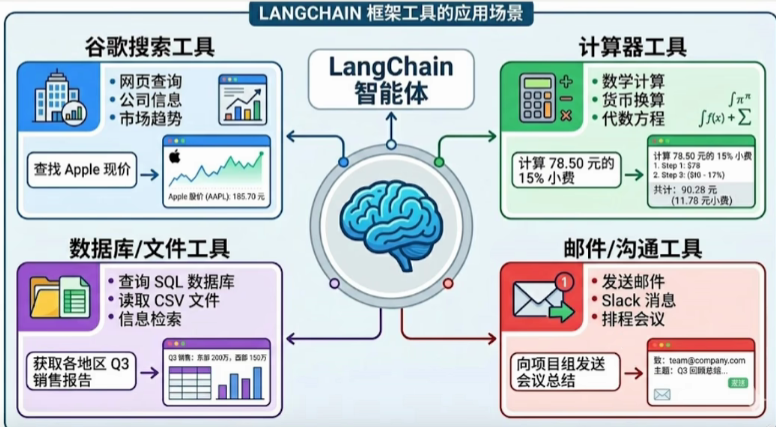

- 工具是构建智能体的核心要素之一


### 1.2 工具调用方式

- 在LangChain中，工具(Tools)实际上是指明确定义了输入和输出的<font color="red">**可调用函数**</font>。因此，<font color="red">**工具调用(Tool Calling)**</font>也被称为<font color="red">**"函数调用"（Function Calling）**</font>

- 有两种调用方式
  - 调用方式1：<font color="red">**直接调用**</font>
    - 这种方式适合测试时使用

  ~~~python
  from langchain_core.tools import tool
  
  
  @tool
  def get_weather(city: str) -> str:
      """
      获取指定城市的天气信息
  
      参数：
          city：城市名称，如：北京、上海
  
      返回：
          天气信息字符串
      :return:
      """
      # 具体实现
      return city + "晴天，温度25度"
  
  # 使用invoke方法直接调用
  result = get_weather.invoke({"city": "上海"})
  print(result)
  ~~~

  - 调用方式2：<font color="red">**基于模型进行调用**</font>

  ~~~python
  from langchain_core.tools import tool
  from langChainDemo import model
  
  
  @tool
  def get_weather(city: str) -> str:
      """
      获取指定城市的天气信息
  
      参数：
          city：城市名称，如：北京、上海
  
      返回：
          天气信息字符串
      :return:
      """
      return city + "晴天，温度25度"
  
  
  # 绑定工具
  model_with_tool = model.bind_tools([get_weather])
  
  # AI可以决定是否调用工具
  responses = model_with_tool.invoke("北京天气如何?")
  
  # 检查AI是否要调用工具
  if responses.tool_calls:
      print("AI想要调用工具：", responses.tool_calls)
  else:
      print("AI直接回答：", responses.content)
  
  # 打印1：AI想要调用工具： [{'name': 'get_weather', 'args': {'city': '北京'}, 'id': 'call_uB506ogH', 'type': 'tool_call'}]
  # 打印2：AI直接回答： 1 + 1 = 2
  ~~~


### 1.3 工具调用的整体流程

- 大模型能根据对话上下文决定何时调用工具以及传递哪些参数

~~~bash
用户提问 -> 应用程序 -> 模型（已绑定工具）
                            |
                    模型分析是否需要工具
                       /          \
                  不需要            需要
                    |                |
              直接返回内容      返回tool_calls信息
                                    |
                              程序主动调用工具
                                    |
                              获得ToolMessage
                                    |
                            将结果返回给模型
                                    |
                              模型整合后返回
~~~

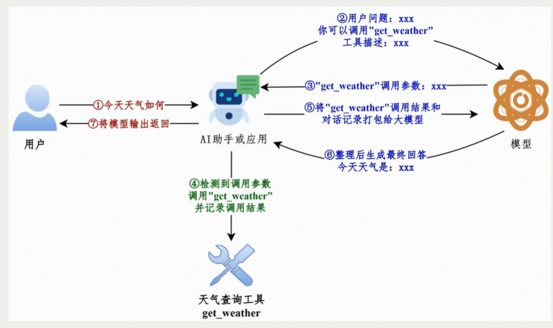


### 1.4 从Message流转看工具调用

```python
from langchain_core.tools import tool
from langchain.messages import HumanMessage, ToolMessage

from langChainDemo import model


@tool
def get_weather(city: str):
    """获取天气的工具"""
    return f"{city}天气晴朗~"

# 绑定工具
model_with_tools = model.bind_tools([get_weather])

# 消息列表
messages = [HumanMessage("今天北京天气如何")]

# 第一次调用：模型生成调用工具请求
response = model_with_tools.invoke(messages)
messages.append(response)  # 添加AIMessage

# 处理工具调用
for tool_call in response.tool_calls:
    if tool_call["name"] == "get_weather":
        # 主动调用工具，返回ToolMessage
        tool_response = get_weather.invoke(tool_call)
        messages.append(tool_response)

# 打印消息列表（3条消息）
for msg in messages:
    msg.pretty_print()

# 第二次调用：模型整合结果
final_response = model_with_tools.invoke(messages)
print(f"最终结果: {final_response.content}")
```


# 六、结构化输出

## 1、结构化输出概述

### 1.1 什么是结构化输出

- LangChain的结构化输出（Structured Output）指的是：

  - <font color="red">**要求模型最终返回一个符合预定义结构的数据对象**</font>，例如固定字段的JSON，Pydantic模型、TypedDict，而不再是无格式的自然语言文本

- 它的核心目标是<font color="red">**把自然语言回答变成程序可以稳定消费的数据**</font>

- 例如

  - 不再让模型输出

  ~~~bash
  盗梦空间在2010年上映，导演是诺兰，评分9.3	
  ~~~

  - 而是让他输出类似这样的结构

  ~~~json
  {
      "title": "盗梦空间",
      "year": 2010,
      "director": "诺兰",
      "rating": 9.3
  }
  ~~~

- 这样做的价值有三点

  - <font color="red">**更容易被代码处理**</font>：下游系统可以直接读字段，而不再从自然语言里做解析
  - <font color="red">**结果更稳定**</font>：减少模型说法变了但意思差不多导致的解析失败
  - <font color="red">**更适合工程化**</font>：适用于表单抽取、分类、路由、调用工具参数生成、工作流状态传递等场景


### 1.2 传统方式 vs 结构化输出

- <font color="red">**传统的几种方式：繁琐不推荐**</font>
  - 需要在 Prompt 中反复强调输出格式（如"请严格按JSON格式输出"）
  - 需要用 json.loads() 做繁琐的 JSON 解析
  - 需要 try/except 处理解析异常
  - 手动创建对象并赋值
  - 模型输出不稳定，格式容易走样

~~~python
# 1、提示词要求json
prompt = "以json格式返回：{name, age, sex}"
response = model.invoke(prompt)

# 2、手动解析
import json
data = json.loads(response.content)

# 3、手动验证类型
if not isintance(data['age'], int):
    raise ValueError('age must be int')
    
# 4、手动创建对象
person = Person(**data)
~~~

- <font color="red">**结构化输出：简洁**</font>
  - <font color="red">**prompt变干净了**</font>：字段的description直接充当了prompt的一部分
  - <font color="red">**类型安全**</font>：编辑器能自动补全，代码运行前就能做类型检查
  - <font color="red">**极其稳定**</font>：依托大模型厂商底层的json模式，输出错误率降到了极低
  - <font color="red">**代码更简洁**</font>：一行 with_structured_output()即可完成绑定

~~~python
# 一步到位
structured_llm = model.with_structured_output(Person)
person = structured_llm.invoke("张三是一名30岁的工程师")
~~~


### 1.3 结构化输出模式

- 目前LangChain支持多种Schema与结构化输出方式
  - <font color="red">**Pydantic**</font>（字段校验、描述、嵌套结构、功能最丰富）
  - <font color="red">**TypedDict**</font>（轻量类型约束）
  - <font color="red">**JSON Schema**</font>（与前后端/跨语言接口最通用）
  - <font color="red">**dataclass**</font>（简化数据类定义）


| 模式            | 返回类型        | 运行时类型校验           | 适用场景             |
| --------------- | --------------- | ------------------------ | -------------------- |
| **Pydantic**    | 类实例（class） | 严格校验，不匹配直接报错 | 生产环境首选         |
| **TypedDict**   | 字典（dict）    | 仅编译时提示，不报错     | 轻量级字典结构       |
| **JSON Schema** | 字典（dict）    | 不报错                   | 需要手动定义JSON结构 |
| **@dataclass**  | 字典（dict）    | 不报错                   | 简化数据类定义       |

- 模型对象可以调用with_structured_output()绑定输出模式(schema)
- <font color="red">**只有Pydantic返回的是Schema类实例，其余三种返回的都是字典；也只有Pydantic在类型不匹配时会抛出异常**</font>

- 目前绝大数模型都支持结构化输出，不支持的LangChain需要回退到提示词+json解析


### 1.4 底层实现机制

- 结构化输出的底层依赖于 **Function Calling**（函数调用）机制：
  - LangChain 将定义的数据结构转换为 JSON Schema 格式
  - 以"工具"的形式传递给大模型（类似上一章的工具绑定）
  - 大模型按照 JSON Schema 严格生成对应格式的输出
  - LangChain 将模型输出解析回对应的 Python 对象

- 这意味着：**只要模型支持 Function Calling，就支持结构化输出**。目前 OpenAI、Anthropic、DeepSeek、Gemini 等主流模型均已支持。对于不支持的模型，只能退回传统的 Prompt + JSON 解析方式。


## 2、四种模式使用

### 2.1 Pydantic

- Pydantic 是 Python 中最流行的数据验证库，LangChain 将其作为结构化输出的首选模式。所有结构化输出的数据模型都必须继承自 BaseModel
- <font color="red">**通过在运行时强制执行类型提示，确保数据的正确性和一致性**</font>，生产首选

- **核心组成要素：**
  - <font color="red">**BaseModel**</font>：所有数据模型的父类，提供数据验证和序列化能力，所有结构化输出的数据模型都必须继承自 BaseModel
  - <font color="red">**Field**</font>：用于为字段提供描述信息（description）、默认值（default）等元数据
  - <font color="red">**类型提示**</font>：定义字段的数据类型（str、int、float、list 等）

- 使用 Pydantic 进行结构化输出的标准流程：

~~~bash
定义 Pydantic 模型 → with_structured_output() 绑定 → invoke() 调用 → 获取类型化结果
~~~

- <font color="red">**关键方法 with_structured_output() 的作用**</font>：将 Pydantic 类型与大模型绑定，创建一个"结构化输出的大语言模型"。绑定后的模型在调用 invoke() 时，会自动按照定义的结构返回结果
- 例子1：
  - 定义 Person 类继承 BaseModel，声明三个字段及类型
  - 使用 Field(description=...) 为每个字段添加描述，帮助模型理解字段含义
  - 调用 with_structured_output(Person) 将模型与 Pydantic 类型绑定
  - 绑定后的模型调用 invoke()，直接返回 Person 类型的实例
  - 由于返回的是类实例，可以直接通过 result.name 等方式访问字段

~~~python
import os

from dotenv import load_dotenv
from langchain.chat_models import init_chat_model
from pydantic import BaseModel, Field

# 1、加载配置文件
load_dotenv(override=True)

# 2、初始化模型对象
model = init_chat_model(
    model=os.getenv("CHAT_MODEL"),
    model_provider='openai',
    base_url=os.getenv("CHAT_BASE_URL"),
    api_key=os.getenv("CHAT_API_KEY")
)

# 3、构造类
class Person(BaseModel):
    name: str = Field(description="姓名")
    age: int = Field(description="年龄")
    job: str = Field(description="职业")

# 4、创建结构化输出的大语言模型
structured_model = model.with_structured_output(Person)

# 5、对话输出
response = structured_model.invoke("张三是一个20岁的软件工程师")
print(f"返回结果类型：{type(response)}")
print(f"返回结果：{response}")
print(f"姓名：{response.name}")
print(f"年龄：{response.age}")
print(f"工作：{response.job}")
        
"""
返回结果类型：<class '__main__.Person'>
返回结果：name='张三' age=20 job='软件工程师'
姓名：张三
年龄：20
工作：软件工程师    
"""
~~~

- 例子2

~~~python
import os

from dotenv import load_dotenv
from langchain.chat_models import init_chat_model
from pydantic import BaseModel, Field

# 1、加载配置文件
load_dotenv(override=True)

# 2、初始化模型对象
model = init_chat_model(
    model=os.getenv("CHAT_MODEL"),
    model_provider='openai',
    base_url=os.getenv("CHAT_BASE_URL"),
    api_key=os.getenv("CHAT_API_KEY")
)

# 3、构造类
class MovieModel(BaseModel):
    """电影的详细信息"""
    title: str = Field(description="电影标题")
    year: int = Field(description="发行年份")
    director: str = Field(description="导演")
    rating: float = Field(description="电影评分，满分十分")

# 4、创建结构化输出的大语言模型
structured_model = model.with_structured_output(MovieModel)

# 5、对话输出
response = structured_model.invoke("给出盗梦空间的详细信息")
print(f"返回结果类型：{type(response)}")
print(f"返回结果：{response}")
print(f"电影标题：{response.title}")
print(f"发行年份：{response.year}")
print(f"导演：{response.director}")
print(f"电影评分：{response.rating}")

"""
返回结果类型：<class '__main__.MovieModel'>
返回结果：title='《盗梦空间》详细信息' year=2010 director='克里斯托弗·诺兰' rating=9.4
电影标题：《盗梦空间》详细信息
发行年份：2010
导演：克里斯托弗·诺兰
电影评分：9.4
"""
~~~

- 例子3
  - keywords 字段使用了 list[str] 类型，表示字符串列表
  - sentiment 字段通过 description 限定了可选值范围（positive/negative/neutral），但这是软约束，模型可能不严格遵守
  - 如需硬约束，应使用后续课程介绍的枚举类型或 Literal

~~~python
import os

from dotenv import load_dotenv
from langchain.chat_models import init_chat_model
from pydantic import BaseModel, Field

# 1、加载配置文件
load_dotenv(override=True)

# 2、初始化模型对象
model = init_chat_model(
    model=os.getenv("CHAT_MODEL"),
    model_provider='openai',
    base_url=os.getenv("CHAT_BASE_URL"),
    api_key=os.getenv("CHAT_API_KEY")
)

# 3、构造类
class SentimentAnalysis(BaseModel):
    """情感分析结果"""
    sentiment: str = Field(description="情感倾向：positive/negative/neutral")
    confidence: float = Field(description="置信度，0-1之间")
    keywords: list[str] = Field(description="关键词列表")

# 4、创建结构化输出的大语言模型
structured_model = model.with_structured_output(SentimentAnalysis)

# 5、对话输出
text = "这个课程内容很实用，学到了很多知识，强烈推荐！"
response = structured_model.invoke(f"分析以下文本的情感：\n{text}")

# 6、输出返回
print(f"返回结果类型：{type(response)}")
print(f"返回结果：{response}")
print(f"情感倾向：{response.sentiment}")
print(f"置信度：{response.confidence}")
print(f"关键词列表：{response.keywords}")

"""
返回结果类型：<class '__main__.SentimentAnalysis'>
返回结果：sentiment='正面/积极' confidence=0.98 keywords=['很实用', '学到了很多知识', '强烈推荐']
情感倾向：正面/积极
置信度：0.98
关键词列表：['很实用', '学到了很多知识', '强烈推荐']
"""
~~~


# 七、智能体

## 1、理解智能体

- 通用人工智能（AGI）将是 AI 的终极形态，几乎已成为业界共识。同样，构建智能体（Agent）则是 AI 工程应用当下的 “终极形态”，即 Agent 是大模型应用开发的核心。

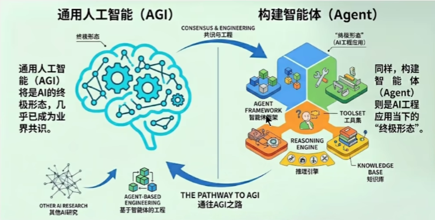


### 1.1 什么是 Agent?

- 在大模型应用开发中，智能体通常指一种<font color="red">**以大语言模型为推理与决策核心**</font>，结合<font color="red">**记忆、工具调用**</font>与环境交互能力，能够进行<font color="red">**规划决策并执行复杂任务**</font>以达成目标的软件系统。

- **Agent 的关键能力**

  - 理解用户问题

  - 如何拆解任务

  - 判断是否需要工具

  - 需要调用哪些工具

  - 如何利用好工具结果生成回答 & 推进任务


### 1.2 Agent 核心组件


- 实际开发中几个要素并不需要同时出现，一句话总结

  - 必须的：<font color="red">**行动**</font>（Action）

  - 几乎总是存在的：<font color="red">**工具**</font>（Tool）

  - 有条件存在的：<font color="red">**规划决策**</font>（Planning）

  - 最容易被省略的：<font color="red">**记忆**</font>（Memory）


### 1.3 Agent创建与调用

#### 1.3.1 历史版本

- 在 LangChain 0.x 时代，框架内的 Agent 系统经历了 “碎片化” 阶段。当时的设计理念是<font color="red">**“针对场景设计特定 Agent”**</font>：
  - 如果你要实现思维链推理（ReAct），就用 <font color="red">**create_react_agent**</font>
  - 如果需要结构化输出，就用 <font color="red">**create_structured_chat_agent**</font>
  - 要工具调用，则用 <font color="red">**create_tool_calling_agent**</font>
- 举例：❌ v0.x 的复杂方式

```python
# 需要多个步骤
from langchain_openai import ChatOpenAI
from langchain.agents import AgentExecutor, create_react_agent
from langchain_core.prompts import PromptTemplate

# 1. 模型初始化
model = ChatOpenAI(model="gpt-4o-mini")

# 2. 创建提示词模板
prompt = PromptTemplate.from_template("""
You are a helpful assistant.

Tools: {tools}
Tool Names: {tool_names}

{agent_scratchpad}
""")

# 3. 创建 agent
agent = create_react_agent(
    llm=model,
    tools=tools,
    prompt=prompt
)

# 4. 创建 executor
executor = AgentExecutor(
    agent=agent,
    tools=tools,
    verbose=True
)

# 5. 调用
result = executor.invoke({"input": "问题"})
```

这种方式灵活，但也带来了三个明显问题：

1. <font color="red">**心智负担高**</font>—— 每种 Agent 都要单独记忆 API 与参数；
2. <font color="red">**可组合性差**</font>—— 多个 Agent 之间无法统一调度；
3. <font color="red">**生态碎片化**</font>—— 不同模块难以复用或协同演化。


#### 1.3.2 全新的调用

- LangChain 在 1.0 版本后，团队做出了彻底重构：将所有 Agent 的创建方式统一为一个入口：<font color="red">**create_agent()**</font>。它取代了旧版本中的 create_react_agent、create_json_agent、create_tool_calling_agent 等多种分支函数，真正让开发者用一行代码即可创建任何类型的智能体。

- 同时在底层通过 “中间件机制（Middleware）” 和 “标准模型接口（invoke /stream）” 实现全局统一。这让框架更轻、更稳，也更易于被集成到其他 Agent 平台中。

- 举例：✅ v1.x 的简洁方式：

~~~python
from langchain.chat_models import init_chat_model
from langchain.agents import create_agent

# 1. 初始化模型
model = init_chat_model("gpt-4o-mini", model_provider="openai")

# 2. 创建 agent（一步完成）
agent = create_agent(
    model=model,
    tools=[tool1, tool2],
    system_prompt="Agent 的行为指令"  # 可选
)

# 3. 调用
result = agent.invoke({
    "messages": [{"role": "user", "content": "问题"}]
})
~~~


## 2、Agent 的基本用法1

- Agent 的基本用法1：<font color="red">**模型的传入方式**</font>
- 在 LangChain1.2 中，create_agent是构建智能体的核心方式，底层基于 LangGraph 实现。
- <font color="red">**create_agent 完整参数**</font>：

```python
from langchain.agents import create_agent

agent = create_agent(
    model: str | BaseChatModel,        # 必需：聊天模型
    tools: List[BaseTool],             # 必需：工具列表
    *,
    system_prompt: str = "",           # 系统提示词
    middleware: Sequence[AgentMiddleware[StateT_co, ContextT]] = (), # 中间件
    interrupt_before: List[str] = None, # 在某些工具前暂停（人机协作）
    interrupt_after: List[str] = None,  # 在某些工具后暂停
    debug: bool = False,                # 调试模式
    name: str | None = None,            # 设置模型名称
)
```

- Agent 在创建时，涉及到**模型 (Agent 使用的模型)**、**可调用工具**、**系统提示词**等参数的设置。
  - 更多参数参考： https://reference.langchain.com/python/langchain/agents/factory/create_agent
