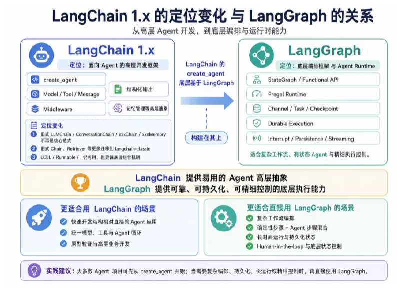
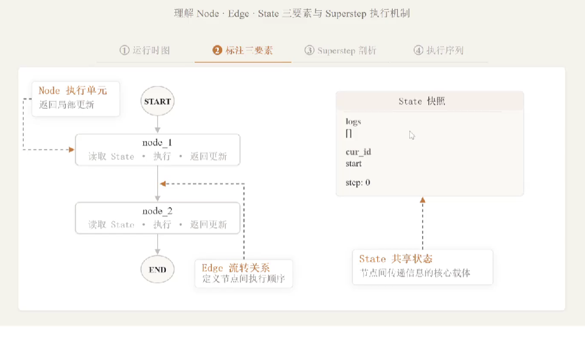
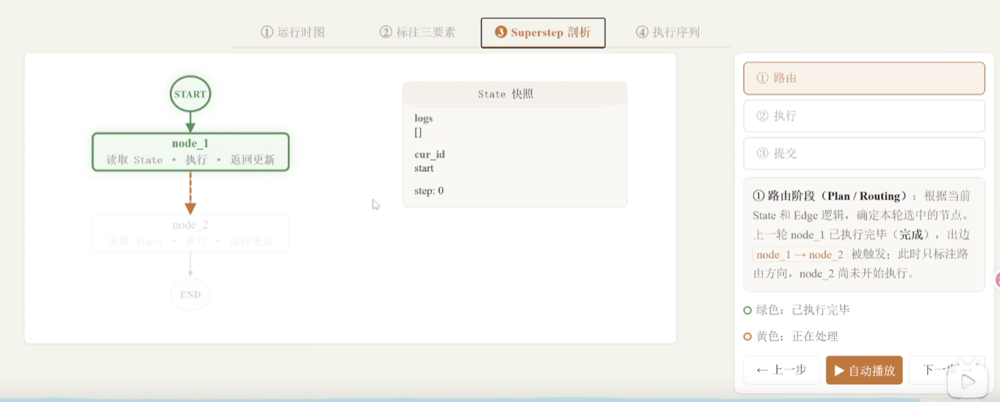
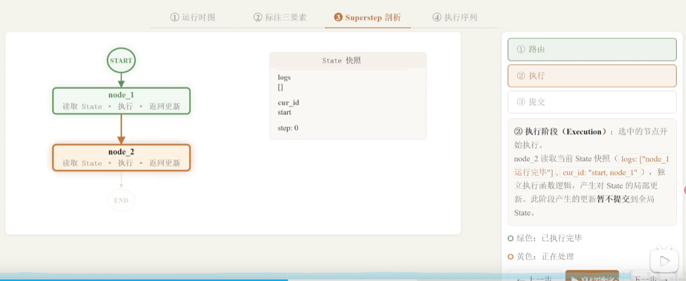
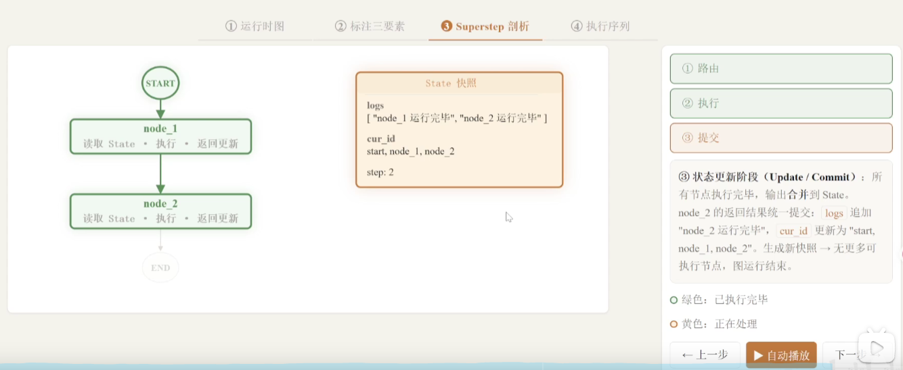

# 一、简介

- LangGraph 是一个**用于组织和执行复杂图计算流程的框架**。其底层运行逻辑基于 Google 发表的 Pregel 计算模型，核心思想是**将 Agent 的执行过程抽象为一张由节点和边组成的有向图**。

- 在实际开发中，大语言模型本身已经非常成熟，开发者需要做的是**将整个计算流程编排好**——先调用谁、后调用谁、数据如何流转。LangGraph 就是用来解决这个编排问题的

## 1、定位

- LangChain 1.x 的定位发生了明显变化：旧式 Chain、Retriever、Memory 等组件被迁移至 langchain‑classic；LCEL 保留为 langchain‑core 的底层组合机制，但不再是主要开发入口。
- LangChain 1.x 现在聚焦于 Agent 开发，核心入口是 create_agent，围绕 Agent 提供模型、工具、消息、结构化输出、Middleware 和记忆管理等高层抽象。
- LangGraph 是更底层的编排框架与 Agent Runtime，负责复杂工作流和有状态 Agent 的执行，提供持久化、流式输出、Durable Execution、Human‑in‑the‑loop 等运行时能力。create_agent 底层基于 LangGraph 实现

- LangGraph 与 LangChain 的关系

  - 两者并非对立，而是**协同工作**的关系：

  | 框架      | 定位             | 适用场景                         |
  | --------- | ---------------- | -------------------------------- |
  | LangChain | 顶层应用层设计   | 快速上手、简单直观的 Agent 构建  |
  | LangGraph | 底层源码架构编排 | 复杂逻辑、持久化检查点、人机协同 |

  - LangGraph 与 LangChain 的对比

  | 对比维度 | LangChain             | LangGraph                                |
  | -------- | --------------------- | ---------------------------------------- |
  | 定位     | Agent 高层开发框架    | 底层编排框架 & Agent Runtime             |
  | 核心入口 | create_agent          | StateGraph / @entrypoint                 |
  | 适用场景 | 结构直接的 Agent 应用 | 复杂工作流、持久化、长时间运行、人工介入 |
  | 流程控制 | Agent 循环自动管理    | 精细控制节点、边、条件分支               |
  | 学习成本 | 较低                  | 较高（但能力上限更高）                   |

  - **LangChain 提供易于使用的 Agent 高层抽象，LangGraph 提供可靠、可持久化且可精细控制的底层执行能力**
  - 对于大多数 Agent 项目，从 LangChain 的 create_agent 开始即可；需要复杂工作流编排、确定性步骤与 Agent 步骤混合、长时间运行或底层状态控制时，再引入 LangGraph

## 2、构成图的三要素

- 构成 LangGraph 图的三个基本要素：**State（状态）、Node（节点）、Edge（边）**

- **State（状态）**

  - State 是 LangGraph 中最核心的概念，它表示**图运行过程中的所有数据**
  - **关键理解**：不要被"状态"这个中文翻译误导，它本质上就是**数据容器**

  - State 承载的内容包括：

    - **上下文信息**：当前运行到哪一步、接下来要执行什么

    - **中间结果**：某个节点执行完毕后的输出数据

    - **后续节点需要读取的数据**：传递给下游节点的输入

  - 一句话总结：在 LangGraph 运行过程中，所有数据都存储在 State 里面。

- **Node（节点）**

  - 节点是图中的**一个执行单元**，通常实现为一个函数
  - 节点会读取当前 State，执行相应的业务逻辑，并返回对 State 的局部更新。节点本身并不直接修改全局状态，状态的合并与提交由运行时统一完成。

  - 如果一个 Agent 只需要调用一次大模型，那就不需要构建图。正因为 Agent 内部的逻辑和流程非常复杂，才需要多个节点组合起来构成图。**每个节点负责完成一个具体的操作**，比如调用某个大模型、处理数据、执行工具等。

- **Edge（边）**

  - 边表示**节点与节点之间的流转关系**，定义了执行的先后顺序。
  - Edge 可以是固定流转，也可以根据当前 State 进行条件判断，从而实现分支、循环等复杂控制流程。

  - 最简单的图结构：START -> Node 1 -> Node 2 -> END，其中每一条箭头就是一条边。边不仅定义了顺序，后续还可以包含条件判断逻辑，实现分支和并行。

## 3、图运行过程

- 超步（SuperStep）：LangGraph 的图在运行时，被拆分成一个一个的**SuperStep（超步）**。**超步是图运行的最小组成单元**，每个超步处理一个节点，由三个阶段组成。

- 超步的三个阶段

  - 阶段1：路由（Routing）：当一个节点执行完成后，路由阶段决定**接下来要执行哪个节点**
    - 对于简单线性结构：直接指向下一个节点
    - 对于复杂结构：可能有多个候选节点（并行执行）或条件判断（选择执行）
    - 边的逻辑在这一阶段被触发，确定下一步的执行目标

  

  - 阶段2：执行（Execution）：确定目标节点后，开始**执行该节点的代码逻辑**

    - **输入**：读取当前的 State 快照作为参数
    - **处理**：运行节点内部的函数逻辑
    - **输出**：产生局部更新（此时不提交到全局状态）

    - 关键点：执行阶段产生的更新是**局部的**，不会立即影响全局状态。

  

  - 阶段3：提交（Commit）：将节点执行过程中产生的数据更新**合并到全局状态**中
    - 将日志、执行内容、当前执行的节点 ID 等信息统一提交
    - 更新全局 State，供后续节点读取
    - 这一步完成后，一个超步才算真正结束

  

- 开始与结束的例外
  - **开始**：从 START 标记直接进入第一个节点，不经过完整超步
  - **结束**：当节点连接到 END 标记时，图运行结束

- 检查点（Checkpoint）：检查点是图运行过程中的**状态保存机制**，类似于在不同位置拍照记录当前状态。它用于：

  - 持久化保存运行过程中的状态数据

  - 支持中断恢复和状态回溯

  - 后续课程会详细讲解

## 4、API分类

- LangGraph 提供了两种不同的 API 来构建运行图：**Graph API（图式 API）** 和 **Functional API（函数式 API）**。这两种 API 共享相同的底层运行时，可以在同一应用程序中协同使用，但它们针对不同的使用场景和开发偏好而设计。

### 3.1 图式 API

- Graph API 采用声明式方式构建工作流。开发者需要显式定义 State、Node 和 Edge，**将业务流程组织成一个可可视化的图结构**

- 当流程中存在较复杂的分支、多个节点之间共享状态、并行执行、结果汇聚，或者需要通过图结构帮助调试和团队协作时，更适合使用 Graph API。官方文档也明确建议，在需要复杂流程可视化、显式状态管理、多条件分支、并行路径以及团队协作时，优先选择 Graph API。

- 总之：**Graph API 更适合构建结构清晰、节点关系复杂、需要长期维护的工作流**

- 典型场景包括：

| 场景               | 说明                                               |
| ------------------ | -------------------------------------------------- |
| 多节点复杂流程     | 流程中存在多个处理节点，需要清晰表达节点之间的关系 |
| 条件分支较多       | 根据 State 中的不同字段决定后续执行路径            |
| 并行执行与结果汇聚 | 多个节点并行运行，之后汇总结果                     |
| 多组件共享状态     | 多个节点都需要读写同一个全局 State                 |
| 需要图结构展示     | 便于调试、讲解、文档化和团队协作                   |

### 3.2 Functional API

- Functional API 采用**命令式方式构建工作流**，更贴近普通 Python 函数调用。开发者可以使用 @entrypoint 定义工作流入口，使用 @task 定义可做检查点记录的任务，然后在函数内部直接使用普通的 if/else、循环和函数调用来编排流程。官方文档指出：当已有过程式代码尽量少改动、流程以线性为主、分支逻辑简单、希望快速做原型验证时，优先 Functional API。

- 可以这样理解：Functional API 更适合在普通 Python 函数流程里，低成本接入 LangGraph 的持久化、中断恢复、任务检查点能力。

- 典型场景包括：

| 场景           | 说明                                          |
| -------------- | --------------------------------------------- |
| 现有代码改造   | 已有函数式 / 过程式代码，不想完整重构成图结构 |
| 线性流程       | 主要按 A → B → C 顺序执行                     |
| 简单分支       | 只有少量 if/else 判断                         |
| 快速原型验证   | 减少样板代码，快速跑通业务逻辑                |
| 局部任务持久化 | 希望部分函数作为独立 task 做检查点记录        |

### 3.3 二者的核心区别

| 对比项     | Graph API                      | Functional API                 |
| ---------- | ------------------------------ | ------------------------------ |
| 编程风格   | 声明式图结构                   | 命令式函数流程                 |
| 核心抽象   | State、Node、Edge              | entrypoint、task               |
| 状态管理   | 显式定义全局 State             | 更多依靠函数参数、返回值       |
| 流程表达   | 通过节点和边来表达             | 用原生 Python 控制流表达       |
| 可视化能力 | 强，天然支持绘图调试           | 弱，和普通代码一样             |
| 适合场景   | 复杂工作流、多分支、多节点协作 | 简单流程、快速原型、旧代码迁移 |
| 学习成本   | 相对更高                       | 相对更低                       |

# 二、图的基本构建与运行

## 1、入门案例

- 创建项目，导入依赖

~~~bash
# 创建项目
uv init LangGraphDemo
# 添加依赖
uv add langgraph
~~~

- 编写代码

~~~python
from langgraph.graph import StateGraph, START, END
from typing import TypedDict, Annotated
from operator import add

# ============================================================
# 第一步：定义状态
# ============================================================
class OverAllState(TypedDict):
    # 日志字段：类型为 list[str]，更新方式为 add（追加）
    logs: Annotated[list[str], add]
    # 当前流程位置字段：类型为 str，默认覆盖更新
    cur_id: str

# ============================================================
# 第二步：定义节点
# ============================================================
def node_1(state: OverAllState) -> OverAllState:
    """节点1：在日志中追加记录，拼接当前ID"""
    pre_id = state["cur_id"]
    return {
        "logs": ["node_1 运行完毕"],
        "cur_id": pre_id + ", node_1"
    }

def node_2(state: OverAllState) -> OverAllState:
    """节点2：在日志中追加记录，拼接当前ID"""
    pre_id = state["cur_id"]
    return {
        "logs": ["node_2 运行完毕"],
        "cur_id": pre_id + ", node_2"
    }

# ============================================================
# 第三步：定义边（构建图）
# ============================================================
# 3.1 创建图的建造者
builder = StateGraph(state_schema=OverAllState)

# 3.2 添加节点
builder.add_node(node_1)
builder.add_node(node_2)

# 3.3 添加边（定义执行顺序）
builder.add_edge(START, "node_1")      # 开始 -> 节点1
builder.add_edge("node_1", "node_2")   # 节点1 -> 节点2
builder.add_edge("node_2", END)        # 节点2 -> 结束

# ============================================================
# 第四步：编译图
# ============================================================
graph = builder.compile()

# ============================================================
# 第五步：运行图
# ============================================================
result = graph.invoke({"cur_id": "start"})
print(result)
# 输出: {'logs': ['node_1 运行完毕', 'node_2 运行完毕'], 'cur_id': 'start, node_1, node_2'}
~~~

- **代码解读**：

  - **状态定义部分**：

    - TypedDict：Python 内置的类型化字典，LangGraph 官方推荐的状态定义方式

    - Annotated[list[str], add]：第一个参数 list[str] 是字段的数据类型，第二个参数 add 是 reducer 函数，表示该字段更新时采用追加方式而非覆盖

    - cur_id: str：普通字符串字段，没有指定 reducer，更新时默认覆盖

  - **节点定义部分**：

    - 节点本质上是普通 Python 函数

    - 参数 state 是当前状态的快照，类型为 OverAllState

    - 返回值是字典形式，只包含需要更新的字段（部分更新）

    - logs 字段因为配置了 add reducer，返回值会被追加到已有列表中

    - cur_id 字段没有配置 reducer，返回值会覆盖旧值

  - **边定义部分**：

    - 使用建造者模式：先创建 StateGraph 获取 builder

    - add_node 添加节点到图中

    - add_edge 定义节点间的连接关系，参数为字符串形式的节点名称

    - START 和 END 是 LangGraph 内置的特殊标记

  - **运行结果分析**：

    - logs 字段：['node_1 运行完毕', 'node_2 运行完毕'] — 两个节点的日志被追加合并

    - cur_id 字段：'start, node_1, node_2' — 手动拼接的结果

## 2、图结构可视化

### 2.1 Mermaid方式

- 用这块代码会生成graph的图

~~~python
# 获取 Mermaid 语法的图结构源码
raw_mermaid = graph.get_graph().draw_mermaid()
print(raw_mermaid)
~~~

- 完整代码

~~~python
from langgraph.graph import StateGraph, START, END
from typing import TypedDict, Annotated
from operator import add

# ============================================================
# 第一步：定义状态
# ============================================================
class OverAllState(TypedDict):
    # 日志字段：类型为 list[str]，更新方式为 add（追加）
    logs: Annotated[list[str], add]
    # 当前流程位置字段：类型为 str，默认覆盖更新
    cur_id: str

# ============================================================
# 第二步：定义节点
# ============================================================
def node_1(state: OverAllState) -> OverAllState:
    """节点1：在日志中追加记录，拼接当前ID"""
    pre_id = state["cur_id"]
    return {
        "logs": ["node_1 运行完毕"],
        "cur_id": pre_id + ", node_1"
    }

def node_2(state: OverAllState) -> OverAllState:
    """节点2：在日志中追加记录，拼接当前ID"""
    pre_id = state["cur_id"]
    return {
        "logs": ["node_2 运行完毕"],
        "cur_id": pre_id + ", node_2"
    }

# ============================================================
# 第三步：定义边（构建图）
# ============================================================
# 3.1 创建图的建造者
builder = StateGraph(state_schema=OverAllState)

# 3.2 添加节点
builder.add_node(node_1)
builder.add_node(node_2)

# 3.3 添加边（定义执行顺序）
builder.add_edge(START, "node_1")      # 开始 -> 节点1
builder.add_edge("node_1", "node_2")   # 节点1 -> 节点2
builder.add_edge("node_2", END)        # 节点2 -> 结束

# ============================================================
# 第四步：编译图
# ============================================================
graph = builder.compile()

# ============================================================
# 第五步：运行图
# ============================================================
result = graph.invoke({"cur_id": "start"})
print(result)
# 输出: {'logs': ['node_1 运行完毕', 'node_2 运行完毕'], 'cur_id': 'start, node_1, node_2'}

# ============================================================
# 第六步：获取 Mermaid 语法的图结构源码
# ============================================================
raw_mermaid = graph.get_graph().draw_mermaid()
print(raw_mermaid)
~~~

- **代码解读**：graph.get_graph() 获取图结构对象，.draw_mermaid() 将其转换为 Mermaid 语法字符串。Mermaid 是一种文本格式的图表描述语言，支持在 Markdown 文档中直接渲染
- 输出源码

~~~bash
---
config:
  flowchart:
    curve: linear
---
graph TD;
	__start__([
__start__
]):::first
	node_1(node_1)
	node_2(node_2)
	__end__([
__end__
]):::last
	__start__ --> node_1;
	node_1 --> node_2;
	node_2 --> __end__;
	classDef default fill:#f2f0ff,line-height:1.2
	classDef first fill-opacity:0
	classDef last fill:#bfb6fc
~~~

- 将 graph TD 节点粘贴为代码，格式为mermaid

~~~mermaid
graph TD;
	__start__([
__start__
]):::first
	node_1(node_1)
	node_2(node_2)
	__end__([
__end__
]):::last
	__start__ --> node_1;
	node_1 --> node_2;
	node_2 --> __end__;
	classDef default fill:#f2f0ff,line-height:1.2
	classDef first fill-opacity:0
	classDef last fill:#bfb6fc
~~~

### 2.2 保存本地

- 将图保存为本地 PNG 文件

~~~python
# 将图保存为本地 PNG 文件
png_bytes = graph.get_graph().draw_mermaid_png()
png_filename = 'D:/kn/AI/first_demo_graph.png'
with open(png_filename, "wb") as f:
    f.write(png_bytes)
~~~

- 全部代码

~~~python
from tkinter import Image

from langgraph.graph import StateGraph, START, END
from typing import TypedDict, Annotated
from operator import add

# ============================================================
# 第一步：定义状态
# ============================================================
class OverAllState(TypedDict):
    # 日志字段：类型为 list[str]，更新方式为 add（追加）
    logs: Annotated[list[str], add]
    # 当前流程位置字段：类型为 str，默认覆盖更新
    cur_id: str

# ============================================================
# 第二步：定义节点
# ============================================================
def node_1(state: OverAllState) -> OverAllState:
    """节点1：在日志中追加记录，拼接当前ID"""
    pre_id = state["cur_id"]
    return {
        "logs": ["node_1 运行完毕"],
        "cur_id": pre_id + ", node_1"
    }

def node_2(state: OverAllState) -> OverAllState:
    """节点2：在日志中追加记录，拼接当前ID"""
    pre_id = state["cur_id"]
    return {
        "logs": ["node_2 运行完毕"],
        "cur_id": pre_id + ", node_2"
    }

# ============================================================
# 第三步：定义边（构建图）
# ============================================================
# 3.1 创建图的建造者
builder = StateGraph(state_schema=OverAllState)

# 3.2 添加节点
builder.add_node(node_1)
builder.add_node(node_2)

# 3.3 添加边（定义执行顺序）
builder.add_edge(START, "node_1")      # 开始 -> 节点1
builder.add_edge("node_1", "node_2")   # 节点1 -> 节点2
builder.add_edge("node_2", END)        # 节点2 -> 结束

# ============================================================
# 第四步：编译图
# ============================================================
graph = builder.compile()

# ============================================================
# 第五步：运行图
# ============================================================
result = graph.invoke({"cur_id": "start"})
print(result)
# 输出: {'logs': ['node_1 运行完毕', 'node_2 运行完毕'], 'cur_id': 'start, node_1, node_2'}

# ============================================================
# 将图保存为本地 PNG 文件
# ============================================================
png_bytes = graph.get_graph().draw_mermaid_png()
png_filename = 'D:/kn/AI/first_demo_graph.png'
with open(png_filename, "wb") as f:
    f.write(png_bytes)
~~~

# 三、状态(State)管理

##  1、状态定义

- 状态的定义实际上是在声明状态的 Schema，后者是状态字段的完整描述。 
- 官方推荐了三种定义 Schema 的方式：TypedDict、dataclass、Pydantic

### 1.1 TypedDict方式

- TypedDict 是 Python 内置的类型化字典，使用字典语法访问字段。LangGraph 官方推荐的首选方式

~~~python
from langgraph.graph import StateGraph, START, END
from typing import TypedDict, Annotated
from operator import add

class OverAllState(TypedDict):
    logs: Annotated[list[str], add]
    cur_id: str

def node_1(state: OverAllState) -> OverAllState:
    pre_id = state["cur_id"]
    return {
        "logs": ["node_1 运行完毕"],
        "cur_id": pre_id + ", node_1"
    }

def node_2(state: OverAllState) -> OverAllState:
    pre_id = state["cur_id"]
    return {
        "logs": ["node_2 运行完毕"],
        "cur_id": pre_id + ", node_2"
    }

builder = StateGraph(state_schema=OverAllState)
builder.add_node("node_1", node_1)
builder.add_node("node_2", node_2)
builder.add_edge(START, "node_1")
builder.add_edge("node_1", "node_2")
builder.add_edge("node_2", END)

graph = builder.compile()
print(graph.invoke({"cur_id": "start"}))
~~~

- 输出：{'logs': ['node_1 运行完毕', 'node_2 运行完毕'], 'cur_id': 'start, node_1, node_2'}

### 1.2 dataclass方式

- 属性调用方式由 ['字段名'] 变为 .字段名

~~~python
from langgraph.graph import StateGraph, START, END
from typing import Annotated
from dataclasses import dataclass
from operator import add

@dataclass
class OverAllState:
    logs: Annotated[list[str], add]
    cur_id: str

def node_1(state: OverAllState) -> OverAllState:
    pre_id = state.cur_id
    return OverAllState(
        logs=state.logs + ["node_1 运行完毕"],
        cur_id=pre_id + ", node_1"
    )

def node_2(state: OverAllState) -> OverAllState:
    pre_id = state.cur_id
    return OverAllState(
        logs=state.logs + ["node_2 运行完毕"],
        cur_id=pre_id + ", node_2"
    )

builder = StateGraph(state_schema=OverAllState)
builder.add_node("node_1", node_1)
builder.add_node("node_2", node_2)
builder.add_edge(START, "node_1")
builder.add_edge("node_1", "node_2")
builder.add_edge("node_2", END)

graph = builder.compile()
print(graph.invoke({"cur_id": "start"}))
~~~

- @dataclass 是 Python 的装饰器，用于自动生成 __init__、__repr__ 等方法
- 使用点号（.）方式访问属性，而非字典的中括号方式
- 返回时可以返回字典，LangGraph 会自动处理转换
- 也可以返回 dataclass 实例

### 1.3 Pydantic方式

- Pydantic 的 BaseModel 提供数据校验能力，字段访问方式与 dataclass 相同（点号访问）

~~~python
from langgraph.graph import StateGraph, START, END
from typing import Annotated
from pydantic import BaseModel
from operator import add

# 1. 定义状态（使用 Pydantic BaseModel）
class OverAllState(BaseModel):
    logs: Annotated[list[str], add]
    cur_id: str

# 2. 定义节点
def node_1(state: OverAllState) -> OverAllState:
    pre_id = state.cur_id
    return {
        "logs": ["node_1 运行完毕"],
        "cur_id": pre_id + ", node_1"
    }

def node_2(state: OverAllState) -> OverAllState:
    pre_id = state.cur_id
    return {
        "cur_id": pre_id + ", node_2"
    }

# 3. 定义边
builder = StateGraph(state_schema=OverAllState)
builder.add_node(node_1)
builder.add_node(node_2)
builder.add_edge(START, "node_1")
builder.add_edge("node_1", "node_2")
builder.add_edge("node_2", END)

graph = builder.compile()

# 4. 运行（可以传字典，Pydantic 会自动解析）
result = graph.invoke({"cur_id": "start"})
print(result)
# 输出: {'logs': ['node_1 运行完毕'], 'cur_id': 'start, node_1, node_2'}
~~~

- 使用 BaseModel 作为状态类的父类
- 字段访问使用点号方式 state.cur_id
- invoke 时传入字典，Pydantic 会自动解析为模型对象
- 注意输出中 logs 只有 node_1 的记录，因为 node_2 没有返回 logs 字段，而 Pydantic 不会保留未更新的字段默认值

### 1.4 总结

- 在 LangGraph 中，三种方式都有字段校验，但校验机制不同：

| 方式          | 校验行为                             | 异常类型        |
| ------------- | ------------------------------------ | --------------- |
| **TypedDict** | 将字段视为字典 Key，Key 不匹配抛异常 | KeyError        |
| **dataclass** | 将字段视为类属性，属性不匹配抛异常   | TypeError       |
| **Pydantic**  | 字段不匹配抛异常                     | ValidationError |

- **重要区别**：在 LangChain 中只有 Pydantic 有严格校验；但在 LangGraph 中，三种方式都会进行校验。

- 节点返回字段与状态字段不匹配时
  - 如果节点返回的字段名与状态定义的字段名不匹配，三种方式的行为是统一的：**该更新会被忽略**，不会影响全局状态。

- 推荐使用 TypedDict 的原因

  - **功能无差异**：三种方式在 LangGraph 中都会进行字段校验

  - **更贴近状态更新机制**：LangGraph 的状态更新本质上是字典更新，TypedDict 最自然

  - **轻量级**：不引入额外的数据校验开销

  - **官方首选**：大多数官方文档和示例都使用 TypedDict

  - **简洁清晰**：写法最简洁，结构最清晰

## 2、状态合并

### 2.1 定义

- State Reducer 是 LangGraph 中用于合并状态更新的核心机制。在 LangGraph 的 stateGraph 中，每个节点可以读取和写入共享状态，而 Reducer 定义了如何将多个节点对同一状态键的更新合并

- **Reducer 的核心特征：**

  - 函数签名：(value, value) -> value，接收当前值和更新值，返回合并后的新值
  - 注解定义：通过 Annotated[Type, reducer_function] 为状态键指定 Reducer

  - 默认行为：未指定 Reducer 的状态键使用覆盖策略（Last‑Write‑Wins）

2
