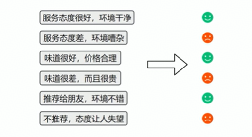
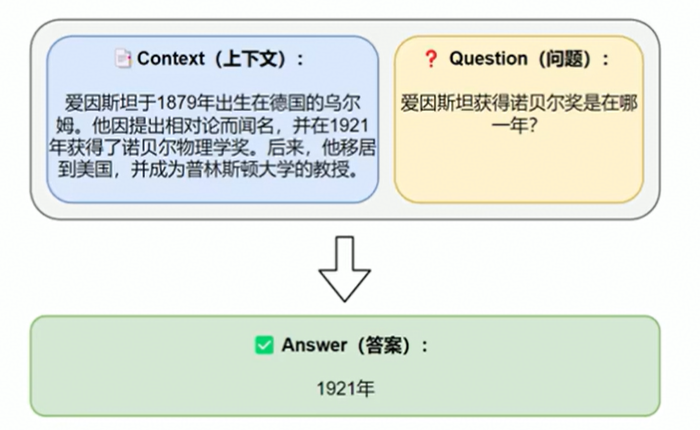

# 一、导论

## 1、定义

- 自然语言处理：Natural Language Processing，简称NLP
- 是人工智能领域的一个重要分支
- 自然语言，指人类日常使用的语言（如：中文、英文），**NLP的目标识让计算机“理解”或”使用“这些语言**

## 2、常见任务

### 2.1 文本分类

- 对整段文本进行判断或归类
- 常见应用：情感分析（判断评价是正面还是负面）、垃圾邮件识别、新闻主题分类等

### 2.2 序列标注

- 对一段文本中的每个词或字打上标签
- 常见应用：命名实体识别（找出人名、地名、手机号码等）

### 2.3 文本生成

- 根据已有内容生成新的自然语言文本
- 常见引用：自动写作、摘要生成、智能回复、对话系统等

### 2.4 信息抽取

- 从文本中提取出结构化的信息
- 常见应用：给出一段文本和一个问题，从中抽取答案

### 2.5 文本转换

- 将一种文本转换成另一种形式
- 常见应用：机器翻译、摘要生成等

## 3、技术演进历史

